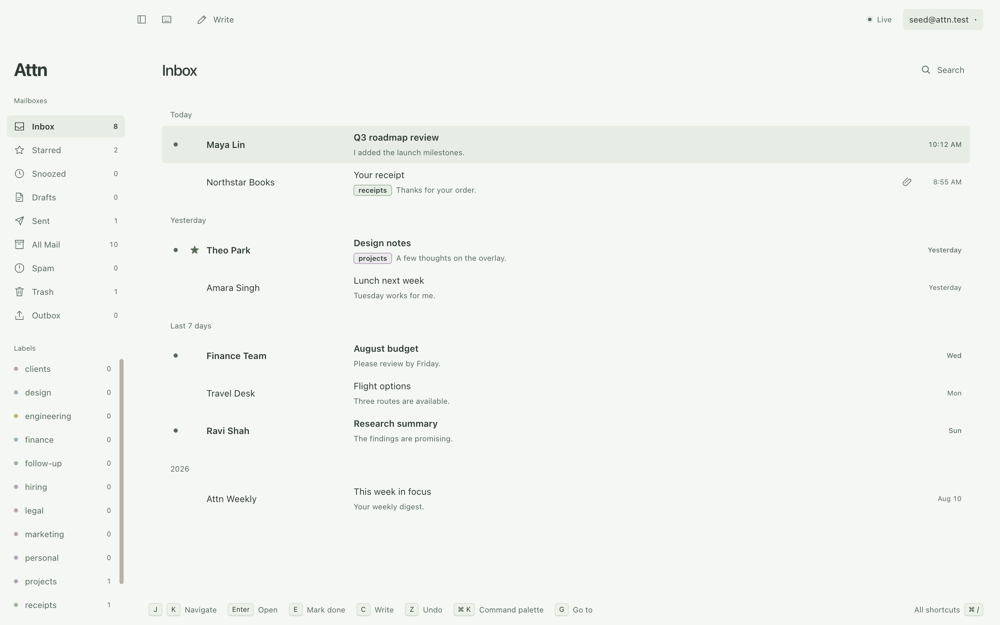
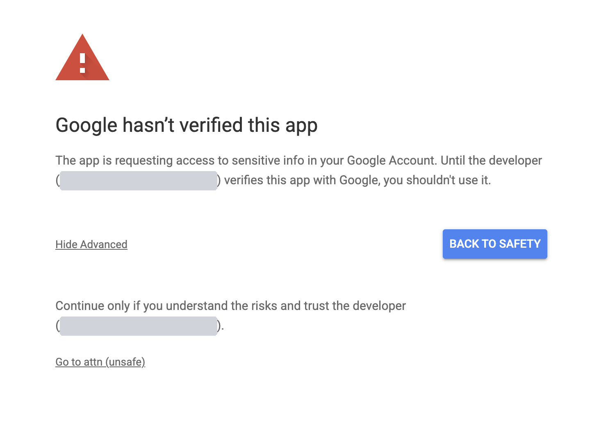

# Attn

A desktop Gmail client built around keyboard shortcuts and offline mail. For macOS and Windows.

[Website](https://useattn.com) · [Get started](#get-started) · [Keyboard shortcuts](#use-the-keyboard) · [Data and privacy](#data-and-privacy) · [Contribute](#contribute)



Read cached mail, write drafts, and organize your inbox without a network connection. Changes save locally and sync with Gmail when you reconnect. Use the command palette to find actions without leaving the keyboard.

The demo below shows keyboard triage, snooze, offline actions, the command palette, and undo-send. It uses fictional mail.

https://github.com/user-attachments/assets/b25c6b19-3167-426b-a47b-5d72373083da

> **Developer preview.** Build from source with your own Google OAuth client. No installer is published. Google shows an unverified-app warning when you sign in. See [Get started](#get-started).

## What you can do

- Work from the keyboard. Navigate conversations, archive, snooze, label, and undo actions, including bulk changes.
- Keep accounts separate. Switch between Gmail inboxes while your other accounts continue to sync.
- Write and send. Use rich text, attachments, saved snippets, verified Gmail send-as identities, Gmail signatures, and an undo-send delay. Drafts save locally and sync with Gmail.
- Find and organize mail. Search cached messages, search Gmail for older mail, create inbox splits with rules, and set follow-up reminders.
- Make it your own. Choose light or dark themes, desktop notifications, and unread badges.
- Add optional AI. Use your own provider for reply drafts and inline autocomplete. Smart splits use a separate TypeSafe key to sort mail from a description you write.

Attn has no hosted mail backend or telemetry. AI features are off by default. See [Data and privacy](#data-and-privacy) for storage and external connections.

## Current limits

Attn supports Gmail on macOS and Windows. Calendar, Outlook, IMAP, a unified inbox, and scheduled send are not supported. Linux can run the test suite, but it is not a supported product target.

Read the [known issues](docs/KNOWN-ISSUES.md) for recorded defects and workarounds.

## Get started

### 1. Install the prerequisites

Use macOS or Windows with Git, Node.js 22.12 or later, and npm.

If a native dependency needs compilation, install the tools for your operating system:

- macOS: Xcode Command Line Tools.
- Windows: Visual Studio Build Tools with the C++ workload.

### 2. Get the source

```sh
git clone https://github.com/stephenw310/attn.git
cd attn
npm install
```

The install step downloads Electron and checks the SQLite native module inside Electron. If that check fails later, run `npm run toolchain` to repair the installation.

### 3. Configure Google sign-in

Each user supplies a Google OAuth client. The same client can connect all your Gmail accounts.

1. Open the [Google Cloud Console](https://console.cloud.google.com/).
2. Create a project or select an existing project.
3. Enable the Gmail API for the project.
4. Configure Google Auth Platform with an External audience.
5. On the **Audience** page, select **Publish app** to set the publishing status to **In production**.
6. Create an OAuth client with the **Desktop app** application type.
7. Copy `oauth.config.example.json` to `oauth.config.json` in the repository root.
8. Put the client ID and client secret in the corresponding fields.

Do not submit the app for verification. The console says that the app needs verification because it requests Gmail access. You can ignore that notice for a client that only you use.

Attn expects this file structure:

```json
{
  "client_id": "YOUR_CLIENT_ID",
  "client_secret": "YOUR_CLIENT_SECRET",
  "quota_units_per_minute": 6000
}
```

Keep `oauth.config.json` private. Git ignores this file. Set the quota value to the per-user limit shown for your project. See [Gmail API usage limits](https://developers.google.com/workspace/gmail/api/reference/quota).

Attn requests `gmail.modify`, `openid`, and `email`. The mail scope permits mail reading, composition, sending, and label changes. See [Google's scope reference](https://developers.google.com/workspace/gmail/api/auth/scopes).

Use **In production** status, not **Testing**. Google expires the sign-in of a test user after seven days, and it limits a Testing project to the test users you list. An unverified production client keeps you signed in. Google allows it 100 users, which is enough for your own accounts. See [Google's publishing status rules](https://support.google.com/cloud/answer/15549945).

### 4. Start Attn

```sh
npm run dev
```

Select **Sign in with Google**. Complete sign-in in your browser.

Google shows a page that says "Google hasn't verified this app", because Google has not reviewed your client. Check that the page names your own project. Then select **Advanced**, and select **Go to** your app name. Google shows this page once for each account.



The gray boxes cover the developer email. On your page, that email is your own Google account.

The first conversations appear while Attn syncs the rest of the mailbox. Older messages can require a connection when you first open them. The sync status shows background progress.

To add another account, open the account menu and select **Add account**.

## Use the keyboard

`Mod` means Command on macOS and Control on Windows.

| Keys | Action |
| --- | --- |
| `J`, `K` | Select the next or previous conversation |
| `Enter` | Open the selected conversation |
| `Esc` | Return to the list or close the current control |
| `E` | Archive |
| `H` | Snooze |
| `Z` | Undo the last mail action |
| `C` | Write a new message |
| `R`, `A`, `F` | Reply, reply all, or forward |
| `Mod+Enter` | Send from the composer |
| `/` | Search |
| `Mod+K` | Open the command palette |
| `Mod+/` | Open the keyboard shortcut reference |
| `Mod+,` | Open settings |
| `Mod+1` through `Mod+9` | Switch accounts in their configured order |

Use the command palette to find other actions. The [keyboard map](docs/SPEC.md#5-keyboard-map-v1-defaults) lists the defaults.

## Build an installed app

Build on the operating system where you will use the app. The commands write installers to `dist/`.

| Target | Command | Install |
| --- | --- | --- |
| macOS, current architecture | `npm run package:mac` | Open the DMG and drag Attn to Applications |
| macOS, Apple Silicon and Intel | `npm run package:mac:all` | Use the DMG for your Mac |
| Windows, current architecture | `npm run package:win` | Run the EXE installer |
| Unpacked app for local checks | `npm run package:dir` | Open the app in `dist/` |

For an installed app, put `oauth.config.json` in its user data directory:

- macOS: `~/Library/Application Support/Attn/oauth.config.json`
- Windows: `%APPDATA%\Attn\oauth.config.json`

Restart Attn after you add the file. Keep the file outside the installed application.

### Make Attn the default email app

An installed Attn can open `mailto:` links from your browser and other apps. Open **Settings > Background** and select **Make default**. The command palette offers the same action.

Each system also keeps its own choice:

- macOS: open Mail, then select **Mail > Settings > General > Default email reader** and choose Attn.
- Windows: open **Settings > Apps > Default apps**, select Attn, then set it for `mailto`.

Personal macOS builds use an ad-hoc signature and are not notarized. Personal Windows builds are unsigned and can trigger a SmartScreen warning. Personal builds do not check for updates. Signing and the automatic-update feed are deferred. To update, get the new source and build the app again. The [release guide](docs/RELEASE.md) describes the procedure if signed releases are enabled later.

## Data and privacy

Attn stores cached mail and local drafts in SQLite under your user data directory. The mail database is not encrypted by Attn. OAuth tokens, your AI writing key, and your TypeSafe key for smart splits use Electron `safeStorage`, backed by the operating system. Each key has its own file.

Attn has no hosted mail backend or telemetry. It connects to Google for mail. Signed release builds also contact their configured update feed. The [privacy policy](https://useattn.com/privacy.html) lists each case where data leaves your computer.

Remote images load directly from senders by default. You can block them in settings and allow individual senders.

AI is disabled by default. If you enable it, Attn sends mail context to your chosen provider for requested reply drafts. Inline autocomplete has a separate opt-in and sends a limited excerpt of unsent text. Review generated text before you send it.

Smart splits have their own opt-in and their own TypeSafe key, both in the Split rules manager. If you turn them on, Attn sends a limited summary of each Inbox conversation to TypeSafe in the background, without a command. Remove the TypeSafe key to stop it.

Snooze and follow-up timers run locally. If Attn is closed when a reminder becomes due, it returns when Attn next starts.

## Contribute

Attn uses Electron, React, TypeScript, and SQLite.

Read [AGENTS.md](AGENTS.md) for the code structure and development rules. Read the [product specification](docs/SPEC.md) for expected behavior.

Follow the [verification requirements](AGENTS.md#verify-the-change) before submitting a change. Use the [test guide](docs/TESTING.md#choose-a-command) to select commands and diagnose failures.

You can contribute bug reports, documentation fixes, or code changes. [Open an issue](https://github.com/stephenw310/attn/issues) to report a bug or propose a feature.

For a bug report, include the operating system, Attn version, steps to reproduce, expected result, and actual result. Remove mail content, addresses, tokens, and API keys from logs and screenshots.

Report a security vulnerability in private. See the [security policy](SECURITY.md).

## License

Attn uses the [MIT license](LICENSE).
