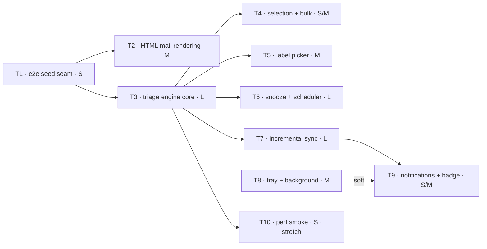

# M1 Completion Plan — Task Breakdown for Handoff

**Audience:** the engineer(s) implementing the rest of M1 (triage core).
**Basis:** [SPEC.md](SPEC.md) §8 M1, repo state at `fd4866b` (M0 complete, Dispatch direction applied, e2e harness live).
**Ground rules:** read [AGENTS.md](../AGENTS.md) first. Every task below is one PR, and no PR is done until `npm run verify` is green. When a task says "spec F4", that's a section of SPEC.md — read it before starting the task.

---

## Where we are

| M1 item (SPEC §8) | Status |
|---|---|
| Apply Dispatch direction (D6) | ✅ shipped |
| Sanitized HTML mail rendering | **T2** |
| Triage verbs done/snooze/trash/star/unread/label | **T3** (E/#/S/U/!), **T5** (L), **T6** (H) |
| Selection + bulk | **T4** |
| Auto-advance | **T3** |
| `Z` undo | **T3** |
| Durable action queue + offline replay | **T3** |
| Snooze scheduler | **T6** |
| Tray/background mode + launch at login | **T8** |
| Basic notifications | **T9** |
| *(F2, enables "offline correctness" claim)* Incremental sync | **T7** |

Supporting tasks: **T1** (test seam every triage test depends on), **T10** (perf smoke, stretch).

---

## Task graph and parallelization



**Parallel lanes (can be worked simultaneously):**

- **T2 ∥ T3** — after T1 lands. Different subsystems (message rendering vs. action engine). Both touch `App.tsx` lightly; whoever merges second rebases.
- **T4 ∥ T5 ∥ T6 ∥ T7** — all only depend on T3. Four independent PRs.
- **T8 ∥ anything** — no dependencies at all. Good "second track" work at any point.
- **T9** — needs T7 (new-mail events). T8 first is nicer (background cadence) but not required.

**Suggested order, one engineer:** T1 → T2 → T3 → T4 → T5 → T6 → T7 → T8 → T9 → T10.
T2 before T3 on purpose: it's self-contained and a gentler ramp into the codebase than the engine.

**Suggested split, two engineers:**

| | Eng A (engine track) | Eng B (surface track) |
|---|---|---|
| Week 1 | T1, then T3 | T8 (no deps), then T2 (after T1) |
| Week 2 | T7, then T9 | T4, T5, then T6 |

Sizes: S ≈ ½–1 day, M ≈ 1–2 days, L ≈ 3–4 days, for someone new to the codebase, tests included.

---

## Global rules (every task)

1. **Migrations are an append-only array** (`src/main/db/migrations.ts`). Never edit a shipped entry. The migration index = position in the array, so **merge order decides numbering** — if a parallel task merged a migration before yours, rebase and your SQL simply becomes the next array element. Two tasks must never share one migration.
2. **IPC has three parts** — a capability is added in `src/main/index.ts` (`ipcMain.handle`), `src/preload/index.ts` (bridge method), and `src/shared/` (types). All three in the same commit. The renderer never imports from `src/main/`.
3. **Mail content is untrusted.** Outside T2's sanitized iframe, body content goes into text nodes only. Never `dangerouslySetInnerHTML`.
4. **Select on `data-testid`** in e2e; add testids for every new interactive element. Never select on Tailwind classes.
5. **Mock mode keeps working.** Signed-out without a seed = the browser-preview mock inbox (`mockData.ts`). New features may be inert there (verbs no-op), but it must render and navigate. The existing smoke tests enforce this.
6. **After UI changes, look at the screenshot** (`e2e/.artifacts/inbox.png`, plus any you add). "Tests pass" is not the same as "looks right".
7. **From T3 on, every user-facing action is a registered command** in the command registry (T3 introduces it). This is the F5 invariant — the M3 palette will assert it.
8. **If your task changes the verify pipeline or harness behavior, update AGENTS.md** in the same PR (it's the working agreement).
9. Commit style, formatting, quotes: Biome enforces; the pre-commit hook auto-fixes staged files.

---

## T1 — E2E seed seam: real-store tests without credentials

**Size:** S · **Depends on:** nothing · **Unblocks:** T2, T3 (and everything after) · **Parallel with:** T8

### Why

Today the mock inbox lives inside the renderer (`mockData.ts`) and never touches SQLite or IPC. Every triage feature we're about to build lives in the main process (reducer, queue, scheduler). If tests drive the mock, they bypass the entire correctness core. This task adds a way to boot the app against a **seeded real store** — renderer → IPC → SQLite, no Google, no tokens.

### Design (decided)

- New env var **`ATTN_TEST_SEED`** = path to a JSON fixture. Honored **only** when `ATTN_TEST_USER_DATA` is also set — the seam must be dead code in production.
- Seeding goes through the **same write path as real sync** (`persistThread`), so tests exercise production persistence, not a parallel test-only insert.
- Seeded mode reports `authStatus()` as `{ configured: false, signedIn: true, email: <seed account> }`. That combination is impossible in real life and flips the renderer into "real mode" (reads via IPC) with zero renderer changes.
- Seeding is **idempotent-by-skip**: if the `accounts` table is non-empty at boot, skip the import. This is what makes relaunch tests meaningful (state from the previous run survives; the seed doesn't stomp it).

### Implementation guide

1. **Extract `persistThread`** from `src/main/sync/backfill.ts` into a new `src/main/sync/persist.ts` (export `persistThread(db, accountId, thread)`; backfill imports it). Pure move, no behavior change. T7 will reuse it for history sync — that's why it moves now.
2. **New `src/main/dev/seed.ts`** (main process):
   - Fixture shape (friendly to write by hand; the loader converts to the `GmailThread` shape from `src/main/gmail/parse.ts` — base64url-encode `bodyText` into `payload.body.data`, build `From`/`To`/`Subject` headers):

     ```json
     {
       "account": "seed@attn.test",
       "labels": [{ "id": "Label_1", "name": "receipts", "type": "user" }],
       "threads": [
         {
           "id": "t-roadmap", "historyId": "1000",
           "messages": [
             {
               "id": "m1", "labelIds": ["INBOX", "UNREAD", "IMPORTANT"],
               "internalDate": "1754800000000",
               "from": "Maya Lin <maya@example.com>", "to": "me@attn.test",
               "subject": "Q3 roadmap review", "snippet": "Heads up…",
               "bodyText": "Full plain-text body…"
             }
           ]
         }
       ]
     }
     ```
   - `loadSeed(db, path): string` — inserts the account row + labels, converts each thread and calls `persistThread`, returns the account id. Log `[seed] loaded N threads for <account>` (the e2e `mainLog` fixture can assert it).
3. **`src/main/index.ts`:**
   - After `openDatabase`: if `testUserData && process.env.ATTN_TEST_SEED` and the `accounts` table is empty → `seedAccountId = loadSeed(db, path)`.
   - `currentAccountId()`: `return seedAccountId ?? loadTokens(...)?.email ?? null`.
   - `authStatus()`: when `seedAccountId` is set, return `{ configured: false, signedIn: true, email: seedAccountId }`.
   - `startSync()`: add an early `if (seedAccountId) return` (belt-and-braces; `makeClient()` already returns null without tokens).
4. **`e2e/electron.ts`:**
   - Add a Playwright **option fixture** `seed?: string` (`seed: [undefined, { option: true }]`). When set, boot resolves it against `e2e/` and passes `ATTN_TEST_SEED` in the env. Specs opt in with `test.use({ seed: 'fixtures/seed-inbox.json' })`.
   - Add a **`relaunch()`** helper to the boot fixture: closes the current app, launches a fresh one against the **same** userData dir, and swaps `boot.app`. T3 and T6 need it for durability tests. (Note: `page` fixture holds the first window — have `relaunch` return the new `{ app, page }` rather than mutating fixtures other tests hold.)
5. **New `e2e/fixtures/seed-inbox.json`:** ~8 threads — a multi-message thread, unread/read mix, one starred, one with `hasAttachment` semantics (a part with a `filename`), one user label. Keep `internalDate`s fixed; don't assert exact rendered time strings.
6. **New `e2e/seeded.spec.ts`:** boots seeded; asserts the list renders fixture threads **from the DB** (row count, first-row sender), unread count matches, `Enter` shows a conversation whose body came over IPC, and `main.log` contains the seed line.

### Done when

- Seeded spec green; all existing smoke tests untouched and green; `npm run verify` green.
- AGENTS.md "How the e2e harness works" gains two lines: `ATTN_TEST_SEED`, and the relaunch helper.

---

## T2 — Sanitized HTML mail rendering

**Size:** M · **Depends on:** T1 · **Parallel with:** T3 · **Spec:** M1 "first item", §6 *HTML mail rendering*, decision log #5

### Why

Triaging means reading real mail, and most real mail is HTML. Today HTML bodies are regex-stripped to text (`stripHtml` in `src/main/gmail/parse.ts`) — newsletters and receipts are barely readable. This is also the scariest attack surface in the app; we do it now, carefully, with hostile-input tests.

### Design (decided — don't relitigate)

- **Store raw HTML at sync time; sanitize at render time.** Sanitizer upgrades then apply retroactively to already-cached mail.
- Sanitize with **DOMPurify** in the renderer, render into an **`<iframe srcdoc>`** with `sandbox="allow-same-origin allow-popups allow-popups-to-escape-sandbox"`. **Never `allow-scripts`.** `allow-same-origin` is required so the parent can measure content height; it's safe *because* scripts can't run — the mail document is inert.
- **Remote images load by default** (decision log #5). The block-toggle arrives with the settings surface (M4).
- HTML mail renders on a **white card** regardless of theme for M1. Dark-mode sanitize/invert is F14 work at M3. Plain-text messages keep the current themed text-node path.
- `cid:` inline images will render as broken images for M1 — accepted; attachment handling is M2.

### Implementation guide

1. **Migration (next array index):** `ALTER TABLE messages ADD COLUMN body_html TEXT;`
2. **`src/main/gmail/parse.ts`:** add `extractBodyHtml(payload): string` — same walk as `extractBodyText`, but collect raw `text/html` parts (joined). Keep `extractBodyText` as is (it stays the plain-text fallback and, later, the FTS source).
3. **`src/main/sync/backfill.ts` / `persist.ts`:** store `body_html` in the message upsert (and in the `ON CONFLICT` update set). In `fetchExternalBodies`, when the fetched external part is `text/html`, store the raw HTML into `body_html` *and* the stripped text into `body_text`.
4. **`src/main/dev/seed.ts` + fixture:** support optional `bodyHtml` per message. Add a **hostile fixture message**: `<script>`, ``, a `javascript:` link, a `<form>`, a remote ``, an inline-styled table.
5. **`src/shared/mail.ts` + `src/main/db/queries.ts` + preload types:** `ConversationMsg` gains `bodyHtml: string | null`.
6. **Renderer — new `src/renderer/src/MessageBody.tsx`:**
   - `bodyHtml == null` → exact current text-node rendering (move it here).
   - Otherwise: `DOMPurify.sanitize(html, …)` with defaults plus `FORBID_TAGS: ['form','input','button','select','textarea']`, `ADD_ATTR: ['target']`; allow `<style>` (CSS can't execute, and its `url()` exposure equals remote images, which we allow). DOMPurify already strips `on*` handlers, `javascript:` URLs, and `<script>`.
   - Wrap in srcdoc: `<base target="_blank">` + a minimal reset (readable sans, 14px, white bg, `img { max-width: 100% }`).
   - Height: on iframe `load`, read `contentDocument.documentElement.scrollHeight`, set the iframe height; attach a `ResizeObserver` to `contentDocument.body` for late-loading images.
   - `data-testid="html-body-frame"`.
7. **Links:** `<base target="_blank">` + `allow-popups-to-escape-sandbox` routes clicks through `window.open` → the existing `setWindowOpenHandler` in `src/main/index.ts` (opens system browser, denies in-app). No `allow-top-navigation`, so in-place navigation is impossible. Verify by clicking in a manual run.
8. **CSP check (`src/renderer/index.html`):** srcdoc iframes inherit the parent CSP. Current policy blocks remote images (`img-src 'self' data:`). Extend to `img-src 'self' data: https: http:`. If the iframe itself is blocked, add `frame-src 'self' about:`. CSP violations appear as renderer console errors — the `page` fixture fails the test, so you'll know immediately.
9. **Dependency:** `npm i dompurify` (v3+, ships its own types).

### Testing

- `e2e/html-mail.spec.ts` (seeded): open the hostile thread; via `page.frameLocator('[data-testid="html-body-frame"]')` assert: zero `<script>` elements, no element with `onerror`, no `javascript:` hrefs, no `<form>`; the styled table *did* survive. Assert a plain-text message in the same fixture still renders as a text node (no iframe).
- Add a `conversation.png` screenshot artifact alongside `inbox.png`; look at it.

### Done when

Hostile-input assertions green; text-mail path unchanged; renderer console clean (fixture enforces); `npm run verify` green; screenshot reviewed.

---

## T3 — Triage engine core: reducer, durable queue, E/#/S/U/!, auto-advance, undo

**Size:** L — the load-bearing task · **Depends on:** T1 · **Parallel with:** T2 · **Spec:** F4, F2 (action queue), §6 (one reducer)

### Why

This is the product. Everything else in M1 hangs off the machinery built here: one local reducer, a durable `action_queue`, an executor, an undo stack, and the keyboard verbs.

### Design (decided)

- **One reducer, two sources (SPEC §6):** a single `applyThreadDelta` mutates local state for *both* optimistic user actions (now) and server history events (T7). Local-first means the optimistic path *is* the local DB write — SQLite is synchronous and local, comfortably inside the 16ms feedback budget.
- **The queue stores intent, not SQL:** rows are per-thread label/trash operations that map 1:1 onto Gmail endpoints. Label ops are idempotent, so crash-recovery is "re-run anything in flight" — the exactly-once machinery is only needed for send (M2 outbox).
- **Undo is a session-scoped stack in the main process** (spec: last 50, includes bulk). Undoing performs precise per-thread inverse actions (computed from pre-state at perform time) and does *not* push onto the stack.
- **Trash uses the dedicated endpoints** (`threads.trash`/`untrash`), not label modify. Spam = modify `+SPAM −INBOX`.
- **A minimal `MailProvider` interface starts here** (D1): the executor calls `modifyThread`/`trashThread`/`untrashThread` on the interface; `GmailMailProvider` wraps `GmailClient`. T7 extends the same interface with sync methods.
- **Verbs are inert in mock mode** (signed-out, unseeded). Real mode only.

### Implementation guide

**Migration (next index):**

```sql
CREATE TABLE action_queue (
  id          INTEGER PRIMARY KEY AUTOINCREMENT,
  account_id  TEXT NOT NULL,
  kind        TEXT NOT NULL,             -- 'modifyLabels' | 'trash' | 'untrash'
  thread_id   TEXT NOT NULL,
  payload     TEXT NOT NULL DEFAULT '{}',-- modifyLabels: {"add":[…],"remove":[…]}
  state       TEXT NOT NULL DEFAULT 'pending',  -- 'pending' | 'inflight' | 'failed'
  attempts    INTEGER NOT NULL DEFAULT 0,
  last_error  TEXT,
  created_at  INTEGER NOT NULL
);
CREATE INDEX idx_action_queue_pending ON action_queue (account_id, state, id);
```

(Successful rows are deleted, not kept — the table stays small and "pending count" is a cheap `COUNT(*)`.)

**Store layer — `src/main/store/mutate.ts`:**

```ts
export interface ThreadDelta { threadId: string; add: string[]; remove: string[] }
export function applyThreadDelta(db: Db, accountId: string, d: ThreadDelta): void
```

One transaction: update `thread_labels`; recompute the denormalized `threads` flags (`is_unread` from UNREAD, `is_starred` from STARRED); when UNREAD is added/removed, update `messages.is_unread` for the thread (all messages — thread-level approximation is fine for M1). INBOX membership already drives `listInboxThreads`, so archive = removing INBOX just works.

**Actions — `src/main/actions/index.ts`:**

```ts
export type TriageAction =
  | { kind: 'archive' | 'trash' | 'spam'; threadIds: string[] }
  | { kind: 'star' | 'markUnread'; threadIds: string[]; on: boolean }
  | { kind: 'label'; threadIds: string[]; add: string[]; remove: string[] }   // T5 uses this
  | { kind: 'restoreInbox'; threadIds: string[] }                             // undo of archive; T6 reuses
  | { kind: 'untrash'; threadIds: string[] }
```

`performTriage(db, accountId, action): { undo: TriageAction[]; label: string }`:
- Reads pre-state per thread (so bulk undo is exact even when pre-states differ — e.g. "star 5" where 2 were already starred).
- Maps to `ThreadDelta`s → `applyThreadDelta` each (one enclosing transaction for bulk).
- Enqueues one `action_queue` row per thread.
- Returns per-thread inverse actions plus a human label (`'Archived'`, `'3 trashed'`, `'Starred'` …).

Undo stack (module state in main): array of `{ label, undo: TriageAction[] }`, cap 50. `undoLast()` pops and performs each inverse **through `performTriage` minus the stack push** (factor accordingly).

**Executor — `src/main/actions/executor.ts`:**
- Constructed with `db` and a `() => MailProvider | null` factory (null when signed out / seeded — executor idles, rows stay pending; this is what makes offline e2e work).
- Drain loop, one row at a time, triggered by: enqueue, boot, provider-became-available, retry timer.
- Per row: `state='inflight'` → provider call → delete row. `GmailApiError` 404 → thread gone, delete row. Other 4xx → `state='failed'` + `last_error` (don't retry forever). Network errors / 5xx / 429 → back to `pending`, `attempts++`, retry with capped backoff (the client's own retry handles short bursts; the executor's timer handles offline: 5s → 30s → 60s cap).
- Boot recovery: any `inflight` rows (crash artifacts) flip back to `pending` — idempotent ops make re-running safe.

**Gmail client (`src/main/gmail/client.ts`):** refactor `get` into a shared `request(method, path, { params, body })`; add `post<T>(path, body)`. Same 401-refresh + backoff behavior. New `src/main/gmail/provider.ts` implements `MailProvider` (interface in `src/main/sync/provider.ts`): `modifyThread` → `POST /threads/{id}/modify`, `trashThread` → `POST /threads/{id}/trash`, `untrashThread` → `POST /threads/{id}/untrash`.

**IPC (all three layers):**
- `mail:triage(action: TriageAction)` → `{ label: string }` — applies, enqueues, broadcasts `mail:changed`, pushes undo.
- `mail:undo()` → `{ label: string } | null`.
- `mail:getPendingActionCount()` → `number` — this is a real product surface (local-first visibility), not a test hook: the footer shows `· N pending` when > 0. The e2e suite asserts on it.

**Renderer:**
- **Command registry — `src/renderer/src/commands.ts`** (the F5 groundwork): `{ id, title, shortcut, context: 'list' | 'overlay' | 'global', run(ctx) }`, plus `register…`/`listCommands()`/`matchKey(e, context)`. Refactor the existing keydown handler in `App.tsx` to dispatch through it (J/K/Enter/Esc become registered commands too). The M3 palette will render `listCommands()`.
- Verbs (list *and* overlay contexts): `e` archive · `#` trash · `!` spam · `s` star-toggle · `u` unread-toggle. Toggles read the selected row's current state.
- **Open-marks-read for real:** replace the renderer-local `readIds` set — opening a conversation issues `markUnread { on: false }` if the thread is unread. Delete the `readIds` machinery; unread counts now come from the DB. (This makes the queue readout honest.)
- **Auto-advance (F4/F3):** after archive/trash/spam, refresh; keeping the same selection *index* naturally lands on the next row (the triaged row is gone from the refetched list — the existing clamp effect handles the end of the list). If the overlay is open it now shows the new selection; if the list is empty, close the overlay. This satisfies "never lands on a stale row" because refresh and advance are the same render.
- **Undo:** `z` → `mail:undo` → toast. Minimal toast component (`data-testid="toast"`, bottom-center, ~4s) — M2's undo-send reuses it.
- Footer: pending-count note when > 0.

**Unit tests (this task introduces the runner):**
- `npm i -D vitest`; `"test:unit": "vitest run"`; wire into verify: `typecheck → biome ci → test:unit → e2e`. **Update the AGENTS.md verification-contract table in this PR.**
- Vitest runs under plain Node, and the Electron-ABI `better-sqlite3` **cannot load there** — so unit tests cover **pure modules only** (no `electron`, no db imports): inverse computation in `performTriage` (factor the pure part out), action→endpoint mapping with a mock `MailProvider`, and `parse.ts` (plain Node already). DB-touching correctness lives in e2e via the seed seam. Colocate as `src/main/**/*.test.ts` (already inside `tsconfig.node.json`'s include).

### Testing (e2e, seeded — `e2e/triage.spec.ts`)

- `e` on row 1 → row disappears, selection is on the old row 2, pending count = 1, queue readout updated.
- `s` / `u` toggle flags and the readout; `#` removes the row.
- `z` after archive → thread back in the list (net local state restored; pending count reflects both queued ops — assert exact value).
- **Durability:** archive 3 → `relaunch()` (T1 helper) → threads still archived locally, pending count still 3 (seed skipped because the store is non-empty), no rows lost or duplicated. This is F2's airplane-mode criterion, minus the network half (T7's manual smoke covers that).
- Verbs in the overlay work and auto-advance the open conversation.
- Mock mode: verbs do nothing, no console errors (existing suite must stay green).

### Done when

All of the above green; `verify` includes the unit step; AGENTS.md updated; command registry in place with every existing + new command registered.

---

## T4 — Selection and bulk triage

**Size:** S/M · **Depends on:** T3 · **Parallel with:** T5, T6, T7 · **Spec:** F4 (`X`, `Shift+J/K`, bulk undo)

### Implementation guide

- Renderer state: `selectedIds: Set<string>` + an anchor index. `x` toggles the focused row; `Shift+J`/`Shift+K` extend from the anchor; `Shift+click` extends; `Esc` clears the selection *before* it means "close overlay" (list context: selection non-empty → clear and stop).
- Visual: selected rows get a distinct left-edge/check state (`data-checked`), header shows an `N selected` chip (`data-testid="selection-count"`).
- Verbs: when the selection is non-empty, every triage command (T3's and later T5/T6's) targets `[...selectedIds]` instead of the focused row, then clears the selection. `performTriage` already takes `threadIds[]` and already returns per-thread inverses — **one stack entry per bulk action**, so a single `z` reverses the whole bulk (F4 acceptance).
- No auto-advance after bulk; keep the focused index clamped.
- Registry: register `x` and the extend variants as commands.

### Testing

e2e: select 3 with `x`/`Shift+J`, archive → all 3 gone in one action, pending count 3, one `z` restores all 3. Selection chip appears/disappears. `Esc` clears selection without closing anything.

### Done when

Bulk archive + single-undo criterion (F4) demonstrated in e2e; `verify` green.

---

## T5 — Label picker (`L`)

**Size:** M · **Depends on:** T3 (uses the generic `label` action) · **Parallel with:** T4, T6, T7 · **Spec:** F4

### Implementation guide

- New IPC `mail:listLabels()` → `{ id, name, type }[]` from the `labels` table (user labels plus a curated system set: STARRED/IMPORTANT are flags, not picker entries — show user labels only for M1).
- Overlay panel (same pattern as the conversation overlay, smaller): search input filters as you type; ArrowUp/Down move; Enter toggles the highlighted label on the target threads (focused row or T4 selection). Checkmark states: on-all / on-some / off.
- Apply via `mail:triage` with `{ kind: 'label', add: […], remove: […] }` — no engine changes.
- Keyboard: `l` opens (register as a command, contexts list + overlay). The existing keydown guard already ignores keystrokes when an `INPUT` is focused, so the search field won't trigger verbs. `Esc` closes the picker (before it closes the conversation overlay).
- Undo: label changes ride T3's stack automatically.
- Fixture: T1's seed already carries a user label; add a second so on-some states are testable.

### Testing

e2e: open picker on a thread, add a label → picker state and a row chip (add a small label chip to rows or the overlay header — your call with a testid) reflect it; `z` reverses; picker search narrows; keys inside the search input don't trigger verbs.

### Done when

Picker works on single + bulk targets; label ops queue like any triage op; `verify` green.

---

## T6 — Snooze (`H`): picker, scheduler, Snoozed view

**Size:** L · **Depends on:** T3 · **Parallel with:** T4, T5, T7 · **Spec:** F4 (snooze), D2 (catch-up), F3 (chips)

### Design (decided — includes one explicit spec deviation)

- **The local `reminders` table is the source of truth** for what's snoozed and when it returns. The spec's `[Attn]/Snoozed` Gmail label needs server-side label creation + id mapping — that lands with T7's sync work, **not here**. For M1, snoozing a thread looks like a plain archive in Gmail web. Accepted: cross-device snooze visibility was already deferred (D2/F7); the label is mechanism, not promise. Leave a `TODO(T7+)` where the label op would go.
- The **scheduler** lives in main (`src/main/scheduler.ts`) and owns exactly one armed timer: the next due reminder (re-arm ≤ 24h out to dodge the 32-bit `setTimeout` cap). On fire *or on boot* (catch-up, D2): every `pending` reminder with `due_at <= now` returns.
- **Returning** = reminder `state='returned'` + `applyThreadDelta` add INBOX + enqueue the server op + `mail:changed`. The "returned" chip renders while `state='returned'`; opening or triaging the thread settles it (`state='done'`).

### Implementation guide

**Migration (next index):**

```sql
CREATE TABLE reminders (
  account_id TEXT NOT NULL,
  thread_id  TEXT NOT NULL,
  kind       TEXT NOT NULL DEFAULT 'snooze',
  due_at     INTEGER NOT NULL,
  created_at INTEGER NOT NULL,
  state      TEXT NOT NULL DEFAULT 'pending',  -- pending | returned | done | canceled
  PRIMARY KEY (account_id, thread_id, kind)
);
CREATE INDEX idx_reminders_due ON reminders (account_id, state, due_at);
```

- **IPC:** `mail:snooze({ threadIds, dueAt })` (validates `dueAt` is a number; past values are allowed and simply return on the next scheduler pass — that's also the e2e seam), `mail:listSnoozed()` → thread rows joined with `due_at`.
- Snooze flow: upsert reminders, archive locally (reuse T3's archive delta + queue), push `{ label: 'Snoozed', undo: [{ kind:'unsnooze'… }] }` — add an `unsnooze` action (delete reminder + restore INBOX) to the action union.
- **Picker UI:** overlay listing presets — Later today (+3h), Tonight (19:00), Tomorrow (09:00), This weekend (Sat 09:00), Next week (Mon 09:00) — plus a free-text row parsed with **chrono-node** (`npm i chrono-node`; renderer-side parse, show the resolved date before confirming). `h` opens it (command registry, list + overlay contexts, works on T4 selections).
- **Snoozed view:** minimal view switching — `g` starts a chord (500ms window), then `h` → snoozed view, `g i` → inbox. Renderer keeps `view: 'inbox' | 'snoozed'`; snoozed view lists `mail:listSnoozed` ordered by `due_at` with a due chip; triage verbs still work there (archive/unsnooze). Header shows which view you're in (`data-testid="view-title"`). Full `G`-navigation (Sent/Drafts/Starred) is M3 — only these two.
- **Chips (F3):** snoozed-return chip on list rows (`data-testid="chip-returned"`); due chip in the snoozed view.
- **Wake-on-reply (F4):** implement `wakeThread(threadId)` on the scheduler (returns it immediately if pending) and export it — **T7 calls it** when history shows a new message on a snoozed thread. Don't build the detection here.

### Testing

- e2e (seeded): `h` → preset → thread leaves inbox, appears in snoozed view with due time; `z` unsnoozes.
- Return path: snooze with `dueAt = now + 1500ms` (via the picker's free-text or a direct `mail:snooze` invoke) → `expect.poll` the thread back in the inbox with the returned chip.
- **Catch-up (D2):** snooze `+2s`, `relaunch()` after 3s → thread is back in the inbox on boot. This is the F4 "or immediately on next launch" criterion.
- Unit: preset-date computation (pure function, freeze `Date.now`).

### Done when

Snooze/return/catch-up/undo all demonstrated; snoozed view navigable by keyboard; `verify` green.

---

## T7 — Incremental sync: history polling, windowed backfill, reconciliation

**Size:** L · **Depends on:** T3 (reducer, provider, executor) · **Parallel with:** T4, T5, T6 · **Spec:** F2, §6

### Design (decided)

- **Thread-refetch strategy:** each poll cycle collects the set of thread ids affected by history records, then re-fetches each thread once (`getThread` → `persistThread` — the T1 extraction) instead of applying fine-grained message-level mutations. Self-healing, simple, and cheap at a 15s cadence. A refetch that 404s = thread deleted → remove it locally (`deleteThread` in `persist.ts`).
- **Server wins, pending replays on top (F2):** after refetching a thread, re-apply the local deltas of any still-pending `action_queue` rows for that thread (query + `applyThreadDelta`). This closes the optimistic-revert window without real conflict machinery.
- **historyId expiry (404 on `history.list`)** → delta re-list: run the windowed backfill again **plus reconcile INBOX membership** — fetch the current server-side INBOX thread-id set; any local thread still labeled INBOX but absent server-side loses INBOX locally. (Without this, remotely-archived mail would haunt the inbox forever.)
- **Cadence:** 15s when any window is focused, 60s otherwise (check at tick time; T8's hidden windows naturally fall into 60s). Ticks are skipped while a backfill or a previous tick is still running — strictly serialized.
- **MailProvider grows** sync methods: `getProfile`, `listLabels`, `listThreadIds(q, pageToken)`, `getThread(id)`, `listHistory(startHistoryId, pageToken)`. Backfill and poller consume the interface; only `provider.ts` touches `GmailClient`.

### Implementation guide

1. **`src/main/sync/poller.ts`:** split into a pure planner and an effectful shell —

   ```ts
   // pure — unit-testable with recorded history fixtures:
   export function planCycle(records: HistoryRecord[]): {
     refetchThreadIds: string[]
     newMail: { threadId: string; messageId: string }[]   // messagesAdded with INBOX+UNREAD, not SENT (self)
   }
   ```

   The shell pages `listHistory` to exhaustion, runs the plan, refetches, replays pending deltas, calls `scheduler.wakeThread` for snoozed threads with new mail (T6's hook), stores the max `historyId`, broadcasts `mail:changed` once per cycle, and emits `newMail` on an internal `EventEmitter` (T9 subscribes; nobody listens yet — that's fine).
2. **Windowed backfill (F2):** replace the M0 caps in `backfill.ts` — list INBOX threads with `q: 'newer_than:12m'`, page to completion, and persist the `pageToken` into `sync_state.backfill_cursor` as you go so a killed app **resumes** instead of restarting. (The 90-day body window and on-demand older bodies move to M3 with the bodies/FTS split — full bodies within the 12-month window are fine for M1.) Remove the 15-minute skip; after a completed backfill, freshness is the poller's job.
3. **Wiring (`src/main/index.ts`):** start the poller after a successful backfill and whenever a signed-in app boots with `backfill_cursor='done'`; stop it on sign-out (tie into `authSessionGeneration`). Poller absence (mock/seeded/signed-out) must be a silent no-op.
4. Executor nudge: a completed cycle with pending queue rows kicks the executor (cheap way to retry quickly after coming back online).

### Testing

- **Unit (the real coverage here):** `planCycle` against recorded history fixtures (checked-in JSON): labelsAdded/Removed, messagesAdded incl. self-sent (excluded from `newMail`), messagesDeleted, mixed pages, duplicate thread ids deduped. Reconciliation set-math (`local INBOX ids − server INBOX ids`) as a pure function with tests. This is the AGENTS.md "sync-engine correctness gets unit tests against a mock MailProvider" requirement.
- e2e can't exercise Gmail: assert only that seeded/signed-out boots never start a poller (no new log lines, no errors).
- **Manual smoke against real Gmail (documented in the PR):** archive in Gmail web → local within one poll; archive locally offline → relaunch online → Gmail reflects it and F2's airplane-mode criterion passes end-to-end; snoozed thread gets a reply → returns.

### Done when

Unit suite covers the planner + reconciliation; manual smoke checklist executed and pasted into the PR; `verify` green.

---

## T8 — Tray, background mode, launch at login

**Size:** M · **Depends on:** nothing (coordinate `src/main/index.ts` edits with T3) · **Parallel with:** everything · **Spec:** F16

### Design (decided)

- **Quit-intent flag:** closing windows never quits; only explicit quit does (`Cmd+Q`/tray Quit set `quitting = true` in a `before-quit` handler; `window-all-closed` no longer calls `app.quit()` on any platform). Windows: window `close` event hides to tray. macOS: standard close-keeps-running (Dock), **no** menu-bar icon in M1 (spec: optional, default off — defer entirely).
- **Tray is Windows-only** (spec targets win/mac; Linux is a dev platform — don't build a Linux tray, and keep all tray code behind `process.platform === 'win32'` so e2e on Linux exercises the lifecycle without it).
- Tray menu: Open Inbox · Compose (disabled, "M2") · Pause notifications (added by T9) · Quit. Double-click opens.
- **Launch at login** (`app.setLoginItemSettings({ openAtLogin: true, openAsHidden: true })`): default **on**, but **only when `app.isPackaged`** — dev builds and e2e must never install themselves into anyone's login items. Hidden launches (`wasOpenedAsHidden` on macOS, a `--hidden` arg you pass via login-item args on Windows) create the window with `show: false` deferred — no window flash.
- **Settings storage:** first persistent setting → migration (next index): `CREATE TABLE settings (key TEXT PRIMARY KEY, value TEXT NOT NULL);` — app-global keys now (`launchAtLogin`); account-scoped keys later namespace as `acct:<id>:<key>` (schema-bikeshed deferred; SPEC §6's per-account settings arrive with the real settings surface at M4).

### Implementation guide

- New `src/main/background.ts` owning: quit flag, window close→hide (win32), tray construction (win32), login-item registration, and a `showMainWindow()` used by tray/activate/second-instance/notification-click (T9).
- `createWindow` gains a `show` option; keep the `ready-to-show` handler but respect hidden launches.
- Tray icon asset: `resources/tray.png` (16 + 32px, simple amber-dot-on-graphite glyph consistent with D6); load via electron-vite `?asset` import.
- **e2e pitfall (important):** with quit-on-close gone, Playwright's `app.close()` can hang waiting for exit. Update the `boot` fixture teardown to `await app.evaluate(({ app }) => app.quit())` before `close()`. Do this in *this* PR — it's this PR's behavior change. Verify the whole suite still tears down cleanly.

### Testing

e2e (Linux, no tray): close the window → `BrowserWindow.getAllWindows().length === 0` but the process is alive (evaluate still works); `app.quit()` via evaluate exits fully (fixture teardown asserts no hang — F16's "no orphaned processes"). Assert `getLoginItemSettings` is untouched in test runs (not packaged). Manual smoke on a real win/mac machine documented in the PR (tray menu, close-to-tray, reopen, quit).

### Done when

Lifecycle e2e green on Linux; manual win/mac checklist in the PR; fixture teardown updated; `verify` green.

---

## T9 — Notifications and unread badge

**Size:** S/M · **Depends on:** T7 (new-mail events) · soft on T8 (window focus/show helpers) · **Spec:** F12

### Design (decided)

- Subscribe to T7's `newMail` emitter. Per poll cycle: ≤ 3 new threads → one notification each (sender · subject · snippet); > 3 → one summary ("7 new conversations"). **Suppress entirely while a window is focused** (you're already looking at the inbox).
- Notification click → `showMainWindow()` (T8) + IPC push `mail:focusThread { threadId }` → renderer selects the row and opens the overlay.
- **Badge:** after every `mail:changed`, macOS `app.setBadgeCount(unreadInboxCount)`. Windows: static-dot `setOverlayIcon` + tooltip count — the numeric-count overlay bitmap is M4 polish (packaging milestone), noted as an accepted deviation. Guard platforms (Linux `setBadgeCount` returns false; ignore).
- Splits don't exist until M3, so M1 notifies for **all** INBOX new mail; per-split filtering arrives with F11.
- Tray menu (T8) gains "Pause notifications — 1h / until tomorrow" backed by a `settings` key the notifier checks.

### Implementation guide

New `src/main/notify.ts`: pure decision function `planNotifications(newMail, { focused, pausedUntil }): Notification[]` (unit-test this) + a thin shell using Electron's `Notification`. Preload: `mail.onFocusThread(cb)`. Renderer: handler selects thread id → opens overlay (works in both views).

### Testing

Unit: `planNotifications` (batching threshold, focus suppression, pause window). e2e: `mail:focusThread` push → row selected + overlay opens (drive the IPC directly via `app.evaluate` broadcasting to the window — no OS notification needed headless); no crash on Linux badge calls. Manual smoke: real notification on macOS/Windows, click-through lands on the thread.

### Done when

Unit + e2e green; manual click-through verified on one real OS; `verify` green.

---

## T10 (stretch) — Perf smoke in CI

**Size:** S · **Depends on:** T3 · **Spec:** §7 ("Budgets are CI-tracked once M1 lands")

Generate a large seed fixture (~2,000 threads) in a script, boot seeded, and assert generous CI-safe ceilings that still catch order-of-magnitude regressions: triage keypress → row removed from DOM < 100ms; list render after boot < 1.5s; conversation open < 200ms (measure via `performance.now()` in `page.evaluate` around dispatched keys). Mark the spec `@perf` and keep it out of the default suite if flaky; run in CI nightly. Rendering 2,000 unvirtualized rows will itself be informative — if it's already janky, file the virtualization task (F3's 10k/60fps criterion, currently deferred) with data attached.

---

## Accepted deviations & deferred decisions (do not "fix" these ad hoc)

| Deviation | Where | Revisit |
|---|---|---|
| Snooze doesn't mirror an `[Attn]/Snoozed` label to Gmail (local reminders only; Gmail shows a plain archive) | T6 | After T7 (needs `labels.create` + id mapping) |
| Sync engine runs in the main process, not the spec'd utility process (§6) | all | M2/M3 — move when polling + executor are proven; interfaces are already Electron-free (`db/`, `sync/` are plain Node modules) |
| HTML mail renders on a white card in dark theme | T2 | F14 at M3 (sanitize/invert) |
| Windows numeric badge overlay is a static dot | T9 | M4 packaging polish |
| Notifications cover all INBOX mail (no split filtering) | T9 | M3 (F11 splits) |
| 90-day body window / on-demand older bodies not enforced (full bodies within 12-month window) | T7 | M3 (bodies table + FTS5 split) |
| List virtualization deferred | — | When T10 data says so, before M2 daily-driving |

---

## M1 exit checklist

M1 is done when every SPEC §8 M1 bullet maps to a shipped task above, and:

- [ ] `npm run verify` green, including the unit-test step (T3+)
- [ ] F4 criteria demonstrated in e2e: bulk archive + single `z` undo; snooze return while running *and* via relaunch catch-up
- [ ] F2 airplane-mode criterion executed as T7's manual smoke (documented in PR)
- [ ] F16 criteria: close-window keeps timers/polling alive; quit leaves nothing behind
- [ ] Every command reachable via keyboard is in the command registry (spot-check `listCommands()`)
- [ ] AGENTS.md reflects any pipeline/harness changes
- [ ] `e2e/.artifacts/*.png` reviewed after the final task

Then M2 (composer, drafts, send + undo send, exactly-once outbox) starts from a genuinely daily-drivable triage loop.
