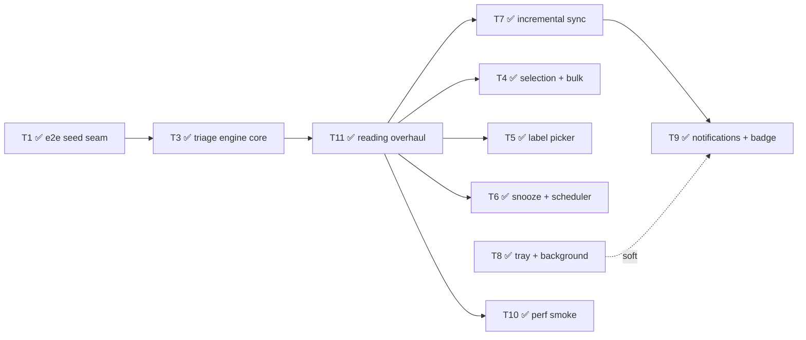

# M1 Completion Plan — Shipped Task Record and Exit Handoff

**Audience:** the engineer(s) closing M1 (triage core) and preparing the M2 handoff.
**Basis:** [SPEC.md](SPEC.md) v0.11 §8 M1 and the implementation merged through PR #21.
**Revised 2026-08-12:** T1–T11 are shipped. The sanitized HTML work tracked as T2 shipped across PRs #7 and #11; T9 shipped in PR #20; PR #21 refined inbox grouping, pane focus, compact rows, and HTML/CID rendering. **All planned M1 feature tasks are implemented.** M1 remains in exit audit until the remaining command-registry/CI cleanup and real-Gmail/real-OS checks below are complete.
**Ground rules:** read [AGENTS.md](../AGENTS.md) first. Every task below is one PR, and no PR is done until `npm run verify` is green. When a task says "spec F4", that's a section of SPEC.md — read it before starting the task.

---

## Where we are

| M1 item (SPEC §8) | Status |
|---|---|
| Apply Dispatch direction (D6) | ✅ shipped (#3) |
| E2E seed seam (enabler) | ✅ **T1** (#6) |
| Triage verbs E/#/S/U/! + auto-advance + `Z` undo + durable queue | ✅ **T3** (#8) |
| Tray/background mode + launch at login | ✅ **T8** (#9) |
| Sanitized HTML mail rendering | ✅ shipped (#7, completed by **T11** in #11) |
| Reading view: on-demand split layout (F3 v0.11, §9 #7/#9) | ✅ **T11** (#11; refined #21) |
| Full message display: recipients, attachments, quote/signature collapse (F3 v0.11) | ✅ **T11** (#11; refined #21) |
| Label verb (`L`) | ✅ **T5** (#13) |
| Selection + bulk | ✅ **T4** (#12) |
| Snooze (`H`) + scheduler | ✅ **T6** (#14; bulk-selection fix #16) |
| Incremental sync (F2 "offline correctness") | ✅ **T7** (#15) |
| Basic notifications + unread badge | ✅ **T9** (#20) |
| Post-M1 inbox and mail-rendering refinements | ✅ #21 |

Supporting: ✅ **T10** perf smoke shipped (#18). Push-vs-polling is settled on paper now — SPEC §9 #8; don't reopen it in reviews.

---

## Task graph and parallelization



The `T11 →` edges record the product ordering used during implementation (only `T7 → T9` is a hard technical dependency).

**Order from here:**

1. Complete **T12**, the M1 closeout task below: command-registry coverage, CI unit-test wiring, and clean visual artifacts.
2. Execute and record the real-Gmail airplane-mode/relaunch smoke and real-OS notification click-through smoke.
3. Close the M1 exit checklist; then begin M2 with the crash-safe composer/draft foundation.

---

## Global rules (every task)

1. **Migrations are an append-only array** (`src/main/db/migrations.ts`). Never edit a shipped entry. The migration index = position in the array, so **merge order decides numbering** — if a parallel task merged a migration before yours, rebase and your SQL simply becomes the next array element. Two tasks must never share one migration. T11's owner-authorized, dev-only v5 rewrite is the sole pre-release exception: existing local DBs must be wiped and resynced, and later tasks must not copy that pattern.
2. **IPC has three parts** — a capability is added in `src/main/index.ts` (`ipcMain.handle`), `src/preload/index.ts` (bridge method), and `src/shared/` (types). All three in the same commit. The renderer never imports from `src/main/`.
3. **Mail content is untrusted.** Outside T11's sanitized iframe, body content goes into text nodes only. Never `dangerouslySetInnerHTML`.
4. **Select on `data-testid`** in e2e; add testids for every new interactive element. Never select on Tailwind classes.
5. **Mock mode keeps working.** Signed-out without a seed = the browser-preview mock inbox (`mockData.ts`). New features may be inert there (verbs no-op), but it must render and navigate. The existing smoke tests enforce this.
6. **After UI changes, look at the screenshot** (`e2e/.artifacts/inbox.png`, plus any you add). "Tests pass" is not the same as "looks right".
7. **From T3 on, every user-facing action is a registered command** in the command registry (T3 introduces it). This is the F5 invariant — the M3 palette will assert it.
8. **If your task changes the verify pipeline or harness behavior, update AGENTS.md** in the same PR (it's the working agreement).
9. Commit style, formatting, quotes: Biome enforces; the pre-commit hook auto-fixes staged files.

---

## T1 — E2E seed seam: real-store tests without credentials

**Depends on:** nothing · **Unblocks:** T2, T3 (and everything after) · **Parallel with:** T8

### Why

Today the mock inbox lives inside the renderer (`mockData.ts`) and never touches SQLite or IPC. Every triage feature we're about to build lives in the main process (reducer, queue, scheduler). If tests drive the mock, they bypass the entire correctness core. This task adds a way to boot the app against a **seeded real store** — renderer → IPC → SQLite, no Google, no tokens.

### Design (decided)

- New env var **`ATTN_TEST_SEED`** = path to a JSON fixture. Honored **only** when `ATTN_TEST_USER_DATA` is also set — the seam must be dead code in production.
- Seeding goes through the **same write path as real sync** (`persistThread`), so tests exercise production persistence, not a parallel test-only insert.
- Seeded mode reports `authStatus()` as `{ configured: false, signedIn: true, email: <seed account> }`. That combination is impossible in real life and flips the renderer into "real mode" (reads via IPC) with zero renderer changes.
- Seeding is **idempotent-by-skip**: if the `accounts` table is non-empty at boot, skip the import. This is what makes relaunch tests meaningful (state from the previous run survives; the seed doesn't stomp it).

### Implementation guide

1. **Extract `persistThread`** from `src/main/sync/backfill.ts` into a new `src/main/sync/persist.ts` (export `persistThread(db, accountId, thread)`; backfill imports it). Pure move, no behavior change. T7 will reuse it for history sync — that's why it moves now.
2. **New `src/main/dev/seed.ts`** (main process):
   - Fixture shape (friendly to write by hand; the loader converts to the `GmailThread` shape from `src/main/gmail/parse.ts` — base64url-encode `bodyText` into `payload.body.data`, build `From`/`To`/`Subject` headers):

     ```json
     {
       "account": "seed@attn.test",
       "labels": [{ "id": "Label_1", "name": "receipts", "type": "user" }],
       "threads": [
         {
           "id": "t-roadmap", "historyId": "1000",
           "messages": [
             {
               "id": "m1", "labelIds": ["INBOX", "UNREAD", "IMPORTANT"],
               "internalDate": "1754800000000",
               "from": "Maya Lin <maya@example.com>", "to": "me@attn.test",
               "subject": "Q3 roadmap review", "snippet": "Heads up…",
               "bodyText": "Full plain-text body…"
             }
           ]
         }
       ]
     }
     ```
   - `loadSeed(db, path): string` — inserts the account row + labels, converts each thread and calls `persistThread`, returns the account id. Log `[seed] loaded N threads for <account>` (the e2e `mainLog` fixture can assert it).
3. **`src/main/index.ts`:**
   - After `openDatabase`: if `testUserData && process.env.ATTN_TEST_SEED` and the `accounts` table is empty → `seedAccountId = loadSeed(db, path)`.
   - `currentAccountId()`: `return seedAccountId ?? loadTokens(...)?.email ?? null`.
   - `authStatus()`: when `seedAccountId` is set, return `{ configured: false, signedIn: true, email: seedAccountId }`.
   - `startSync()`: add an early `if (seedAccountId) return` (belt-and-braces; `makeClient()` already returns null without tokens).
4. **`e2e/electron.ts`:**
   - Add a Playwright **option fixture** `seed?: string` (`seed: [undefined, { option: true }]`). When set, boot resolves it against `e2e/` and passes `ATTN_TEST_SEED` in the env. Specs opt in with `test.use({ seed: 'fixtures/seed-inbox.json' })`.
   - Add a **`relaunch()`** helper to the boot fixture: closes the current app, launches a fresh one against the **same** userData dir, and swaps `boot.app`. T3 and T6 need it for durability tests. (Note: `page` fixture holds the first window — have `relaunch` return the new `{ app, page }` rather than mutating fixtures other tests hold.)
5. **New `e2e/fixtures/seed-inbox.json`:** ~8 threads — a multi-message thread, unread/read mix, one starred, one with `hasAttachment` semantics (a part with a `filename`), one user label. Keep `internalDate`s fixed; don't assert exact rendered time strings.
6. **New `e2e/seeded.spec.ts`:** boots seeded; asserts the list renders fixture threads **from the DB** (row count, first-row sender), unread count matches, `Enter` shows a conversation whose body came over IPC, and `main.log` contains the seed line.

### Done when

- Seeded spec green; all existing smoke tests untouched and green; `npm run verify` green.
- AGENTS.md "How the e2e harness works" gains two lines: `ATTN_TEST_SEED`, and the relaunch helper.

---

## T2 — Sanitized HTML mail rendering *(absorbed by T11 Part A — do not run standalone)*

> **Status:** completed inside T11. The design and implementation guide below remains the contract for the sanitizer/iframe/CSP details.

**Depends on:** T1 · **Spec:** M1 "first item", §6 *HTML mail rendering*, decision log #5

### Why

Triaging means reading real mail, and most real mail is HTML. Today HTML bodies are regex-stripped to text (`stripHtml` in `src/main/gmail/parse.ts`) — newsletters and receipts are barely readable. This is also the scariest attack surface in the app; we do it now, carefully, with hostile-input tests.

### Design (decided — don't relitigate)

- **Store raw HTML at sync time; sanitize at render time.** Sanitizer upgrades then apply retroactively to already-cached mail.
- Sanitize with **DOMPurify** in the renderer, render into an **`<iframe srcdoc>`** with `sandbox="allow-same-origin allow-popups allow-popups-to-escape-sandbox"`. **Never `allow-scripts`.** `allow-same-origin` is required so the parent can measure content height; it's safe *because* scripts can't run — the mail document is inert.
- **Remote images load by default** (decision log #5). The block-toggle arrives with the settings surface (M4).
- HTML mail renders on a **white card** regardless of theme for M1. Dark-mode sanitize/invert is F14 work at M3. Plain-text messages keep the current themed text-node path.
- The original T2 path left `cid:` inline images unresolved. PR #21 later added safe resolution through cached/signed-in attachment data; Part D records the shipped behavior.

### Implementation guide

1. **Migration (next array index):** `ALTER TABLE messages ADD COLUMN body_html TEXT;`
2. **`src/main/gmail/parse.ts`:** add `extractBodyHtml(payload): string` — same walk as `extractBodyText`, but collect raw `text/html` parts (joined). Keep `extractBodyText` as is (it stays the plain-text fallback and, later, the FTS source).
3. **`src/main/sync/backfill.ts` / `persist.ts`:** store `body_html` in the message upsert (and in the `ON CONFLICT` update set). In `fetchExternalBodies`, when the fetched external part is `text/html`, store the raw HTML into `body_html` *and* the stripped text into `body_text`.
4. **`src/main/dev/seed.ts` + fixture:** support optional `bodyHtml` per message. Add a **hostile fixture message**: `<script>`, ``, a `javascript:` link, a `<form>`, a remote ``, an inline-styled table.
5. **`src/shared/mail.ts` + `src/main/db/queries.ts` + preload types:** `ConversationMsg` gains `bodyHtml: string | null`.
6. **Renderer — new `src/renderer/src/MessageBody.tsx`:**
   - `bodyHtml == null` → exact current text-node rendering (move it here).
   - Otherwise: `DOMPurify.sanitize(html, …)` with defaults plus `FORBID_TAGS: ['form','input','button','select','textarea']`, `ADD_ATTR: ['target']`; allow `<style>` (CSS can't execute, and its `url()` exposure equals remote images, which we allow). DOMPurify already strips `on*` handlers, `javascript:` URLs, and `<script>`.
   - Wrap in srcdoc: `<base target="_blank">` + a minimal reset (readable sans, 14px, white bg, `img { max-width: 100% }`).
   - Height: on iframe `load`, read `contentDocument.documentElement.scrollHeight`, set the iframe height; attach a `ResizeObserver` to `contentDocument.body` for late-loading images.
   - `data-testid="html-body-frame"`.
7. **Links:** `<base target="_blank">` + `allow-popups-to-escape-sandbox` routes clicks through `window.open` → the existing `setWindowOpenHandler` in `src/main/index.ts` (opens system browser, denies in-app). No `allow-top-navigation`, so in-place navigation is impossible. Verify by clicking in a manual run.
8. **CSP check (`src/renderer/index.html`):** srcdoc iframes inherit the parent CSP. Current policy blocks remote images (`img-src 'self' data:`). Extend to `img-src 'self' data: https: http:`. If the iframe itself is blocked, add `frame-src 'self' about:`. CSP violations appear as renderer console errors — the `page` fixture fails the test, so you'll know immediately.
9. **Dependency:** `npm i dompurify` (v3+, ships its own types).

### Testing

- `e2e/html-mail.spec.ts` (seeded): open the hostile thread; via `page.frameLocator('[data-testid="html-body-frame"]')` assert: zero `<script>` elements, no element with `onerror`, no `javascript:` hrefs, no `<form>`; the styled table *did* survive. Assert a plain-text message in the same fixture still renders as a text node (no iframe).
- Add a `conversation.png` screenshot artifact alongside `inbox.png`; look at it.

### Done when

Hostile-input assertions green; text-mail path unchanged; renderer console clean (fixture enforces); `npm run verify` green; screenshot reviewed.

---

## T3 — Triage engine core: reducer, durable queue, E/#/S/U/!, auto-advance, undo

**Depends on:** T1 · **Parallel with:** T2 · **Spec:** F4, F2 (action queue), §6 (one reducer)

### Why

This is the product. Everything else in M1 hangs off the machinery built here: one local reducer, a durable `action_queue`, an executor, an undo stack, and the keyboard verbs.

### Design (decided)

- **One reducer, two sources (SPEC §6):** a single `applyThreadDelta` mutates local state for *both* optimistic user actions (now) and server history events (T7). Local-first means the optimistic path *is* the local DB write — SQLite is synchronous and local, comfortably inside the 16ms feedback budget.
- **The queue stores intent, not SQL:** rows are per-thread label/trash operations that map 1:1 onto Gmail endpoints. Label ops are idempotent, so crash-recovery is "re-run anything in flight" — the exactly-once machinery is only needed for send (M2 outbox).
- **Undo is a session-scoped stack in the main process** (spec: last 50, includes bulk). Undoing performs precise per-thread inverse actions (computed from pre-state at perform time) and does *not* push onto the stack.
- **Trash uses the dedicated endpoints** (`threads.trash`/`untrash`), not label modify. Spam = modify `+SPAM −INBOX`.
- **A minimal `MailProvider` interface starts here** (D1): the executor calls `modifyThread`/`trashThread`/`untrashThread` on the interface; `GmailMailProvider` wraps `GmailClient`. T7 extends the same interface with sync methods.
- **Verbs are inert in mock mode** (signed-out, unseeded). Real mode only.

### Implementation guide

**Migration (next index):**

```sql
CREATE TABLE action_queue (
  id          INTEGER PRIMARY KEY AUTOINCREMENT,
  account_id  TEXT NOT NULL,
  kind        TEXT NOT NULL,             -- 'modifyLabels' | 'trash' | 'untrash'
  thread_id   TEXT NOT NULL,
  payload     TEXT NOT NULL DEFAULT '{}',-- modifyLabels: {"add":[…],"remove":[…]}
  state       TEXT NOT NULL DEFAULT 'pending',  -- 'pending' | 'inflight' | 'failed'
  attempts    INTEGER NOT NULL DEFAULT 0,
  last_error  TEXT,
  created_at  INTEGER NOT NULL
);
CREATE INDEX idx_action_queue_pending ON action_queue (account_id, state, id);
```

(Successful rows are deleted, not kept — the table stays small and "pending count" is a cheap `COUNT(*)`.)

**Store layer — `src/main/store/mutate.ts`:**

```ts
export interface ThreadDelta { threadId: string; add: string[]; remove: string[] }
export function applyThreadDelta(db: Db, accountId: string, d: ThreadDelta): void
```

One transaction: update `thread_labels`; recompute the denormalized `threads` flags (`is_unread` from UNREAD, `is_starred` from STARRED); when UNREAD is added/removed, update `messages.is_unread` for the thread (all messages — thread-level approximation is fine for M1). INBOX membership already drives `listInboxThreads`, so archive = removing INBOX just works.

**Actions — `src/main/actions/index.ts`:**

```ts
export type TriageAction =
  | { kind: 'archive' | 'trash' | 'spam'; threadIds: string[] }
  | { kind: 'star' | 'markUnread'; threadIds: string[]; on: boolean }
  | { kind: 'label'; threadIds: string[]; add: string[]; remove: string[] }   // T5 uses this
  | { kind: 'restoreInbox'; threadIds: string[] }                             // undo of archive; T6 reuses
  | { kind: 'untrash'; threadIds: string[] }
```

`performTriage(db, accountId, action): { undo: TriageAction[]; label: string }`:
- Reads pre-state per thread (so bulk undo is exact even when pre-states differ — e.g. "star 5" where 2 were already starred).
- Maps to `ThreadDelta`s → `applyThreadDelta` each (one enclosing transaction for bulk).
- Enqueues one `action_queue` row per thread.
- Returns per-thread inverse actions plus a human label (`'Archived'`, `'3 trashed'`, `'Starred'` …).

Undo stack (module state in main): array of `{ label, undo: TriageAction[] }`, cap 50. `undoLast()` pops and performs each inverse **through `performTriage` minus the stack push** (factor accordingly).

**Executor — `src/main/actions/executor.ts`:**
- Constructed with `db` and a `() => MailProvider | null` factory (null when signed out / seeded — executor idles, rows stay pending; this is what makes offline e2e work).
- Drain loop, one row at a time, triggered by: enqueue, boot, provider-became-available, retry timer.
- Per row: `state='inflight'` → provider call → delete row. `GmailApiError` 404 → thread gone, delete row. Other 4xx → `state='failed'` + `last_error` (don't retry forever). Network errors / 5xx / 429 → back to `pending`, `attempts++`, retry with capped backoff (the client's own retry handles short bursts; the executor's timer handles offline: 5s → 30s → 60s cap).
- Boot recovery: any `inflight` rows (crash artifacts) flip back to `pending` — idempotent ops make re-running safe.

**Gmail client (`src/main/gmail/client.ts`):** refactor `get` into a shared `request(method, path, { params, body })`; add `post<T>(path, body)`. Same 401-refresh + backoff behavior. New `src/main/gmail/provider.ts` implements `MailProvider` (interface in `src/main/sync/provider.ts`): `modifyThread` → `POST /threads/{id}/modify`, `trashThread` → `POST /threads/{id}/trash`, `untrashThread` → `POST /threads/{id}/untrash`.

**IPC (all three layers):**
- `mail:triage(action: TriageAction)` → `{ label: string }` — applies, enqueues, broadcasts `mail:changed`, pushes undo.
- `mail:undo()` → `{ label: string } | null`.
- `mail:getPendingActionCount()` → `number` — this is a real product surface (local-first visibility), not a test hook: the footer shows `· N pending` when > 0. The e2e suite asserts on it.

**Renderer:**
- **Command registry — `src/renderer/src/commands.ts`** (the F5 groundwork): `{ id, title, shortcut, context: 'list' | 'overlay' | 'global', run(ctx) }`, plus `register…`/`listCommands()`/`matchKey(e, context)`. Refactor the existing keydown handler in `App.tsx` to dispatch through it (J/K/Enter/Esc become registered commands too). The M3 palette will render `listCommands()`.
- Verbs (list *and* overlay contexts): `e` archive · `#` trash · `!` spam · `s` star-toggle · `u` unread-toggle. Toggles read the selected row's current state.
- **Open-marks-read for real:** replace the renderer-local `readIds` set — opening a conversation issues `markUnread { on: false }` if the thread is unread. Delete the `readIds` machinery; unread counts now come from the DB. (This makes the queue readout honest.)
- **Auto-advance (F4/F3):** after archive/trash/spam, refresh; keeping the same selection *index* naturally lands on the next row (the triaged row is gone from the refetched list — the existing clamp effect handles the end of the list). If the overlay is open it now shows the new selection; if the list is empty, close the overlay. This satisfies "never lands on a stale row" because refresh and advance are the same render.
- **Undo:** `z` → `mail:undo` → toast. Minimal toast component (`data-testid="toast"`, bottom-center, ~4s) — M2's undo-send reuses it.
- Footer: pending-count note when > 0.

**Unit tests (this task introduces the runner):**
- `npm i -D vitest`; `"test:unit": "vitest run"`; wire into verify: `typecheck → biome ci → test:unit → e2e`. **Update the AGENTS.md verification-contract table in this PR.**
- Vitest runs under plain Node, and the Electron-ABI `better-sqlite3` **cannot load there** — so unit tests cover **pure modules only** (no `electron`, no db imports): inverse computation in `performTriage` (factor the pure part out), action→endpoint mapping with a mock `MailProvider`, and `parse.ts` (plain Node already). DB-touching correctness lives in e2e via the seed seam. Colocate as `src/main/**/*.test.ts` (already inside `tsconfig.node.json`'s include).

### Testing (e2e, seeded — `e2e/triage.spec.ts`)

- `e` on row 1 → row disappears, selection is on the old row 2, pending count = 1, queue readout updated.
- `s` / `u` toggle flags and the readout; `#` removes the row.
- `z` after archive → thread back in the list (net local state restored; pending count reflects both queued ops — assert exact value).
- **Durability:** archive 3 → `relaunch()` (T1 helper) → threads still archived locally, pending count still 3 (seed skipped because the store is non-empty), no rows lost or duplicated. This is F2's airplane-mode criterion, minus the network half (T7's manual smoke covers that).
- Verbs in the overlay work and auto-advance the open conversation.
- Mock mode: verbs do nothing, no console errors (existing suite must stay green).

### Done when

All of the above green; `verify` includes the unit step; AGENTS.md updated; command registry in place with every existing + new command registered.

---

## T4 — Selection and bulk triage

**Status:** shipped in PR #12. · **Depends on:** T3 · **Spec:** F4 (`X`, `Shift+J/K`, bulk undo)

### Implementation guide

- Renderer state: `selectedIds: Set<string>` + an anchor index. `x` toggles the focused row; `Shift+J`/`Shift+K` extend from the anchor; `Shift+click` extends; `Esc` clears the selection *before* it means "close pane" (selection non-empty → clear and stop).
- Visual: selected rows get a distinct left-edge/check state (`data-checked`), header shows an `N selected` chip (`data-testid="selection-count"`).
- Verbs: when the selection is non-empty, every triage command (T3's and later T5/T6's) targets `[...selectedIds]` instead of the focused row, then clears the selection. `performTriage` already takes `threadIds[]` and already returns per-thread inverses — **one stack entry per bulk action**, so a single `z` reverses the whole bulk (F4 acceptance).
- No auto-advance after bulk; keep the focused index clamped.
- Registry: register `x` and the extend variants as commands.

### Testing

e2e: select 3 with `x`/`Shift+J`, archive → all 3 gone in one action, pending count 3, one `z` restores all 3. Selection chip appears/disappears. `Esc` clears selection without closing anything.

### Done when

Bulk archive + single-undo criterion (F4) demonstrated in e2e; `verify` green.

---

## T5 — Label picker (`L`)

**Status:** shipped in PR #13. · **Depends on:** T3 (uses the generic `label` action) · **Spec:** F4

### Implementation guide

- New IPC `mail:listLabels()` → `{ id, name, type }[]` from the `labels` table (user labels plus a curated system set: STARRED/IMPORTANT are flags, not picker entries — show user labels only for M1).
- Centered modal panel (modals stay right for pickers even after T11's split-view change): search input filters as you type; ArrowUp/Down move; Enter toggles the highlighted label on the target threads (focused row or T4 selection). Checkmark states: on-all / on-some / off.
- Apply via `mail:triage` with `{ kind: 'label', add: […], remove: […] }` — no engine changes.
- Keyboard: `l` opens (register as a command; works with and without the pane open). The existing keydown guard already ignores keystrokes when an `INPUT` is focused, so the search field won't trigger verbs. `Esc` closes the picker (before it closes the conversation pane).
- Undo: label changes ride T3's stack automatically.
- Fixture: T1's seed already carries a user label; add a second so on-some states are testable.

### Testing

e2e: open picker on a thread, add a label → picker state and a row chip (add a small label chip to rows or the pane header — your call with a testid) reflect it; `z` reverses; picker search narrows; keys inside the search input don't trigger verbs.

### Done when

Picker works on single + bulk targets; label ops queue like any triage op; `verify` green.

---

## T6 — Snooze (`H`): picker, scheduler, Snoozed view

**Status:** shipped in PR #14; bulk-selection correction shipped in PR #16. · **Depends on:** T3 · **Spec:** F4 (snooze), D2 (catch-up), F3 (chips)

### Design (decided — v1 contract)

- **The local `reminders` table is the v1 source of truth** for what's snoozed and when it returns. Snoozing therefore looks like a plain archive in Gmail web. Cross-device labels, exact-time return while the desktop is off, and reinstall recovery move together to the v1.5 companion script (D2/F7); SPEC v0.11 records that product boundary. The existing `TODO(T7+)` is historical and should be removed during T12 documentation/code-comment cleanup rather than treated as an M1 feature gap.
- The **scheduler** lives in main (`src/main/scheduler.ts`) and owns exactly one armed timer: the next due reminder (re-arm ≤ 24h out to dodge the 32-bit `setTimeout` cap). On fire *or on boot* (catch-up, D2): every `pending` reminder with `due_at <= now` returns.
- **Returning** = reminder `state='returned'` + `applyThreadDelta` add INBOX + enqueue the server op + `mail:changed`. The "returned" chip renders while `state='returned'`; opening or triaging the thread settles it (`state='done'`).

### Implementation guide

**Migration (next index):**

```sql
CREATE TABLE reminders (
  account_id TEXT NOT NULL,
  thread_id  TEXT NOT NULL,
  kind       TEXT NOT NULL DEFAULT 'snooze',
  due_at     INTEGER NOT NULL,
  created_at INTEGER NOT NULL,
  state      TEXT NOT NULL DEFAULT 'pending',  -- pending | returned | done | canceled
  PRIMARY KEY (account_id, thread_id, kind)
);
CREATE INDEX idx_reminders_due ON reminders (account_id, state, due_at);
```

- **IPC:** `mail:snooze({ threadIds, dueAt })` (validates `dueAt` is a number; past values are allowed and simply return on the next scheduler pass — that's also the e2e seam), `mail:listSnoozed()` → thread rows joined with `due_at`.
- Snooze flow: upsert reminders, archive locally (reuse T3's archive delta + queue), push `{ label: 'Snoozed', undo: [{ kind:'unsnooze'… }] }` — add an `unsnooze` action (delete reminder + restore INBOX) to the action union.
- **Picker UI:** centered modal listing presets — Later today (+3h), Tonight (19:00), Tomorrow (09:00), This weekend (Sat 09:00), Next week (Mon 09:00) — plus a free-text row parsed with **chrono-node** (`npm i chrono-node`; renderer-side parse, show the resolved date before confirming). `h` opens it (command registry; works with and without the pane open, and on T4 selections).
- **Snoozed view:** minimal view switching — `g` starts a chord (500ms window), then `h` → snoozed view, `g i` → inbox. Renderer keeps `view: 'inbox' | 'snoozed'`; snoozed view lists `mail:listSnoozed` ordered by `due_at` with a due chip; triage verbs still work there (archive/unsnooze). Header shows which view you're in (`data-testid="view-title"`). The complete F3 system-mailbox set (All Mail/Sent/Drafts/Starred/Spam/Trash) is the M3 follow-up below — do not expand T6 beyond Inbox/Snoozed.
- **Chips (F3):** snoozed-return chip on list rows (`data-testid="chip-returned"`); due chip in the snoozed view.
- **Wake-on-reply (F4):** implement `wakeThread(threadId)` on the scheduler (returns it immediately if pending) and export it — **T7 calls it** when history shows a new message on a snoozed thread. Don't build the detection here.

### Testing

- e2e (seeded): `h` → preset → thread leaves inbox, appears in snoozed view with due time; `z` unsnoozes.
- Return path: snooze with `dueAt = now + 1500ms` (via the picker's free-text or a direct `mail:snooze` invoke) → `expect.poll` the thread back in the inbox with the returned chip.
- **Catch-up (D2):** snooze `+2s`, `relaunch()` after 3s → thread is back in the inbox on boot. This is the F4 "or immediately on next launch" criterion.
- Unit: preset-date computation (pure function, freeze `Date.now`).

### Done when

Snooze/return/catch-up/undo all demonstrated; snoozed view navigable by keyboard; `verify` green.

---

## T7 — Incremental sync: history polling, windowed backfill, reconciliation

**Status:** shipped in PR #15. · **Depends on:** T3 (reducer, provider, executor) · **Spec:** F2, §6

### Design (decided)

- **Thread-refetch strategy:** each poll cycle collects the set of thread ids affected by history records, then re-fetches each thread once (`getThread` → `persistThread` — the T1 extraction) instead of applying fine-grained message-level mutations. Self-healing, simple, and cheap at a 15s cadence. A refetch that 404s = thread deleted → remove it locally (`deleteThread` in `persist.ts`).
- **Server wins, pending replays on top (F2):** after refetching a thread, re-apply the local deltas of any still-pending `action_queue` rows for that thread (query + `applyThreadDelta`). This closes the optimistic-revert window without real conflict machinery.
- **historyId expiry (404 on `history.list`)** → delta re-list: run the windowed backfill again **plus reconcile INBOX membership** — fetch the current server-side INBOX thread-id set; any local thread still labeled INBOX but absent server-side loses INBOX locally. (Without this, remotely-archived mail would haunt the inbox forever.)
- **Cadence:** 15s when any window is focused, 60s otherwise (check at tick time; T8's hidden windows naturally fall into 60s). Ticks are skipped while a backfill or a previous tick is still running — strictly serialized.
- **MailProvider grows** sync methods: `getProfile`, `listLabels`, `listThreadIds(q, pageToken)`, `getThread(id)`, `listHistory(startHistoryId, pageToken)`. Backfill and poller consume the interface; only `provider.ts` touches `GmailClient`.

### Implementation guide

1. **`src/main/sync/poller.ts`:** split into a pure planner and an effectful shell —

   ```ts
   // pure — unit-testable with recorded history fixtures:
   export function planCycle(records: HistoryRecord[]): {
     refetchThreadIds: string[]
     newMail: { threadId: string; messageId: string }[]   // messagesAdded with INBOX+UNREAD, not SENT (self)
   }
   ```

   The shell pages `listHistory` to exhaustion, runs the plan, refetches, replays pending deltas, calls `scheduler.wakeThread` for snoozed threads with new mail (T6's hook), stores the max `historyId`, broadcasts `mail:changed` once per cycle, and emits `newMail` on an internal `EventEmitter` (T9 subscribes; nobody listens yet — that's fine).
2. **Windowed backfill (F2):** replace the M0 caps in `backfill.ts` — list INBOX threads with `q: 'newer_than:12m'`, page to completion, and persist the `pageToken` into `sync_state.backfill_cursor` as you go so a killed app **resumes** instead of restarting. T7 implements the 90-day body window, but on-demand hydration for older metadata-only threads remains deferred to M3's bodies/FTS work. Remove the 15-minute skip; after a completed backfill, freshness is the poller's job.
3. **Wiring (`src/main/index.ts`):** start the poller after a successful backfill and whenever a signed-in app boots with `backfill_cursor='done'`; stop it on sign-out (tie into `authSessionGeneration`). Poller absence (mock/seeded/signed-out) must be a silent no-op.
4. Executor nudge: a completed cycle with pending queue rows kicks the executor (cheap way to retry quickly after coming back online).

### Testing

- **Unit (the real coverage here):** `planCycle` against recorded history fixtures (checked-in JSON): labelsAdded/Removed, messagesAdded incl. self-sent (excluded from `newMail`), messagesDeleted, mixed pages, duplicate thread ids deduped. Reconciliation set-math (`local INBOX ids − server INBOX ids`) as a pure function with tests. This is the AGENTS.md "sync-engine correctness gets unit tests against a mock MailProvider" requirement.
- e2e can't exercise Gmail: assert only that seeded/signed-out boots never start a poller (no new log lines, no errors).
- **Manual smoke against real Gmail (documented in the PR):** archive in Gmail web → local within one poll; archive locally offline → relaunch online → Gmail reflects it and F2's airplane-mode criterion passes end-to-end; snoozed thread gets a reply → returns.

### Done when

Unit suite covers the planner + reconciliation; manual smoke checklist executed and pasted into the PR; `verify` green.

---

## T8 — Tray, background mode, launch at login

**Depends on:** nothing (coordinate `src/main/index.ts` edits with T3) · **Parallel with:** everything · **Spec:** F16

### Design (decided)

- **Quit-intent flag:** closing windows never quits; only explicit quit does (`Cmd+Q`/tray Quit set `quitting = true` in a `before-quit` handler; `window-all-closed` no longer calls `app.quit()` on any platform). Windows: window `close` event hides to tray. macOS: standard close-keeps-running (Dock), **no** menu-bar icon in M1 (spec: optional, default off — defer entirely).
- **Tray is Windows-only** (spec targets win/mac; Linux is a dev platform — don't build a Linux tray, and keep all tray code behind `process.platform === 'win32'` so e2e on Linux exercises the lifecycle without it).
- Tray menu: Open Inbox · Compose (disabled, "M2") · Pause notifications (added by T9) · Quit. Double-click opens.
- **Launch at login** (`app.setLoginItemSettings({ openAtLogin: true, openAsHidden: true })`): default **on**, but **only when `app.isPackaged`** — dev builds and e2e must never install themselves into anyone's login items. Hidden launches (`wasOpenedAsHidden` on macOS, a `--hidden` arg you pass via login-item args on Windows) create the window with `show: false` deferred — no window flash.
- **Settings storage:** first persistent setting → migration (next index): `CREATE TABLE settings (key TEXT PRIMARY KEY, value TEXT NOT NULL);` — app-global keys now (`launchAtLogin`); account-scoped keys later namespace as `acct:<id>:<key>` (schema-bikeshed deferred; SPEC §6's per-account settings arrive with the real settings surface at M4).

### Implementation guide

- New `src/main/background.ts` owning: quit flag, window close→hide (win32), tray construction (win32), login-item registration, and a `showMainWindow()` used by tray/activate/second-instance/notification-click (T9).
- `createWindow` gains a `show` option; keep the `ready-to-show` handler but respect hidden launches.
- Tray icon asset: `resources/tray.png` (16 + 32px, simple amber-dot-on-graphite glyph consistent with D6); load via electron-vite `?asset` import.
- **e2e pitfall (important):** with quit-on-close gone, Playwright's `app.close()` can hang waiting for exit. Update the `boot` fixture teardown to `await app.evaluate(({ app }) => app.quit())` before `close()`. Do this in *this* PR — it's this PR's behavior change. Verify the whole suite still tears down cleanly.

### Testing

e2e (Linux, no tray): close the window → `BrowserWindow.getAllWindows().length === 0` but the process is alive (evaluate still works); `app.quit()` via evaluate exits fully (fixture teardown asserts no hang — F16's "no orphaned processes"). Assert `getLoginItemSettings` is untouched in test runs (not packaged). Manual smoke on a real win/mac machine documented in the PR (tray menu, close-to-tray, reopen, quit).

### Done when

Lifecycle e2e green on Linux; manual win/mac checklist in the PR; fixture teardown updated; `verify` green.

---

## T9 — Notifications and unread badge

**Status:** shipped in PR #20. · **Depends on:** T7 (new-mail events) · soft on T8 (window focus/show helpers) · **Spec:** F12

### Design (decided)

- Subscribe to T7's `newMail` emitter. Per poll cycle: ≤ 3 new threads → one notification each (sender · subject · snippet); > 3 → one summary ("7 new conversations"). **Suppress entirely while a window is focused** (you're already looking at the inbox).
- Notification click → store a short-lived pending thread target, call `showMainWindow()` (T8), then notify the sandboxed renderer to consume it through the typed preload bridge. The renderer switches to Inbox, selects the row, and opens the conversation pane. Targets expire after 60s and clear on account changes so a stale click cannot redirect a later session.
- **Badge:** after every `mail:changed`, macOS `app.setBadgeCount(unreadInboxCount)`. Windows: static-dot `setOverlayIcon` + tooltip count — the numeric-count overlay bitmap is M4 polish (packaging milestone), noted as an accepted deviation. Guard platforms (Linux `setBadgeCount` returns false; ignore).
- Splits don't exist until M3, so M1 notifies for **all** INBOX new mail; per-split filtering arrives with F11.
- Tray menu (T8) gains "Pause notifications — 1h / until tomorrow" backed by a `settings` key the notifier checks.

### Implementation guide

New `src/main/notify.ts`: pure decision function `planNotifications(newMail, { focused, pausedUntil }): Notification[]` plus a thin shell using Electron's `Notification`. Preload: `mail.onFocusThread(cb)` consumes the pending target. Renderer: handler safely leaves Snoozed when necessary, selects the Inbox thread, and opens the conversation pane.

### Testing

Unit: notification planning, batching, candidate hydration, focus suppression, pause persistence, badge mapping, failure isolation, and pending-target expiry. E2E: focus-thread delivery selects and opens the intended Inbox row, survives window recreation, and safely leaves Snoozed; Linux badge calls remain inert. Manual exit smoke: a real notification on macOS/Windows clicks through to the intended Gmail thread.

### Done when

Automated task coverage and `verify` shipped green in PR #20. The real-OS click-through remains an M1 exit-checklist item because headless Electron cannot validate the OS notification center.

---

## T10 (stretch) — Perf smoke in CI

**Status:** shipped in PR #18. · **Depends on:** T3 · **Spec:** §7 (M1 absolute performance guardrails)

Generate a large seed fixture (~2,000 threads) in a script, boot seeded, and assert generous CI-safe ceilings that still catch order-of-magnitude regressions: triage keypress → row removed from DOM < 100ms; list render after boot < 1.5s; conversation open < 200ms (measure via `performance.now()` in `page.evaluate` around dispatched keys). The `@perf` suite stays out of the default local e2e run and currently runs as its own GitHub Actions job on pull requests and pushes. Rendering 2,000 unvirtualized rows provides the baseline for deciding when to implement F3's deferred 10k/60fps virtualization requirement before M2 daily-drivable sign-off.

---

## T11 — Reading experience overhaul: split view, HTML mail, full message display

**Status: shipped in PR #11; refined in PR #21.** · **Depends on:** T1/T3/T8 · **Spec:** F3 (v0.11), D6 (revised), §9 #7/#9 · **PRs:** [#11](https://github.com/stephenw310/attn/pull/11), [#21](https://github.com/stephenw310/attn/pull/21).

### Why

Product review (2026-08-11) found the reading experience wrong in shape and short on substance: the centered overlay doesn't work for reading real mail (SPEC §9 #7 has the reasoning), and message cards omit what every mail client shows — recipients, attachments, and quote/signature folding. This task fixes all of it in one pass, absorbing the in-flight HTML-rendering work, so every later renderer task (T4, T5, T6, T9) builds against the final reading surface instead of conflicting with it.

The implementation and its dogfood/review iterations live in one PR; the sections below now record the resulting contract rather than an aspirational build order.

### Part A — Rebase & finish HTML mail rendering (the old T2)

The T2 guide above is still the contract for sanitizer/iframe/CSP details. The rebase has three known traps:

1. **Dev-only schema exception.** T11 folds `body_html`, `recipients_json`, and `attachments_json` into v5. This deliberately changes a migration already used by development databases and is acceptable only because the owner authorized wiping/resyncing all local data; no v6 compatibility migration or backfill is part of this task. Any DB already stamped v5 must be deleted before testing the merged schema.
2. **`App.tsx` conflicts.** T3 rewired the keyboard through the command registry and T8/T3 touched main-process wiring. Re-express the `MessageBody` swap on top mechanically — don't fight the layout during rebase; Part B replaces the layout anyway.
3. **Seed-fixture collisions.** T3's triage specs assert exact fixture math (8 threads, "4 to zero", row order — e.g. Northstar Books at index 1 — and exact pending counts). Add the hostile-HTML content as an **additional message on an existing read thread** rather than a new thread; if any assertion must move, change it deliberately in the same commit with a comment.

### Part B — Layout: full-width list ⇄ on-demand split (F3 v0.11)

- Remove the centered overlay + backdrop. New structure: when a conversation is open, the root splits — list column left (fixed ~380px), `data-testid="conversation-pane"` right. Put `data-pane-open` on the list container so e2e and CSS key off one attribute.
- **Compact rows** when the pane is open: PR #21 refined them to one aligned line — selection marker, sender, labels/star + subject, then attachment/time; no snippet. Same `thread-row` testid, same selection/unread attributes.
- Conversation pane: thread position ("4 of 12") + `Esc` hint in its header (keep the existing `conversation-position` testid); responsive body measure `clamp(720px, 72vw, 1120px)` so wide windows are used without turning prose into an edge-to-edge line; message cards as today plus Parts C–E. The newest message is expanded, while every older message starts as a one-line summary and does not mount its body/HTML frame until expanded. Reserve the vertical scrollbar gutter so expanding a long message cannot shift the centered reading column.
- **Keyboard:** `Enter` opens into message focus; clicking a row keeps list focus; `Esc` closes the pane with selection and scroll intact. `←`/`→` switches the explicit pane focus. In message focus, `J`/`K` and unmodified ArrowUp/Down scroll the conversation 120px at a time; in list focus those keys move thread selection, make the pane follow, and reset the reused reading scroller to the new thread's top. Modifier+arrow chords are untouched. Keys from the sandboxed iframe are forwarded to the parent, but `Enter` remains unclaimed while the pane is open so a focused mail link keeps its native activation; recipient/attachment/trim buttons blur after click so no control can strand the global keyboard loop. `src/renderer/src/commands.ts` uses `'list' | 'global'` contexts, but T12 still needs to register or explicitly account for the focus/scroll paths currently handled before `matchKey`. Auto-advance is untouched (pane follows selection; empty list closes the pane).
- Start visuals from `design/explorations/b2-conversation-side.html` (the side-panel study already in the Dispatch language). Dimming is gone; the tie between panes is the selected-row highlight.
- **E2E contract:** `Esc` removes `data-pane-open`; compact rows keep sender, subject, and time on one line; message-focus keys scroll without changing the thread; `ArrowLeft` moves focus to the list, where J/K/arrows update selection and pane subject.

### Part C — Recipients: From/To/Cc/Bcc/Reply-To

- **`src/main/gmail/parse.ts`:** add `parseAddressList(raw): { name, email }[]` — split on top-level commas (respect quoted display names containing commas), reuse `parseAddress` per element, drop empties. Extract `To`, `Cc`, `Bcc`, `Reply-To` headers.
- **Migration v5 (single migration for the whole task):**

  ```sql
  ALTER TABLE messages ADD COLUMN body_html TEXT;
  ALTER TABLE messages ADD COLUMN recipients_json TEXT;
  ALTER TABLE messages ADD COLUMN attachments_json TEXT;
  ```
- **`persist.ts`:** store `recipients_json` = `{ "to": [{name,email}…], "cc": […], "bcc": […], "replyTo": […] }` (include in the upsert's `ON CONFLICT` set, like `body_text`). Expose via `queries.ts` + `shared/mail.ts` (`ConversationMsg.recipients`).
- **UI:** a full-width summary line under the sender — `to me, Priya · cc Daniel` (first names; "me" when the address is the account) — `data-testid="recipient-summary"`. Click toggles `data-testid="recipient-details"`: full addresses grouped by To/Cc/Bcc/Reply-To plus the full date; the control blurs after click so keyboard navigation continues.
- Bcc reality (document in a comment + PR body): Gmail only exposes Bcc on the user's *own sent copies* — other senders' Bcc never exists in the payload.
- Seed fixture: add `cc` to at least one message (extend the loader's fixture shape + conversion).

### Part D — Attachments: display + download

- **`parse.ts`:** `collectAttachments(payload): { attachmentId, filename, mimeType, sizeBytes, inlineData? }[]` — parts with a non-empty `filename` and either `body.attachmentId` or inline `body.data` (the same user-visible criterion drives `hasAttachment`). Inline parts receive a stable local `inline:<partId/path>` ID and derive their size from decoded bytes when Gmail omits it. Store in `attachments_json` (v5), but strip `inlineData` from `ConversationMsg` so raw bytes never cross into the renderer.
- **Message card:** filename + human-readable size chips render inside the same body surface (`data-testid="attachment-chip"`) and blur after click.
- **IPC (all three layers):** `mail:downloadAttachment({ messageId, attachmentId, filename })` → main process first looks for locally stored inline bytes; otherwise it requires a live signed-in client and calls `GET /messages/{id}/attachments/{attachmentId}`. Decode base64url, write to `app.getPath('downloads')` with collision-safe naming (`name (2).ext`), then `shell.showItemInFolder`, return `{ path }` or `{ error }`.
- **Filename is untrusted input crossing to the filesystem** — normalize it; strip path separators, control characters, and invalid Windows punctuation; reject empty/dot-only names; and prefix Windows device stems (`CON`, `NUL`, `PRN`, `COM1`…`LPT9`). This is a security boundary, treat it like the iframe.
- Seeded/offline behavior: locally delivered inline attachments remain downloadable; an uncached/out-of-line attachment returns `{ error }` → toast "Attachments download when signed in". e2e asserts chips render and the offline toast appears; a real out-of-line download is manual smoke.
- PR #21 resolves `cid:` inline images through a typed `mail:getInlineImage` bridge using cached inline bytes or the signed-in attachment path, with a 10MB response ceiling. Missing or malformed references remain inert broken-image placeholders; raw bytes never enter the renderer API.

### Part E — Quote & signature auto-collapse

- **Pure module** `src/renderer/src/mailTrim.ts`: `findTrimIndex(text): number | null` — earliest match wins: `\n-- \n` (the delimiter is part of the hidden signature); `/^On .{0,200} wrote:\s*$/m`; a trailing run of `>`-prefixed lines found by a reverse line scan; common mobile signatures ("Sent from my iPhone/Android/Galaxy…"). Never use a nested-quantifier regex for the quote run: parsing must stay linear for bottom-posted replies with thousands of quoted lines. Guard: if no authored content exists before the boundary, return null (never collapse a message to nothing).
- **HTML path:** sanitize once and keep one stable `srcDoc`. Probe for `.gmail_quote`, `.gmail_signature_prefix`, `.gmail_signature`, or `blockquote[type="cite"]`; insert a fixed-height marker immediately before the first match only when renderable content exists before it. Collapse by sizing the iframe to the marker boundary and expand by restoring its measured full height — do not rebuild/remount the frame. Horizontal overflow stays inside the frame and contributes scrollbar height to measurement.
- **UI:** a regular-font `...` button sits inline at the trim boundary inside the white body surface (`data-testid="mail-trim-toggle"`). It stays at exactly the same position expanded or collapsed; clicking again collapses and removes the extra gap. Attachment chips remain below it in the same surface.
- Unit tests (vitest, pure): signature delimiter, quote trail, both, neither, all-quote pathological case, `-- ` mid-line non-delimiter, and a large mid-message quote run that proves linear behavior.

### Part F — Dev-store note

The v5 columns populate only for newly synced mail, and this task intentionally does not append v6. Dev machines already stamped v5 must sign out, delete the local DB (or wipe the userData dir), and re-sync recipients/attachments/HTML. Seeded e2e is unaffected (fixtures import fresh every run). This is an explicit development-only choice, not a precedent for production migrations.

### Testing (rollup)

- **e2e:** updated smoke/triage/seeded specs (pane semantics); `html-mail.spec.ts` per the T2 contract; new `reading.spec.ts` covers full-width recipients, attachment chips + offline toast, simple-HTML padding/fallback contrast, an all-quote HTML guard, stable expand/collapse position, stable scrollbar gutter, older-message body deferral, pane focus, iframe key forwarding without stealing link Enter, per-thread scroll reset, post-click keyboard continuity, modifier-arrow behavior, and the responsive reading width.
- **Unit:** `parseAddressList`, remote + inline `collectAttachments` (payload-walk fixtures), `findTrimIndex` including the linear-time regression, and cross-platform attachment filename sanitization.
- **Screenshots:** `inbox.png`, `reading.png`, `simple-mail.png`, and `label-picker.png` — look at all four, per global rule 6. Screenshot setup must not leave a browser text-selection range over the content.
- **Manual smoke, signed in:** a real HTML newsletter renders; an attachment downloads and reveals; recipients expand on a group thread; a real Gmail reply chain collapses its quote + signature.

### Done when

- Implementation and review fixes shipped in **PRs #11 and #21**; both merge gates are complete.
- SPEC v0.11 F3's T11 acceptance criteria demonstrably hold (pane/focus semantics, recipients inspectable, remote + inline attachment discovery, CID resolution, and safe/stable collapse); the newly explicit system-mailbox criteria remain assigned to M3.
- Migration v5 is the only T11 schema entry; the required dev-DB wipe is documented instead of compatibility work.
- The status table is updated. Final artifact sign-off remains in T12 because the current `simple-mail.png` capture contains an accidental text-selection highlight from test setup.

---

## T12 — M1 closeout: registry, CI, artifacts, and manual evidence

**Status: next.** · **Depends on:** all shipped M1 tasks · **Spec:** §8 M1 exit status and F5 engineering rule

This is a bounded closeout task, not a new product feature:

1. **Documentation:** keep SPEC v0.11, this task record, README, and AGENTS aligned with PRs #20/#21 and the local-only v1 snooze decision. Remove stale implementation comments that still promise a T7 Gmail snooze label.
2. **Command registry:** account for every keyboard path, including pane focus and context-sensitive reading/list movement, in `listCommands()` or document and test an explicit non-palette navigation primitive. Add unit coverage so the registry cannot silently drift from the keyboard map before M3 renders it in the palette.
3. **CI contract:** make GitHub Actions execute `npm run test:unit` (or the exact `npm run verify` gate) so README and AGENTS no longer depend on a local-only unit gate.
4. **Visual artifacts:** replace screenshot-only `dblclick()` setup with a selection-safe open path, regenerate all four images, and review them at the final viewport.
5. **Manual evidence:** execute the real-Gmail airplane-mode → quit → relaunch-online drain, and a real macOS/Windows notification click-through to the intended thread. Record dates/results in the closing PR.

### Done when

- The exit checklist below is entirely checked, `npm run verify` is green, all artifacts are visually clean, and no planned M1 work remains.
- M2 may then start with the crash-safe composer/draft foundation.

---

## M3 follow-up — System mailbox navigation *(not an M1 task)*

**Status: planned.** · **Depends on:** T7 incremental sync; M2 for editable Draft rows · **Spec:** F3 (v0.11), F5, §9 #10

Important/Other is a split of Inbox, not a general mailbox navigator. M3 adds Inbox, All Mail, Sent, Drafts, Starred, Snoozed, Spam, and Trash without introducing a permanent folder sidebar.

1. **Local data coverage:** expand the metadata window beyond `INBOX` so the last 12 months of message/thread system-label membership are cached. All Mail excludes `SPAM`/`TRASH`; the other views map to their Gmail system label, while Snoozed remains backed by local reminders. Reuse T7's serialized pagination and history reconciliation rather than adding a second sync engine.
2. **Typed query surface:** replace one-off inbox/snoozed reads with a shared `MailboxView` union and `mail:listThreads({ view })`. Keep filtering/order in SQLite; cached view switching must not call Gmail.
3. **Navigation UI:** reuse the current full-width list ⇄ reading split. Show `view-title`; keep Important/Other/user splits visible only for Inbox; register `Go to …` palette commands and the complete `G` chords (`I/A/T/D/S/H/P/R`). Returning to a view restores its selection and scroll.
4. **View behavior:** switching mailboxes closes the open pane; Draft rows open the M2 composer; local triage refreshes the active filter immediately. Spam/Trash are browsable, but v1 does not add permanent-delete or empty-folder actions.
5. **Coverage:** seed at least one thread/message per system label. E2e every palette/chord route, label-correct row membership, All Mail exclusion rules, per-view selection/scroll restoration, Draft-to-composer behavior, and offline cached switching. Unit-test the view-to-query mapping and history-driven membership updates.

### Done when

- All eight views render from SQLite and switch in < 50ms once cached.
- Palette commands and documented `G` chords reach every view; the command registry and cheat sheet contain the same set.
- Important/Other never appear as peer system mailboxes, and system views never masquerade as Inbox splits.
- `npm run verify` is green, including the new seeded navigation and sync-membership coverage.

---

## Accepted deviations & deferred decisions (do not "fix" these ad hoc)

| Deviation | Where | Revisit |
|---|---|---|
| Sync engine remains in the main process instead of the target utility-process hardening (§6) | all | M2/M3 — move when polling + executor are proven; interfaces are already Electron-free (`db/`, `sync/` are plain Node modules) |
| Permanently-failed queue rows count toward the pending badge forever; `last_error` has no UI surface and no retry/clear affordance | T3 | M2 — needs a product call: surface failed actions, auto-expire, or re-queue on sign-in |
| Hard 401s mark queue rows `failed` permanently — actions queued across a revoked-token window never retry after re-sign-in | T3 | With the failed-action surface above (re-pend on sign-in) |
| `matchKey` drops all Ctrl/Alt/Meta chords, so AltGr-layout keys can't trigger verbs (AZERTY `#` = AltGr+3 = Ctrl+Alt on Windows) | T3 | M3 — F5 palette / configurable keybindings |
| Executor broadcasts `mail:changed` once per drained row (no batching) | T3 | T10 perf data, if large-queue drains show up |
| HTML mail renders on a white card in dark theme | T11 | F14 at M3 (sanitize/invert) |
| Out-of-line attachment download requires a live signed-in connection; inline-delivered bytes are cached locally, while uncached seeded/offline downloads show an explanatory toast | T11 | M2+ if general offline attachment caching proves needed |
| Windows numeric badge overlay is a static dot | T9 | M4 packaging polish |
| Notifications cover all INBOX mail (no split filtering) | T9 | M3 (F11 splits) |
| Opening a 90-day-to-12-month-old metadata-only thread does not fetch and cache its bodies; the 90-day body staging itself is implemented | T7 | M2 hardening before daily-drivable sign-off; reuse for M3 bodies/FTS5 work |
| List virtualization deferred | — | M2 hardening if T10/10k data misses the F3 budget; required before daily-drivable sign-off |

---

## M1 exit checklist

M1 is done when every SPEC §8 M1 bullet maps to a shipped task above, and:

- [x] T9 notifications + unread badge shipped (#20)
- [x] Final `npm run verify` green, including 65 unit tests and 50 Electron e2e tests (2026-08-12 audit)
- [x] F4 core paths demonstrated in e2e: bulk archive + single `z` undo; snooze return while running *and* via relaunch catch-up
- [ ] F2 airplane-mode criterion executed as T7's manual smoke (documented in PR)
- [x] F16 automated lifecycle criteria: close-window keeps the process alive; explicit quit leaves nothing behind
- [ ] T9 real-OS smoke: notification appears and click-through opens the intended thread
- [ ] Every command reachable via keyboard is in the command registry (final spot-check `listCommands()`)
- [ ] GitHub Actions executes the unit suite required by `npm run verify`
- [x] SPEC, M1 plan, README, and AGENTS reflect the PR #21 implementation and current milestone status
- [x] AGENTS.md reflects the current pipeline/harness behavior
- [ ] `e2e/.artifacts/*.png` regenerated without selection artifacts and reviewed after the final task

Then M2 (composer, drafts, send + undo send, exactly-once outbox) starts from a genuinely daily-drivable triage loop.
