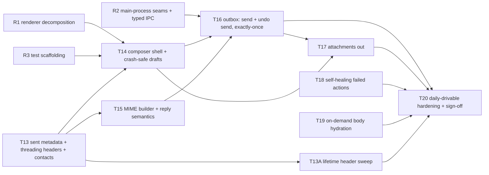

# M2 Implementation Plan — Mail Out (Composer, Drafts, Send, Undo Send, Exactly-Once Outbox)

**Audience:** the engineer(s) building M2. Written to the same contract as [M1-PLAN.md](M1-PLAN.md): every task is one PR, nothing is done until `npm run verify` is green, and "spec F6" means a section of [SPEC.md](SPEC.md) (v0.16) — read it before starting the task.
**Basis:** SPEC §8 M2, F6 (compose/send/undo send), F3 (reader the composer opens from), the M1 deviations table, and the codebase through draft PR #38.
**Goal:** M2 ends at the **daily-drivable bar** — one of us runs Attn as their only mail client. That requires both the new mail-out surface and the hardening pass (T20) that closes the M1 deviations assigned to M2.

**Current progress (2026-08-19):** R1 (#31), R2 (#30), R3 (#37), T13 (#32), T15 (#39), T14 (#38, full-window), T16 (#45), T17 (#48), T18 (#47), and T19 (#41) are shipped. Dogfood of the shipped composer produced revision tasks T14A–T14E, covering drafts as first-class objects, reply/forward entry points, rich content with a zero-loss invariant, two-way Gmail Drafts sync, and inline thread drafting; T14A–T14D shipped in #43, with draft-mirror reconciliation fixed in #44, T14E shipped in #50, and #52 fixed the composer bugs found while dogfooding them. T14C reverses the composer's narrow-schema decision (SPEC §9 #16) and expands M2 beyond composer-and-send; that cost is accepted knowingly. T13A's whole-account lifetime header sweep (SPEC §9 #17) shipped in #51; its real-mailbox quota/timing run remains sign-off evidence. The bounded stage restructure planned as M3's S3 and S4's membership half — the all-mail, spam, and trash stages, the retired `sent` stage, and per-label reconciliation with purge verification — shipped alongside it in the same PR by owner decision (see docs/M3-PLAN.md statuses). T21's poll-cycle label-catalog refresh is implemented with authoritative add/rename/delete semantics and change-only renderer invalidation. T20's engineering items are implemented: fixed-height 10k windowing, composer and bulk-action profiling, the production 10k query bound, weighted Gmail quota scheduling, and structured bootstrap telemetry are recorded in [T20-EVIDENCE.md](T20-EVIDENCE.md). **Open for M2 exit:** the manual real-Gmail evidence and one-week dogfood items listed in the T20 exit checklist. The only remaining M1 evidence item is the real-OS notification click-through smoke; it must be recorded before M2 sign-off but does not block implementation.

---

## Why this order

The composer is the largest single UI surface in the product, and the outbox is the first subsystem where a bug destroys trust irreversibly (a duplicate send cannot be undone). M2 therefore began with renderer/main-process decomposition and the sent-mail data foundation. Those pieces are now shipped; the composer and send machinery build on them before the hardening pass (T20).



Parallelization: T15 is pure modules and can run beside T14. T13A, T18, T19, and T21 are independent of the composer chain and fit whenever someone is free; T13A must land before T20 sign-off but does not expand PR #38.

---

## Global rules (every task — carried over from M1, plus two new ones)

1. **The app has no runtime compatibility-migration framework.** `src/main/db/schema.ts` is the single authoritative schema snapshot and every schema change bumps `CURRENT_SCHEMA_VERSION`. Throwaway profiles may be deleted and re-synced. A maintainer's real dogfood profile may instead receive an additive, data-preserving manual upgrade using the procedure in `AGENTS.md`; every schema-changing task must publish its exact eligible DDL. Do not add a general migration subsystem without its own product task.
2. **IPC has three parts** (main handler, preload bridge, shared types) — all in the same commit. After R2, channel names and signatures live in the typed channel map in `src/shared/` — never write a raw channel string in main or preload again.
3. **Mail content is untrusted.** That now includes **outgoing** content: quoted history entering the composer passes the same DOMPurify path as display, and composer output is sanitized against a minimal allowlist before it is stored or built into MIME. Never `dangerouslySetInnerHTML`.
4. **Select on `data-testid`** in e2e; add testids for every new interactive element.
5. **Signed-out means onboarding, not a degraded inbox** (PR #27 removed mock mode). The mail tree — including the composer — only mounts for a signed-in or seeded account, so no composer code may assume it can render without one. Nothing behind the sign-in screen may register commands, IPC subscriptions, or key handlers; the regression test asserting that no key is `preventDefault`-ed on that screen must stay green.
6. **After UI changes, look at the screenshots** — the suite gains `composer.png` in T14; review it like the other four.
7. **Every user-facing action is a registered command** (F5). New contexts (`composer`) still register; the M3 palette will assert the full inventory.
8. **If your task changes the verify pipeline or harness behavior, update AGENTS.md in the same PR.**
9. **New (exactly-once discipline):** any code path that can call `messages.send`/`drafts.send` must be reachable only from the outbox state machine in T16. No convenience send helpers anywhere else — one chokepoint, one invariant.
10. **New (pure-core discipline):** decisions live in pure planner modules (the T7 poller and T9 notifier pattern) so the outbox machine, reply computation, MIME builder, and contact ranking are pure functions with exhaustive unit tests. *Correction (2026-08-16):* the premise this rule was written under — "better-sqlite3 cannot load under vitest (Electron ABI)" — is wrong: better-sqlite3 ships Node-API prebuilds and `openDatabase(':memory:')` works under vitest, as `outbox/{spool,queue,inlineImages}.test.ts` already rely on. Keep decisions pure, but do not leave thin DB CRUD (e.g. `outbox/drafts.ts`) untested on that account.
11. **Best-effort draft work never enters `action_queue`.** That queue is reserved for user mail intents keyed by a Gmail thread id. Gmail draft checkpoints derive their own durable work from `outbox.local_revision > mirror_revision`, so a quota/network failure cannot head-of-line-block archive, trash, snooze, or label changes.

---

## R1 — Decompose the renderer before the composer lands

**Status: shipped in PR #31.**

**Depends on:** nothing · **Unblocks:** T14 · **Parallel with:** R2, T13

### Why

`App.tsx` is **2,054 lines** (PR #27 added the login screen) and its `Inbox` component alone holds ~25 pieces of state: list, reader, selection, snooze picker, label picker, sync status, account menu, toasts, keyboard dispatch, and the mail-data lifecycle. The composer adds the biggest stateful surface yet (recipients, editor, attachments, autocomplete, outbox status) plus per-keystroke latency budgets (<16ms). Landing that in the current file would push it past 3,000 lines and make the keystroke path re-render the world.

PR #27 already set the precedent worth continuing: it split the file into an **auth shell** (`App`) and a **mail tree** (`Inbox`) so the signed-out screen cannot mount mail hooks. R1 extends that same cut downward — keep the shell/tree boundary intact and pull leaf surfaces out of `Inbox`.

### Implementation guide

**No behavior change. No new features. The then-current e2e suite is the safety net and must pass unmodified** (testids and DOM structure stay stable; only import paths move).

1. New `src/renderer/src/components/`: extract, one commit each so review stays mechanical:
   - `LoginScreen.tsx`, `SyncStatus.tsx` (with `SyncProgress`), `AccountMenu.tsx`, `SnoozePicker.tsx`, `Toast.tsx`, `QueueReadout.tsx`
   - `ThreadList.tsx` (list container + row + date groups + `ThreadLabels`/`ReminderChips`)
   - `ConversationView.tsx` (reader header + scroll container) and move the existing `MessageCard`/`RecipientLine`/`ConversationMessages` beside it
2. New `src/renderer/src/hooks/`:
   - `useMailData` — auth status, sync state, threads/snoozed/labels/unread/pending, the `refresh` + `mail:changed` wiring, and the deferred-refresh machinery (`deferRefreshUntilRef`)
   - `useSelectionState` — `selectedIds`/anchor/base + toggle/extend/clear (the pure parts already live in `selection.ts`)
   - `useConversation` — the conversation cache, neighbor preload, and mark-read-on-open effect
   - `useKeyboardDispatch` — the window keydown listener, chord state, and reading-scroll handoff
   - `useToast`
3. `App.tsx` keeps the auth shell; `Inbox` becomes composition + the triage/command-registration glue. Target: **under ~450 lines for the file**. If a piece resists extraction, that's a finding — write it down in the PR rather than forcing it.
4. Props stay explicit (no context providers yet); the composer task decides whether a context is warranted when it actually feels the pain.

### Done when

E2e suite green with zero spec edits; all five existing screenshot artifacts (`login`, `inbox`, `reading`, `simple-mail`, `label-picker`) visually unchanged; `App.tsx` under ~450 lines; no component over ~350.

---

## R2 — Main-process seams and the typed IPC map

**Status: shipped in PR #30.**

**Depends on:** nothing · **Unblocks:** T16 · **Parallel with:** R1, T13

### Why

`src/main/index.ts` is 720 lines mixing boot wiring, window creation, sync orchestration (the generation-guard logic — the subtlest code in the app), and every IPC handler. T16 adds an outbox sender, more IPC, and boot recovery; without seams, index.ts becomes the next App.tsx. And IPC channel names are currently bare strings repeated in three files — a typo compiles fine and fails at runtime.

### Implementation guide

1. **`src/shared/ipc.ts` — the typed channel map.** One interface listing every invoke channel with request/response types, and every broadcast channel with payload type. `preload/index.ts` and the main-process registrar both derive from it (a small `handle<K extends Channel>(channel, fn)` wrapper in main; the preload methods keyed off the same names). Renaming or retyping a channel becomes a compile error everywhere. No runtime behavior change.
2. **`src/main/ipc.ts`** — move `registerIpc` there, taking its dependencies (`db`, `currentAccountId`, executor, scheduler, notifier, sync controller) as an explicit context object instead of closing over module globals.
3. **`src/main/syncController.ts`** — extract the sync orchestration state machine: `startSync`, `startHistoryPoller`, `stopHistoryPoller`, `retrySync`, `resumeOnlineWork`, the `authSessionGeneration` counter, `backfillRetryGeneration`, `syncRunning`, and sync-state publishing. Give it a narrow interface (`onSignIn()`, `onSignOut()`, `retry()`, `getState()`) and keep the generation-guard rules in one documented place. Extract the pure routing decisions (which already exist as `syncRetryRoute`) plus any new ones into unit-testable functions.
4. `index.ts` keeps: env seams, single-instance lock, window creation, boot sequence, will-quit teardown. Target under ~350 lines.
5. Grep-proof: after R2, `ipcMain.handle('` appears only in `ipc.ts`, and no channel string literal appears more than once in the codebase.

### Done when

Verify green with no e2e edits; channel map adopted by all three layers; `index.ts` under ~350 lines; sync generation logic isolated with its routing decisions unit-tested.

---

## R3 — Test scaffolding for mail-out

**Status: shipped in PR #37.**

**Depends on:** R1 (file layout) · **Unblocks:** T14, T16 · **Small task**

1. **Seed fixture growth:** add to `e2e/fixtures/seed-inbox.json` a thread whose messages carry `Message-ID`/`References` headers (T13 exposes them) and a message with a `Reply-To` differing from `From` — reply-computation e2e needs both. Keep existing thread indices stable (triage specs assert fixture math; append, don't reorder).
2. **Composer page object:** `e2e/composer.ts` helper (open via `c`/`r`, read recipient chips, type in editor, trigger send, read outbox state via the footer/pending readout) so T14–T17 specs stay declarative.
3. **Clock seam for unit tests:** the outbox machine and undo-send window are time-driven. Standardize on injectable `now()`/timer factories (the M1 scheduler already takes this shape) so vitest covers window elapse without real waits.
4. Document all three in AGENTS.md's harness section.

---

## T13 — Sent-mail metadata, threading headers, and the contacts store

**Status: shipped in PR #32.**

**Depends on:** nothing (main-process only) · **Unblocks:** T14 (autocomplete data), T15 (threading fields) · **Spec:** F6 (autocomplete "built locally from synced sent mail"), F2

### Why

Three M2 features need data the store doesn't have yet: recipient autocomplete needs the user's sending history; reply threading needs each message's RFC `Message-ID`/`References`; and the M3 Sent view will need SENT membership anyway. One sync-layer task supplies all three.

### Design (decided)

- **`listThreadIds` must stop hardcoding INBOX first** (review finding, P1). `GmailMailProvider.listThreadIds` sets `labelIds: 'INBOX'` unconditionally (`src/main/gmail/provider.ts`), so a naive `q: 'in:sent'` stage would request INBOX ∩ SENT — near-empty, and autocomplete would silently ship with no data. Change the signature to take the label explicitly (`listThreadIds({ q?, labelIds?, pageToken? })`) and pass `['INBOX']` at the **three existing call sites** — backfill's metadata stage, its bodies stage, and the reconcile re-list, where the implicit filter is load-bearing. Do this as the task's first commit, mechanically, with the existing suite as the check.
- **Backfill gains a `sent` metadata stage** after `bodies`: `listThreadIds({ labelIds: ['SENT'], q: 'newer_than:12m' })`, persisted `metadataOnly` through the same `runThreadPhase` machinery (checkpointed cursor `sent:<token>`, resumable). The history poller already refetches *any* thread that appears in history records, so sent mail stays current after backfill without poller changes; the `newMail` exclusion of self-sent messages (SENT label) is untouched.
- **The windows are product heuristics, not count caps:** 12 months of Inbox metadata gives one year of list/threading context; 90 days of bodies makes recent mail offline-readable without eagerly downloading every old payload; 12 months of Sent metadata supports autocomplete frequency/recency and the future Sent view. Gmail's `maxResults` is a page size, never a total-sync ceiling. T13 preserves the full eventual windows; M3's utility-process task below separates the fast interactive bootstrap from quota-paced background completion.
- **No runtime upgrade path (decided 2026-08-13, clarified 2026-08-14):** the sent stage ships as an ordinary phase of the normal backfill and nothing special-cases an already-`done` cursor. An earlier draft added a `sent_synced` flag plus a sent-only startup route; that was removed because its two-statement completion opened a crash window that could replay the whole scan. Runtime remains snapshot-only. For a maintainer preserving an existing dogfood database, the additive revision-7 DDL below is the task-specific input to the manual `AGENTS.md` procedure; that operator action is not application migration code.
- **Threading headers:** `parse.ts` extracts `Message-ID` and `References` (plus `In-Reply-To` as a References fallback); `persistThread` stores them. Only newly-synced mail carries them — T15 handles the missing-header case at reply time.
- **Contacts are derived, and must be idempotent** (review finding, P2). The obvious design — increment `sent_to_count` while walking `persistThread` — is wrong, because `persistThread` runs again every time a thread is refetched: history polling, body hydration, expiry recovery, and T16's post-send refresh all re-persist the same messages. Counters would inflate with *refetch frequency* rather than interaction frequency, so the threads you touch most would dominate autocomplete regardless of who you actually write to. Nothing about that failure is visible until the rankings are quietly wrong.
  - Instead, record **one contribution row per (message, email, role)** and aggregate. `INSERT OR IGNORE` makes re-persisting a no-op by construction, so correctness doesn't depend on remembering which sync paths can repeat.
  - Roles: `to` (a recipient of a message carrying SENT) and `from` (the sender of a received message). Store the display name seen on that contribution so the aggregate can prefer the most recent one.
  - `contact_messages` remains the source of truth, while a rebuildable `contacts` projection stores frequency, recency, and the latest display name. `persistThread` recomputes only addresses touched by the authoritative snapshot; pruning or deleting mail does the same after removing its contributions. This keeps refetches idempotent without grouping all message history on every autocomplete keystroke.
  - The projection was added after measuring the live aggregate at roughly 27–39 ms for a synthetic 50,000-contact store before IPC and display-name resolution. Search now filters, ranks, and caps directly over `contacts`.
- **Ranking is a pure function** in `src/shared/contacts.ts`: score = `3·sent_to + received` with a recency multiplier (halve per 90 days since the last interaction), prefix matches on address or name beat infix, self is excluded. Exact formula is a starting point — tune during dogfood, keep it pure and tested.

### Implementation guide

**Shipped schema revision 7:**

```sql
ALTER TABLE messages ADD COLUMN rfc_message_id TEXT;
ALTER TABLE messages ADD COLUMN references_json TEXT;
-- One idempotent contribution per (message, email, role): re-persisting a
-- thread can never double-count, whatever sync path triggered it.
CREATE TABLE contact_messages (
  account_id TEXT NOT NULL,
  message_id TEXT NOT NULL,
  email      TEXT NOT NULL,
  role       TEXT NOT NULL,          -- 'to' (we wrote to them) | 'from' (they wrote to us)
  name       TEXT,
  PRIMARY KEY (account_id, message_id, email, role)
);
CREATE INDEX idx_contact_messages_email ON contact_messages (account_id, email);

-- Rebuildable search projection; contact_messages is authoritative.
CREATE TABLE contacts (
  account_id          TEXT NOT NULL,
  email               TEXT NOT NULL,
  name                TEXT,
  sent_to_count       INTEGER NOT NULL DEFAULT 0,
  received_count      INTEGER NOT NULL DEFAULT 0,
  last_interacted_at  INTEGER NOT NULL DEFAULT 0,
  PRIMARY KEY (account_id, email)
);
```

Search works only over the compact projection and applies the exact ranking before `LIMIT 8`:

```sql
SELECT name, email,
       (3.0 * sent_to_count + received_count) *
         pow(0.5, max(0, :now - last_interacted_at) / :half_life) AS score
  FROM contacts
 WHERE account_id = :account_id
   AND (lower(email) LIKE :infix OR lower(COALESCE(name, '')) LIKE :infix)
 ORDER BY CASE WHEN lower(email) LIKE :prefix OR lower(COALESCE(name, '')) LIKE :prefix
               THEN 0 ELSE 1 END,
          score DESC, last_interacted_at DESC, email
 LIMIT 8
```

- IPC (typed map): `contacts:search(query) → { name, email, score }[]` (main matches and ranks in SQL; cap 8 rows).
- Seed loader: accept optional `messageId`/`references` per fixture message (R3 uses this).
- `SyncStage` union gains `'sent'`; the footer stage label reads "Sent mail". Keep `sameSyncState`/progress rendering in step.

### Testing

- Unit: header extraction (angle-bracket forms, folded References), contact ranking (recency decay, prefix beats infix, self-exclusion), cursor routing (fresh, mid-backfill, completed, history-recovery restart).
- **E2e regression for the idempotency finding:** persist the same seeded thread twice (a refetch is one `relaunch()` plus a poll, or drive `persistThread` through the test seam) and assert the contact aggregate is unchanged. Then delete the source thread and assert its unique contact disappears while contacts with other contributions survive. Without this, overcounting or stale projection rows reappear when sync paths change.
- E2e (seeded): seeded fixture exposes headers through `getConversation`; `contacts:search` returns seed senders ranked; boot log shows the sent stage skipped when seeded.
- Manual smoke (signed in): fresh sign-in runs metadata → bodies → drafts → all-mail → spam → trash → reconcile, then lifetime indexing; contacts populate from real history. Record time to first readable page separately from full completion, plus per-stage thread totals/durations and any quota-wait intervals. A large-mailbox run is expected to remain usable while background completion continues; a five-minute full-sync target is not implied.

### Done when

Verify green; fresh backfill demonstrated end to end; autocomplete data queryable over IPC; AGENTS harness notes updated if the fixture shape changed.

---

## T13A — Lifetime header sweep and saved-contact decision

**Status: implemented; real-Gmail timing/quota evidence remains for sign-off.** · **Depends on:** T13 · **Blocks:** T20 sign-off · **Parallel with:** the T14 revisions and the outbox chain · **Spec:** F2 backfill stage 7 + lifetime header sweep, F6 autocomplete

### Why this is upgraded from Sent-only

v0.14 scoped this task to lifetime **Sent** headers because contacts were the only consumer. SPEC §9 #17
retargets the local store at lifetime headers for the **whole account**, and this task is where that sweep's
machinery gets built: pointing the same resumable walk at an unfiltered listing instead of `SENT` is the same
engineering with a longer runtime, and building the Sent-only version first would mean measuring quota and
tuning the throttle twice. Contacts remain this task's product deliverable; the fully populated header store
it leaves behind is what M3's search and system mailboxes stand on. It also shrinks the accepted-risk row
about replies lacking `References`: once old threads have header rows, reply threading headers exist for
them too.

### Design and implementation

- Keep T13's recent-window bootstrap unchanged so autocomplete becomes useful quickly.
- After the staged backfill reports done, run a resumable, low-priority **lifetime header sweep**: walk
  `threads.list` with **no query and no label filter** (newest first, as Gmail returns), and for each id not
  already in `threads`, fetch `threads.get(format: metadata)` through `persistThread(metadataOnly)`. No
  bodies, no attachments, no date bound — an unbounded walk with skip-if-present is deliberately chosen over
  `older_than:` complements, whose fuzzy boundaries can leave silent seam gaps (F2). Skipping is safe
  because the history checkpoint predates the first backfill page, so the poller keeps every stored thread
  current. Skip-if-present lives in the sweep, not in `persistThread` — the idempotent write path stays
  authoritative for threads that are fetched.
- The sweep persists its own cursor in `sync_state` (same `phase:pageToken` grammar and `'done'` sentinel
  as `backfill_cursor`) and resumes on every launch until done. Foreground sends, action replay, history
  polling, body hydration, and the interactive backfill all outrank it. The shared weighted limiter enforces
  the configured project quota (6,000 units/user/minute by default) and retains an explicit foreground
  reserve; the sweep also keeps a conservative duty cycle so interactive calls do not queue behind it.
  The implemented starting posture is one request at a time, a 100 ms inter-request floor, and a one-second
  page-boundary pause; the weighted 40-unit metadata gets are paced further whenever the bucket requires it. Active user-action replays,
  draft mirrors, outbox sends, body/attachment hydration, and history cycles make the sweep yield in 250 ms
  slices. The real-mailbox run may tune these constants before sign-off; it must preserve that priority
  ordering.
- **Contacts derive from the same stream** through the existing `contact_messages`/`contacts` projection,
  idempotent with T13's bootstrap contributions. Two hygiene rules land here: messages labeled `SPAM` or
  `TRASH` never contribute contact rows (the poller already trickles spam threads in; a deliberate sweep
  must not bulk-import spammers), and legacy Hangouts `CHAT` rows are skipped defensively.
- Progress reports the account total/ETA that F2's footer language promises. The implementation counts
  unique locally stored threads from every completed stage against `getProfile().threadsTotal`; the
  listing's processed count remains durable cursor bookkeeping, and its page-level `resultSizeEstimate` is
  never presented as a mailbox total. `getProfile().messagesTotal` remains contextual account-wide message
  count. Footer state: **Live · indexing older mail** with **X of Y threads indexed · time remaining** and explicit
  quota-wait/retry-wait states; quitting or losing
  connectivity resumes from the last durable page without making the live Inbox appear offline.
- **Relationship to the bounded all-mail stage.** This sweep has no date bound, so before the all-mail
  backfill stage existed it was the only path to archived mail of *any* age. The bounded stage fetches the
  most recent 12 months at normal priority ahead of this walk; skip-if-present keeps the two from fetching
  anything twice, and this task's code did not change when that stage landed. The one thing this sweep can
  never reach is Spam and Trash — unfiltered listings exclude both — which is why those are explicit label
  stages rather than a widening of this walk.
- **Decided (owner, 2026-08-17, SPEC §9 #18c) and shipped: the listing-only `q=has:attachment` walk** (ids
  only, ~1% of sweep cost) sets the thread-level attachment flag lifetime-wide; header-only threads still
  gain full attachment metadata on first hydration (F2). It lives in `src/main/sync/attachmentFlags.ts`
  with its own resumable cursor, runs as the tail of `startLifetimeSweep` (so it also runs on a launch where
  the sweep itself has nothing left to do), shares the sweep's yield/cancel posture, and only ever *raises*
  the flag on threads the store already holds — absence from the listing is not evidence, since the listing
  excludes Spam/Trash and answers from Gmail's own index. Schema revision 14 → 15; local dogfood upgrade DDL
  (AGENTS.md procedure):

  ```sql
  BEGIN IMMEDIATE;
  ALTER TABLE sync_state ADD COLUMN attachment_cursor TEXT;
  PRAGMA user_version = 15;
  COMMIT;
  ```
- The saved-Google-Contacts (People API) decision is unchanged from v0.14: different address source,
  additional consent scope, separate opt-in task if ever approved — never silently bundled.
- **Schema:** add `sweep_cursor`, `sweep_threads_done`, and `sweep_threads_total` to `sync_state`, plus
  `threads.is_inbox_visible` so lifetime-only old Inbox rows retain truthful Gmail labels without entering
  M2's bounded Inbox surface; bump the T16 revision-13 snapshot to revision 14. Local dogfood upgrade DDL
  from revision 13 (AGENTS.md procedure):
  `ALTER TABLE sync_state ADD COLUMN sweep_cursor TEXT;`,
  `ALTER TABLE sync_state ADD COLUMN sweep_threads_done INTEGER NOT NULL DEFAULT 0;`,
  `ALTER TABLE sync_state ADD COLUMN sweep_threads_total INTEGER;`, and
  `ALTER TABLE threads ADD COLUMN is_inbox_visible INTEGER NOT NULL DEFAULT 1;`, with
  `PRAGMA user_version = 14` in the same transaction.

### Testing and done condition

Unit-test cursor routing and resume, skip-if-present against seeded stores, priority/yield and throttle
behavior on the injectable `SchedulerTime`, contact idempotency across the T13 overlap, and the SPAM/TRASH
contact exclusion. E2e a partially completed sweep across relaunch/offline recovery and assert that no body
bytes are fetched and unread counts do not change. Manual evidence records wall-clock/quota on a real
long-lived mailbox with interaction budgets green — the throttle constants get set from that measurement.
Automated evidence now covers cursor/progress restart and resume, metadata-only fetches, foreground yielding,
retryable quota failures, contact idempotency and hygiene, an offline relaunch, unchanged bounded Inbox rows
and unread count when old Inbox headers arrive, lifetime autocomplete, and the non-blocking footer state.
Remaining manual evidence is the wall-clock/quota run on a real long-lived mailbox. Done means an address last
emailed outside the mail window autocompletes locally, a thread archived
years ago has a local header row, progress never masquerades as a blocked inbox sync, and the People-API
decision stays recorded.

---

## T14 — Composer shell: full-window focus, crash-safe local drafts, autocomplete

**Shipped (#38). Kept as the record of what landed. Its draft behaviour, editor schema, and one-draft-per-account rule (enforced in `saveDraft`, not just the UI) are superseded by T14A–T14D; amend those tasks rather than this one.**

**Depends on:** R1, R3, T13 (can start against a stubbed `contacts:search`) · **Unblocks:** T16, T17 · **Spec:** F6, §5 composer keys

### Design (decided)

- **Full-window focused composer** (revised after 2026-08-14 dogfood) — composing replaces the visible
  list/reader with a centered 800–900px writing surface. The prior view stays mounted but hidden, preserving
  its exact selection and scroll; `Esc` or Back saves and restores it instantly. The global shortcut footer
  is not rendered while composing. The composer owns its action footer, eliminating the observed overlap
  between formatting controls and wrapped global shortcut hints.
- **The local `outbox` row is the draft's source of truth from the moment the composer opens** (state `composing`). T14 adds the draft fields to the current schema snapshot; T16 completes the same table and bumps the schema version again. Create the row on open, before any typing, so there is always something to recover into.
- **Autosave needs a bounded checkpoint, not just an idle debounce** (review finding, P1). A trailing 1s-idle debounce does *not* bound loss to one second: every keystroke resets the timer, so someone typing continuously for three minutes has written nothing to disk, and a force-quit loses the whole draft — the exact scenario F6's crash-safety criterion is about. Pair the 1s idle trigger with a **hard max-wait (5s) while dirty**, so continuous typing still checkpoints on a fixed interval. Note the test trap the same finding names: a relaunch test that pauses before quitting silently passes, because the pause fires the idle save. The regression test must type *continuously* and relaunch with no idle gap.
- **Gmail Drafts mirror is best-effort and asynchronous:** debounced (~3s idle) `drafts.create`/`drafts.update` through the provider, storing `gmail_draft_id`. A dedicated mirror executor derives durable work directly from `outbox.local_revision > mirror_revision`; it runs independently from `action_queue`, so mirror backoff can never block a user mail action. A Gmail-side 404 clears the stale id and recreates the remote draft. Mirror mutations are single-attempt and abortable: normal shutdown stops before another row, gives the active checkpoint five seconds to persist any returned Gmail id, then cancels its request while SQLite is still open. Discard immediately scrubs local content, retains only a `discarding` tombstone when a remote id exists, and retries `drafts.delete` until that remote copy is gone (404 is success).
- **Editor: Lexical** (owner decision, 2026-08-13 — `npm i lexical @lexical/react @lexical/rich-text @lexical/list @lexical/link @lexical/html`). Rejected alternative: raw `contenteditable` + `document.execCommand`. The deciding argument is **M4, not M2** — F8 snippets must expand as a *single* undoable step with `{cursor}` placement, and F17 streams an AI draft into a live editable box. Both are programmatic edits that need correct undo grouping and selection preservation, which a document model provides and `execCommand` (also deprecated) does not. Paste normalization from other mail clients is the second reason. The usual headline reason — cross-browser normalization — is explicitly *not* why we're adopting it: Electron pins one Chromium (D3).
  - **Constrain the schema to F6's surface and nothing more:** bold/italic/underline, ordered/unordered lists, links, blockquote. A narrow schema is the point — it makes output predictable and rejects pasted junk by construction. Do not enable tables, images, code blocks, or collaborative extensions "because they're available".
  - **Serialization:** `@lexical/html` `$generateHtmlFromNodes` on autosave and on send, then **still** through DOMPurify with the minimal allowlist (`p/div/br/b/strong/i/em/u/a[href]/ul/ol/li/blockquote`). The schema makes the sanitizer's job easy; it does not replace it (global rule 3 — outgoing content is untrusted too).
  - **Plain-text alternative** derives from the editor state, not from `innerText`: walk the node tree so blockquote becomes `>` prefixes and list items keep their markers and nested indentation.
  - **Latency:** Lexical's own updates are cheap, but the composer must not re-render the React tree per keystroke — subscribe to editor state for the *autosave debounce only*, never lift editor content into React state on change. This is the single most likely way to miss F6's <16ms budget; T20 profiles it.
  - **Bundle:** ~25KB gz for core + the plugins above. Vite bundles the renderer copy, so Lexical stays in `devDependencies` like React and DOMPurify rather than being packed a second time as production `node_modules` in the asar.
- **Recipient fields:** chip-based To/Cc/Bcc (Cc/Bcc revealed on demand), free-text parse on comma/Enter/blur with the existing `parseAddressList` semantics, invalid addresses visibly rejected at chip-creation time. Autocomplete dropdown from `contacts:search`; `Tab`/`Enter` accepts the highlighted structured suggestion without reparsing its display name, so quoted names containing commas remain intact. Invalid contact rows are excluded before the SQL candidate cap and chip insertion validates again because the index is derived from untrusted remote headers. Escape/Back commit pending valid text and refuse to close on invalid text.
- **Keys:** `c` (global) opens a new message. `Mod+Enter` sends, `Mod+Shift+D` discards the
  active draft, and `Esc` closes with the draft saved. `Mod+B/I/U` format text and `Mod+Shift+K`
  inserts a link. All are registered with a `'composer'` context; modifier dispatch stays inside the
  mounted composer so mail verbs cannot fire while the user edits text. The Drafts list registers its
  own discard command on `Mod+Shift+D` and sends the selected row through the same typed discard IPC.
- **Reopen behavior:** exactly one composer at a time in v1. `composing` means the composer was open and must recover after a crash; explicit save-and-close moves that row to `drafted`, which remains closed across launch but `c` reactivates. This local lifecycle never depends on `mirror_revision` or network success. A second draft requires discarding or sending the first. M3's Drafts view generalizes discovery.

### Implementation guide

- New `src/renderer/src/composer/` (Composer.tsx, RecipientField.tsx, EditorToolbar.tsx, editorConfig.ts — the constrained node set + theme, serialize.ts — HTML/plain-text output, useComposerDraft.ts, useAutocomplete.ts). Keep every module under the R1 size bars.
- IPC (typed map): `draft:save(draft) → { id }`, `draft:get(id)`, `draft:close(id)`, `draft:discard(id)`, `draft:takeRecovered() → draft | null` (boot recovery pull, mirroring the pending-focus pattern).
- Main: `src/main/outbox/drafts.ts` owns row CRUD; `mirror.ts` plus `mirrorExecutor.ts` own Gmail checkpoint/retry/delete independently from `action_queue`. No send paths here (global rule 9).
- Testids: `composer`, `composer-to`, `composer-subject`, `composer-editor`, `composer-attachments`, `autocomplete-option`, `composer-close`.
- Screenshot artifact: `composer.png` (full-window composer, one recipient chip, styled body line, no global shortcut footer).

**Local dogfood upgrade for shipped revision 8 → T14 revision 9:** use the stopped-database procedure in
`AGENTS.md` and apply this exact task-specific DDL plus `PRAGMA user_version = 9` in the same transaction:

```sql
CREATE TABLE outbox (
  id               TEXT PRIMARY KEY,
  account_id       TEXT NOT NULL,
  gmail_draft_id   TEXT,
  state            TEXT NOT NULL DEFAULT 'composing',
  to_json          TEXT NOT NULL DEFAULT '[]',
  cc_json          TEXT NOT NULL DEFAULT '[]',
  bcc_json         TEXT NOT NULL DEFAULT '[]',
  subject          TEXT NOT NULL DEFAULT '',
  body_html        TEXT NOT NULL DEFAULT '',
  body_text        TEXT NOT NULL DEFAULT '',
  attachments_json TEXT NOT NULL DEFAULT '[]',
  thread_id        TEXT,
  in_reply_to      TEXT,
  references_json  TEXT NOT NULL DEFAULT '[]',
  created_at       INTEGER NOT NULL,
  updated_at       INTEGER NOT NULL,
  local_revision   INTEGER NOT NULL DEFAULT 0,
  mirror_revision  INTEGER NOT NULL DEFAULT 0
);
CREATE INDEX idx_outbox_composing ON outbox (account_id, state, updated_at DESC);
```

This change is additive; validate that all pre-existing mail/contact/reminder/action counts are unchanged
before relaunch. Do not delete the profile or `tokens.bin`.

### Testing

- Unit: outgoing-HTML sanitizer allowlist (hostile paste collapses to allowed tags), plain-text derivation including nested lists, recipient parse/chip rules, autocomplete ranking integration, autosave rejection after unmount, and mirror-executor shutdown. Build editor states with `@lexical/headless` for the plain-text walk, but run DOMPurify allowlist assertions under jsdom: the lighter headless DOM shim does not implement DOM traversal closely enough for a security regression test.
- E2e (seeded): `c` opens focused at To and makes the list/reader plus global footer invisible; chips accept/reject structured comma names and pending text; `Esc` saves, toasts, and restores the exact prior list or reader context; clean close remains closed across launch while `c` reactivates it; relaunch → an open draft reopens with content intact even when `mirror_revision` already caught up, and one undo cannot erase recovered initial content (**the F6 crash acceptance, minus force-kill which the relaunch helper approximates**); **a second relaunch case that types continuously and never idles, proving the max-wait checkpoint rather than the debounce**; typing in the editor never triggers list verbs; the sign-in screen still registers nothing (the #27 regression test stays green with composer commands in the registry).
- Perf (@perf): composer open < 100ms CI ceiling; keystroke-to-paint sampled under the 2k-thread seed with a generous CI ceiling (catch order-of-magnitude regressions, not 16ms exactness — that's T20's profiled pass).

### Done when

Draft lifecycle (open/type/autosave retry/close/discard/reopen/relaunch-recover) fully demonstrated in e2e without network; Gmail mirror work remains independent from the visible user-action pending count; `composer.png` reviewed; verify green.

---

## T14A — Drafts as first-class objects

**Status: shipped in PR #43 (at schema revision 11).** · **Depends on:** T14 (shipped) · **Unblocks:** T14B, T14C, T14D · **Spec:** F6 (drafts), §5 `G` `D`

**Revision task.** T14 shipped the composer and stays as the record of what landed; this task changes the behaviour it defined. Do not rewrite T14.

### Why

T14 shipped **one draft slot per account**. An id-less save reuses the newest `composing`/`drafted` row and flips it back to `composing` (`outbox/drafts.ts:87-103`), so `c` reopens your last draft rather than starting a new one. Drafts are therefore reachable today, including across a restart; what you cannot do is have a second one. Starting a new message means sending or discarding the first.

That is a deliberate v1 simplification, and the spec always expected it to be outgrown: SPEC's M3 Drafts bullet already states that *"multiple simultaneous drafts remain distinct"* and that a Draft row *"opens its crash-safe M2 composer draft"*. This task brings the shipped code up to that, and brings the surface M3 planned forward into M2.

**Dropping the rule and adding the list are one change, not two.** Today's behaviour is self-consistent: one draft, always reachable via `c`. The moment `c` creates instead of reusing, every earlier draft loses its only entry point. Shipping the rule change without the list would create an unreachable-drafts bug that does not exist today.

Two smaller things ride along: empty drafts are marked `drafted` rather than discarded (`isEmptyDraft` only suppresses the mirror revision bump, not the state change), and `takeRecoveredDraft` reads a single `composing` row, which stops being sufficient once several drafts can exist.

### Design (decided)

- **Drop the one-composer restriction in both places it lives.** The UI guard is the `|| composerDraft` clause in `openComposer` (`Inbox.tsx:229`); the real enforcement is the id-less reuse branch in `saveDraft` (`drafts.ts:88-103`), which must start creating rather than reusing. Update the doc comment above it too, since it cites the rule as the reason. `c` then always starts a new draft, and only one composer is *mounted* at a time, which is a rendering fact rather than a limit on how many drafts exist.
- **Attn-created slots are per conversation, not per app:** `r`/`a` reopen one shared local `reply`/`replyAll` slot and `f` reopens one local `forward` slot per thread. New-message drafts (`thread_id IS NULL`) are unlimited. Gmail draft resource ids remain authoritative during two-way sync, so separately identified remote drafts never collapse merely because they share a thread and kind.
- **Drafts view, pulled forward from M3.** Third value in the view union, third nav button, `g d`, already promised in §5 and by decision #10. The M2/M3 boundary is deliberate and narrow:
  - **M2 (here):** a Drafts view listing local drafts, merged with remote ones once T14D lands; `g d`; opening a row into the composer; the Draft chip on thread rows.
  - **M3 (unchanged):** the other seven mailboxes, the shared list/reading shell, palette `Go to …`, and the expanded 12-month system-label metadata sync those require. M3 absorbs this view into the unified mailbox rather than building on it, so keep it small and do not let it become load-bearing.
- **`Esc` on an empty draft discards it** instead of marking it `drafted`.
- **Thread-bound drafts show a `Draft` chip** on their conversation row, reusing the existing chip system in `ThreadList.tsx`.

### Implementation guide

Schema (initially revision 10; revised to 11 when remote draft identity became authoritative):

```sql
ALTER TABLE outbox ADD COLUMN kind TEXT NOT NULL DEFAULT 'new';  -- new|reply|replyAll|forward
ALTER TABLE outbox ADD COLUMN source_message_id TEXT;
CREATE INDEX idx_outbox_thread_kind ON outbox (
  account_id,
  thread_id,
  CASE WHEN kind IN ('reply', 'replyAll') THEN 'reply' ELSE kind END
)
  WHERE state IN ('composing', 'drafted') AND thread_id IS NOT NULL;
```

- IPC: `mail:listDrafts` returning `composing` + `drafted` rows, empties excluded, newest first; `draft:reopen(id)` moving `drafted → composing`.
- `takeRecoveredDraft` reopens the single `composing` row (a crash with the composer open) and leaves everything else to the list.
- Testids: `view-drafts`, `draft-row`, `chip-draft`.

### Testing

- Unit: local thread-slot reuse, empty-draft discard, list ordering and empty exclusion.
- E2e: write two drafts and reach both from `g d`; `Esc` on an empty draft leaves no row; reply draft shows a chip on its thread row and reopens via `r`; relaunch with three drafts lists all three.

### Done when

`c` starts a new draft while earlier ones remain, and every one of them is reachable from `g d`; verify green. The regression this guards is the one the change itself could introduce: no draft may become unreachable once `c` stops reusing the newest row.

---

## T14B — Reply and forward entry points

**Status: shipped in PR #43.** · **Depends on:** T14A, T15 (shipped) · **Spec:** F6, §5 `R`/`A`/`F`

**Revision task.** T15 shipped `planReply` with a full unit matrix, but nothing calls it: `r`/`a`/`f` are absent from `commands.ts`, and the plan buries the wiring in T16, blocking reply behind the send machinery for no reason.

### Design (decided)

- `r`/`a`/`f` in the reader context call the shipped `planReply(kind, conversation, accountEmail)` and open the composer prefilled, writing `kind`, `thread_id`, `source_message_id`, `in_reply_to` and `references` onto the row.
- **Fix the mirror's lost threading.** `DraftMimeInput` (`outbox/draftMime.ts:3`) carries only to/cc/bcc/subject/body, and `saveDraft` posts `{ message: { raw } }` with no `threadId` (`gmail/provider.ts:44`). A reply draft written in Attn therefore arrives in Gmail Drafts detached from its conversation. Add `In-Reply-To`/`References` to the draft MIME and `threadId` to the `saveDraft` payload.
- **Exclude `DRAFT`-labelled messages from the message store — a correctness fix this task forces.** Nothing in `src/` filters the `DRAFT` label today (`grep -rn "'DRAFT'" src/ --include=*.ts | grep -v test` returns nothing). `persistThread` writes every message in a thread snapshot into `messages`, and the history poller refetches any touched thread and calls it. That is latent only because Attn's drafts are currently unthreaded and lack `INBOX`, so they never reach `listInboxThreads`. **Adding `threadId` above breaks that:** the draft message lands in a real conversation, the next poll refetches the thread, `persistThread` stores the draft as an ordinary message, and `getConversation` renders it as though it had been sent — while the same draft also exists as an `outbox` row. Fix at the single choke point both callers share: `persistThread` skips messages whose `labelIds` include `DRAFT`, at the top of the message loop so a draft also cannot drive the thread's `last_msg_at` or snippet.
- **Forwards attempt threading.** `planReply` already returns `threadId` for every kind and Gmail's own client keeps forwards in the conversation, so match it. **Unverified:** Gmail may require the `Subject` to match the thread for `threadId` to be honoured, and forwards are prefixed `Fwd: `. This is a named line in T16's manual smoke, not an assumption: *"forward from a thread lands in the same conversation, or record the observed behaviour."* **Observed (owner, real Gmail, 2026-08-17): forwards land in the source conversation — `threadId` plus the `Fwd:`-prefixed subject is honoured with no reply headers. Closed (SPEC §9 #18b).**

### Testing

- Unit: prefill mapping from `planReply` output onto an outbox row for all three kinds; `persistThread` skips a `DRAFT`-labelled message and leaves `last_msg_at`/snippet driven by the newest real message.
- E2e (seeded): a threaded reply draft never appears as a message in its conversation.
- E2e (seeded): `r` on the fixture's Reply-To thread prefills the correct recipient and quoted history collapsed; `a` includes To+Cc minus self; `f` starts with empty recipients.

### Done when

Reply, reply-all and forward open prefilled and their drafts mirror into Gmail threaded; verify green.

---

## T14C — Rich content and the zero-loss invariant

**Status: shipped in PR #43.** · **Depends on:** T14A · **Unblocks:** T14D · **Spec:** F6 (rich text, zero formatting loss), §9 #16

**Revision task.** It reverses a settled policy; read §9 #16 before starting. The *policy* change is the significant part — the implementation is smaller than it first appears (see Cost below).

### Why

Two consequences were rejected in dogfood: you cannot paste an image into a message, and opening a Gmail-authored draft would silently flatten it, after which the next autosave overwrites the rich original.

**Content is dropped by two gates, both of them ours.** Neither is a Lexical limitation:

1. **The node registry.** `editorConfig.ts:8` registers four nodes (`LinkNode, ListNode, ListItemNode, QuoteNode`). Lexical only converts HTML elements that a registered node's `importDOM()` claims, so `<table>` and `` are not dropped because Lexical cannot represent them — nothing ever told Lexical they exist.
2. **The outgoing sanitizer.** `composer/sanitize.ts` allows 13 tags with `ALLOWED_ATTR: ['href']`, applied by `serialize.ts` after `$generateHtmlFromNodes`. Anything surviving gate 1 still dies here.

**Both gates must widen together.** Register a node without allowing its tag and content dies on serialize; allow a tag without registering a node and it dies on import. Doing one half produces a silent drop that reads like a bug.

That this is a choice rather than a constraint is already demonstrated in-repo: `replyPlan.test.ts:132-133` asserts that quoted history retains `` and `<p style="color:red">`, because the quote path runs the far wider `sanitizeQuotedMailHtml`. Attn already preserves images on one path and strips them on another; only the allowlist differs. Note the quote path is currently built but unwired — `quoteHtml` appears only in `replyPlan.ts` and its tests, there is no `quote_html` column, and `r`/`a`/`f` land in T14B — so no rich foreign HTML has reached the editor yet, which is why none of this has visibly broken.

### Design (decided)

Two mechanisms, and **both** are required. Widening alone does not guarantee zero loss, because Lexical drops any node its schema does not know; the preservation layer is what turns the promise into an invariant.

1. **Widen the editor to Gmail's authoring surface**, in both gates: inline images, tables, font family and size, text and background colour, alignment, and strikethrough. The sanitizer's allowlist widens alongside — `img` with `src`, table elements, `span`, a bounded `style` subset, and strikethrough tags — and `ALLOWED_URI_REGEXP` gains `cid:`. Outgoing content stays untrusted (global rule 3); this is a wider allowlist, not a permissive one.
   - **Headings are deliberately excluded from the parity set.** Gmail's composer has no heading levels; its Small/Normal/Large/Huge control emits `<span style="font-size:…">`. Supporting `h1`–`h6` would be a superset rather than parity, and is left as an optional follow-up so this task stays scoped to closing the gap.
2. **Preserve what remains.** Any element the widened schema still cannot represent becomes an opaque region: a Lexical `DecoratorNode` holding the original HTML verbatim, rendered through the same scriptless path as incoming mail, not editable inline, and serialized back byte-for-byte on save and send. Editing continues around it.

- **Fidelity check on open.** Walk incoming HTML against the allowlist before rendering, so the app knows exactly what it cannot represent rather than discovering it after the fact. Drafts with no unrepresentable content — the large majority — open with no banner and no difference. A region only becomes opaque when the unsupported markup **survives import sanitization** *and* actually carries formatting: the sanitizer is the security authority and its drops happen whether or not the region is frozen, so freezing what it already removed would preserve nothing while costing the user an editable line and showing a banner about formatting that is gone. Gmail's ubiquitous `<br clear="all">` above a signature is the case that makes this matter. A `class` is judged the same way — it can only paint when a stylesheet targets it, and a draft body carries none, so Gmail's editor classes (`Q6ibn ng` around typed text, `gmail_default` on a wrapper) are inert noise. The structural markers are the exception and stay preserved byte-for-byte: `gmail_quote`, `gmail_quote_container`, `gmail_attr`, and the two signature classes carry meaning that Attn's trim boundary, the surface classifier, and Gmail's own quote collapsing all depend on.
- **Inline images** spool to disk like attachments (`DraftAttachment.spoolPath` already exists), are referenced by `cid:`, and reach the editor as data URLs over the typed bridge. The display bridge accepts up to 25 MB; newly pasted images retain their narrower 10 MB authoring cap.

### Cost

Widening is closer to configuration than to engineering; two pieces are genuine work:

| Piece | Cost |
|---|---|
| Tables | Install `@lexical/table` (an official package on the same 0.49.0 line, simply not in `package.json` today) and register `TableNode`, `TableRowNode`, `TableCellNode` |
| Colour, font size, alignment, strikethrough | Largely present already: Lexical has native text-format flags, and `@lexical/selection` (already installed) provides `$patchStyleText` for inline styles |
| Sanitizer widening | Config |
| **Inline images** | Real work: a custom `ImageNode` (`DecoratorNode` is Lexical's designed extension point; the Lexical playground ships a reference implementation), spool/`cid:` plumbing, and `multipart/related` in the MIME builder |
| **Preservation layer** | Real work: a `DecoratorNode` holding verbatim HTML |

Schedule it as two custom nodes plus configuration, not as a rebuild of the composer.

### Implementation guide

- `mime.ts` gains `multipart/related` wrapping `multipart/alternative` plus the inline image parts. T15 already anticipated this (`Content-ID` for future inline use); its golden-file fixtures grow a related-with-inline-image case.
- Paste handling: clipboard image → spool → insert image node. Paste of foreign HTML runs the same fidelity check.
- Size: inline images count against F6's 25 MB ceiling alongside attachments.

### Testing

- Unit: fidelity check flags exactly the unrepresentable elements; opaque regions round-trip byte-identical through parse → serialize; MIME golden file for `multipart/related`.
- E2e: paste an image into the composer and see it in the body and in `composer.png`; open a seeded draft containing a table and confirm it renders, survives an edit elsewhere in the body, and is unchanged on save.
- **The invariant test:** a fixture draft containing an image, a table, and a `style`-coloured span opens, is edited, saves, and comes back byte-identical outside the edited region.

### Done when

No draft loses formatting by being opened in Attn, demonstrated by the invariant test; verify green.

---

## T14D — Two-way Gmail Drafts sync

**Status: shipped in PR #43; mirror reconciliation fixed in #44; round-trip quote/attachment fixes in #52.** · **Depends on:** T14A, T14C · **Spec:** F6 (draft sync)

**Revision task.** The shipped mirror is one-way by construction: `saveDraft`/`deleteDraft` are the only draft provider methods (`sync/provider.ts:54`), backfill fetches `INBOX` and `SENT` only, and nothing ever reads a draft back.

### Design (decided)

- **Provider grows `listDrafts`/`getDraft`.**
- **`drafts.list` is the mechanism, not the history feed.** Gmail addresses a draft by a *draft* id (`drafts.list` → `{ id: "r-8842", message: { id: "18f2a" } }`) and `outbox.gmail_draft_id` stores that draft id, but `history.list` only ever reports *message* ids. Editing a draft in Gmail keeps the draft id stable and replaces the underlying message, so history reports a delete plus an add of ids we have never seen, and mapping them back to a draft still requires `drafts.list`. Routing through history therefore adds a call rather than saving one. `drafts.list` alone returns the authoritative set, including — by absence — anything deleted elsewhere.
- **It runs inside the existing history poller, not a new scheduler.** Add an optional `syncDrafts` effect to `HistoryPollerOptions`, in the same seam style as `wakeThread` and `kickExecutor`, invoked in `runNow` after the history cycle and before `onCycleComplete`. It inherits the foreground/background cadence, the `executing` guard, `stopped` handling, teardown, the generation guard, and the offline retry route. A sixth time-driven scheduler would duplicate all six for one API call.
  - **Draft failures must not fail the mail poll.** Wrap the effect in its own try/catch: a `drafts.list` error leaves the inbox syncing and the footer calm, matching the best-effort posture the outbound mirror already takes.
  - Every 15s is one small extra call per cycle and is acceptable. If that proves wasteful, gate the effect on a last-swept timestamp using the injected clock rather than introducing a timer.
- **Conflict resolution is last-write-wins, with two rules that keep it honest:**
  - **An open composer always wins.** LWW applies only to `drafted` rows. A remote change never rewrites text under the cursor; it reconciles when the draft closes.
  - **Prefer the revision pair over clocks.** If `local_revision == mirror_revision` (nothing changed locally since the last push) and the remote differs, take the remote outright — no timestamp comparison, so no clock-skew hazard. Only when both sides changed does LWW by timestamp apply.
- **Remote drafts open like local ones.** T14C's preservation layer is what makes this safe; without it, reading a Gmail draft in would flatten it.
- **Attachments on remote drafts fetch on demand,** matching how message attachments already work.
- Whole-draft granularity, not per-field.

### First-sync backfill

Two-way sync also needs the *first* sync to pull existing Gmail drafts; without this, a fresh profile never sees drafts written before Attn was installed. Add a `drafts` stage to the staged backfill:

```
metadata   12m INBOX headers    → inbox usable
bodies     90d INBOX full       → reading works
drafts     all drafts           ← new
sent       12m SENT headers     → autocomplete data
reconcile
```

Placed before `sent` because drafts are user-visible content and few in number, while the SENT pass is a long background sweep whose only purpose is autocomplete ranking. A first-run user should not wait behind it to see their own drafts.

Touch points, all mechanical but crossing the shared type:

- `SyncStage` in `src/shared/mail.ts:91` gains `'drafts'`.
- `parseCursor` and the checkpoint strings in `sync/backfill.ts` gain the phase, keeping `phase:pageToken` resume semantics.
- `SYNC_STAGES` and the stage label switch in `renderer/src/components/SyncStatus.tsx:5-9` gain an entry ("Drafts").
- The stage needs its own small phase runner: `runThreadPhase` pages *thread* ids, and `drafts.list` returns draft ids.

### Testing

- Unit: the three-way decision table (local-only change, remote-only change, both changed) against a fake provider and injected clock; open-composer immunity; backfill cursor resume across the new `drafts` phase.
- E2e (seeded): a simulated remote edit to a closed draft is adopted; the same edit against an open draft is deferred until close.
- **Verify Bcc round-trips.** Silently dropping Bcc through a sync cycle would be a data-loss bug; test it explicitly.
- Reconcile two separately identified Gmail drafts on the same thread twice; both local ids must remain distinct and stable rather than rebinding on every poll.

### Done when

A draft edited in Gmail appears correctly in Attn and vice versa, with no formatting loss in either direction; verify green.

### Local dogfood schema upgrade for the T14A–T14D implementation

This implementation originally batched the four revision tasks into schema revision 10. Revision 11 removes
the unique thread/kind constraint because Gmail permits multiple draft resources on one thread. For an
additive manual upgrade of a stopped revision-9 dogfood profile directly to the current snapshot, use the
`AGENTS.md` procedure with this exact task-specific DDL and set `user_version` in the same transaction:

```sql
ALTER TABLE outbox ADD COLUMN gmail_message_id TEXT;
ALTER TABLE outbox ADD COLUMN kind TEXT NOT NULL DEFAULT 'new';
ALTER TABLE outbox ADD COLUMN source_message_id TEXT;
ALTER TABLE outbox ADD COLUMN quote_html TEXT NOT NULL DEFAULT '';
ALTER TABLE outbox ADD COLUMN quote_text TEXT NOT NULL DEFAULT '';
ALTER TABLE outbox ADD COLUMN remote_updated_at INTEGER;
ALTER TABLE outbox ADD COLUMN remote_fingerprint TEXT;
CREATE INDEX idx_outbox_thread_kind ON outbox (
  account_id,
  thread_id,
  CASE WHEN kind IN ('reply', 'replyAll') THEN 'reply' ELSE kind END
) WHERE state IN ('composing', 'drafted') AND thread_id IS NOT NULL;
PRAGMA user_version = 11;
```

For a stopped revision-10 dogfood profile, replace only the constraint index and bump the version in the
same transaction:

```sql
DROP INDEX idx_outbox_thread_kind;
CREATE INDEX idx_outbox_thread_kind ON outbox (
  account_id,
  thread_id,
  CASE WHEN kind IN ('reply', 'replyAll') THEN 'reply' ELSE kind END
) WHERE state IN ('composing', 'drafted') AND thread_id IS NOT NULL;
PRAGMA user_version = 11;
```

---

## T14E — Inline thread drafting and reliable conversation badges

**Status: shipped in PR #50; dogfood fixes in #52.** · **Depends on:** T14A, T14B, T14D · **Spec:** F6, §9 #13

**Revision task.** New mail remains a focused full-window task. Reply, reply-all, and forward instead append
the composer as the final card beneath the source conversation, keeping the referenced messages visible.
Opening a thread-bound row from Drafts returns to the same context; if the parent has left Inbox but remains
cached, the Drafts reader opens that conversation directly and returns to Drafts on close.
Opening a conversation row with a bound draft reopens the newest matching draft inline. The composer's own
close button leaves the reader open, while either `Esc` or the reader Back control saves the draft and returns
to the originating list in one action. Opening or navigating to a conversation keeps the reading viewport
anchored to the newest message or restored draft while asynchronously sized HTML settles. Quoted history sits
behind an inline `...` control and shares the reader's surface decision: mail without a non-neutral authored
canvas uses the native composer canvas and normalizes dark sender foreground colours for contrast, while
non-neutral backgrounds and background images retain a light document canvas plus their sanitized structure
and explicit styling. Typography, media, tables, and layout alone remain native. From Inbox or Snoozed, `r`
and `f` open the selected row directly into the corresponding inline composer.
`Enter` opens the selected collapsed message; when it is already expanded, it opens Reply all.
`a` always opens Reply all, and `Enter` retains native activation on focused links.

Gmail-imported forwards need one additional identity rule. A draft whose authoritative Gmail `threadId`
matches a cached thread is thread-bound even though forwards normally lack `In-Reply-To` and `References`.
Classify a `Fwd:`/`FW:` subject as `forward` only with that known-thread evidence, preserve new drafts whose
thread is not cached, and re-fetch unchanged legacy rows once so an earlier unbound import repairs itself.

### Testing

- Unit: remote drafts bind as reply/forward only when their Gmail thread already exists locally.
- E2e: reply/reply-all/forward keep the original message cards visible; the list row shows a Draft chip;
  opening both Inbox-bound and archived-parent Gmail forward drafts returns to an inline composer; opening
  the conversation row itself restores its draft in the viewport after long HTML settles; quoted history
  reveals inline on the same native or presentation surface as its source; `r`/`f` work from the selected list
  row; `Enter` expands a collapsed message or opens Reply all for an expanded message; Back and `Esc`
  exit directly to the originating list without losing it.
- Visual artifacts: `inline-reply.png` and `draft-chip.png`.

### Done when

Thread drafting never replaces its source conversation, every bound draft is visible from its conversation
row, cached archived parents remain available from Drafts, and `npm run verify` is green.

---

## T15 — MIME builder and reply/reply-all/forward semantics

**Shipped (#39). Extended by T14B (entry points, threading headers in the draft mirror) and T14C (`multipart/related` for inline images).**

**Depends on:** T13 (headers) · **Unblocks:** T16 · **Parallel with:** T14 · **Spec:** F6

### Why a dedicated task

Everything here is a pure function from stored state to bytes or to a prefilled draft — the most unit-testable code in M2 and the code most likely to embarrass us in other people's mail clients. It gets its own task so it is exhaustively tested before the outbox ever calls it.

### Implementation guide

**`src/main/outbox/mime.ts`** — RFC 5322/2045 builder, no dependencies:
- `buildMime(draft, { accountEmail, accountName, rfcMessageId, date }): string` → complete message: headers (`From`, including the primary Gmail send-as display name, `To`/`Cc`/`Bcc`, `Subject` with RFC 2047 encoded-words for non-ASCII, `Message-ID` (the caller-supplied one — exactly-once depends on it), `In-Reply-To`/`References` when replying, `Date`, `MIME-Version`), body as `multipart/alternative` (text + html), wrapped in `multipart/mixed` when attachments exist (base64, 76-col lines, `Content-Disposition: attachment; filename*=` RFC 2231 for non-ASCII names; `Content-ID` for future inline use).
- Deterministic boundaries derived from the message id (stable output = testable with fixture files).

**`src/main/outbox/replyPlan.ts`:**
- `planReply(kind, conversation, accountEmail)` → `{ to, cc, subject, quoteHtml, quoteText, inReplyTo, references, threadId }`.
- Recipients: reply → `Reply-To ?? From` of the latest non-self message (fall back to latest message if all are self), minus self. Reply-all → that plus To+Cc of the source message, minus self, deduped case-insensitively. Forward → empty.
- Subject: `Re: `/`Fwd: ` prefixed once, case-insensitive detection, existing prefix preserved (`Re: Re:` never produced).
- Quote: attribution line ("On {date}, {name} <{email}> wrote:") + the source body inside `blockquote` (HTML path reuses the display sanitizer **before** embedding; text path `>`-prefixes). Forward uses the forwarded-message header block instead. The quote is stored separately on the draft (`quote_html`) and collapsed in the composer (F6) — the user's text never mixes into it unless they expand and edit, which folds it into the body.
- References: source's `References` + source's `Message-ID` (RFC 5322 §3.6.4), truncated from the front if the header would exceed ~998 octets. **Missing headers** (mail cached before v7): plan returns `references: []` and T16 still sets `threadId` on the API call — Gmail threads it server-side; external recipients may see a new thread, which is the accepted cost, logged in the PR.

### Testing

Unit only (this task ships no UI): golden-file MIME fixtures (simple text, html+text, attachment, non-ASCII subject + filename, reply with References chain); reply-plan table tests (self-only thread, Reply-To divergence, dedupe, prefix cases, missing headers); property check that every generated message parses back with a naive header splitter. Update `parse.ts` fixtures if header extraction needs sharing.

### Done when

Builder + planner land with the test matrix above; no send path exists yet; verify green.

---

## T16 — Outbox: send, undo send, exactly-once

**Status: shipped in PR #45; manual exactly-once matrix on real Gmail remains sign-off evidence.**

**Amended by T14A–T14D:** the outbox now holds many drafts at once, so "one chokepoint" in global rule 9 constrains *code paths*, never the number of messages in flight. Its "Reply entry points" bullet moves to T14B. Add the forward-threading check named there to the manual smoke list.

**Depends on:** R2, T14, T15 · **Unblocks:** T17, T20 · **Spec:** F6 (undo send, outbox state machine), F2 (queue), §6 (scheduler owns undo-send windows)

### Design (decided — the invariant lives here)

- **State machine per outbox row:** `composing → queued → sending → sent` (+ `failed`, + `needs-review` for the unresolvable-ambiguity case below). Transitions are durable **before** their side effects: a row is `queued` with `send_at` before the toast shows; `sending` is written before the first byte leaves; `sent` is written only on confirmed success.
- **Exactly-once rests on the Gmail draft id, not on a search** (revised after a review finding, P1). The original design generated a client RFC Message-ID, baked it into the MIME, and on any ambiguity searched `rfc822msgid:` — treating "not found" as proof the send never happened. That inference is unsound: Gmail's search index is not synchronously consistent with send, and Gmail does not honor a supplied Message-ID as an idempotency key. A message accepted seconds ago can be genuinely absent from search, so "not found ⇒ resend" manufactures exactly the duplicate this machine exists to prevent.
  - **Always send through a Gmail draft.** At send time, if the row has no `gmail_draft_id`, `drafts.create` first (with our Message-ID in the MIME), persist the id, then `drafts.update` + `drafts.send`. The draft id is a *strong, immediately-consistent* handle — no search index involved — and `drafts.send` atomically consumes the draft, so its disappearance is a real signal rather than an inference.
  - **Recovery when a `sending` row is found after a crash or ambiguous error:** `drafts.get(gmail_draft_id)` — **present ⇒ the send did not complete, resend is safe**; **404 ⇒ it did, mark `sent`**. This is the common path and it is decisive.
  - **The residual ambiguity is narrow:** a crash between `drafts.create` and persisting its id. There the Message-ID search is a *secondary* check, run with a bounded verification window (re-check over ~60s rather than trusting one negative), and it searches drafts as well as messages, since an orphaned draft carries the same Message-ID.
  - **When still unresolved, do not send.** A message that failed to send is recoverable by the user; a duplicate is not, and F6 makes "no duplicate send" the acceptance criterion. Park the row in a `needs-review` state, show a plain explanation ("We couldn't confirm this was sent — check your Sent mail before resending"), and keep the complete message actionable in Outbox without interrupting the user's current task.
  - Keep the client Message-ID regardless — it is what makes both the secondary search and any manual reconciliation possible.
- **Undo window:** queueing sets `send_at = now + delay` (setting stored via the M1 `settings` table: `undoSendDelaySeconds`, **default 5**; the settings *UI* is M4 — a palette-less default is fine for M2 dogfood). The **scheduler owns the timer** (§6): extend the M1 scheduler pattern with an `OutboxSender` armed on the next due `queued` row; catch-up on boot sends anything whose window elapsed while the app was closed. **Undo (`Z`) rides the existing main-process undo stack:** queueing a send pushes an entry whose inverse flips the row back to `composing`, cancels the timer, and tells the renderer to reopen the composer. Popping it after the send fired reports "Already sent" (no inverse) — deliberately still consuming the stack entry so `Z Z` doesn't skip backwards silently.
- **Queue validation:** call T15's `validateMimeRecipients` before persisting a queued row. Invalid or missing recipients leave the draft in the composer with an inline error; they must never become a row that can only fail later inside `buildMime`. The builder repeats validation as its final serialization boundary and converts internationalized domains to ASCII IDNs.
- **Send execution** (the only `send` chokepoint, global rule 9): always the draft path — `drafts.create` if no `gmail_draft_id` yet (persist it *before* sending), then `drafts.update` (raw MIME) and `drafts.send`, which replaces the draft atomically and leaves no husk in Drafts. `messages.send` is deliberately **not** used: it would forfeit the draft-id handle that makes recovery decisive. Calls set `threadId` when replying; attachment payloads use `uploadType=multipart`. A 404 on `drafts.send` means the draft is already consumed — treat as sent, never as a reason to blind-resend.
- **After confirmed send:** refetch the returned `threadId` through the provider → `persistThread` → `mail:changed`, so the sent message appears in the local thread within a second (and Sent-view data accrues for M3). Reply-sends leave the inbox untouched; F4 auto-advance is not coupled to sending in v1.
- **Retry accounting:** `attempts` drives transport backoff; `verify_attempts` counts only successful negative secondary searches. A quota/offline retry can therefore never consume the bounded ~60-second verification window. Intermediate negative checks keep `last_error` clear until the row actually enters `needs-review`.
- **Shutdown:** outbox mutations are single-attempt requests owned by the durable scheduler, not the Gmail client's long transient retry ladder. Shutdown gives the active request five seconds to quiesce, then aborts it while SQLite is still open so recovery state is persisted before teardown.
- **Retention:** confirmed sent rows retain their audit/recovery data for seven days, then are pruned on startup or the next confirmed send. Attachment spool bytes are removed immediately on confirmation.
- **Offline and discovery:** rows sit in `queued` past their window while no provider exists; the top-bar pending readout includes `queued`/`sending` outbox rows and is clickable. It and a registered **Go to Outbox** command open an on-demand local view of `queued`, `sending`, `failed`, and `needs-review` items—no permanent sidebar. Actionable rows reopen in the composer with all local content intact. Toast on queue: **"Sent — Undo (Z)"** with the toast and its progress-bar countdown both bound to the durable `send_at` deadline rather than the standard 4s.
- **Failures:** permanent 4xx (bad recipient, size) → `failed` + toast; the complete message remains actionable in Outbox and reopens with its error banner when selected. Retryable errors follow the executor's backoff ladder with the verification-first rule above.

### Implementation guide

**Schema evolution from the shipped T14A–T14D revision-11 snapshot** (update the current snapshot and bump
to revision 13):

```sql
ALTER TABLE outbox ADD COLUMN rfc_message_id TEXT;
ALTER TABLE outbox ADD COLUMN send_at INTEGER;
ALTER TABLE outbox ADD COLUMN attempts INTEGER NOT NULL DEFAULT 0;
ALTER TABLE outbox ADD COLUMN verify_attempts INTEGER NOT NULL DEFAULT 0;
ALTER TABLE outbox ADD COLUMN last_error TEXT;
CREATE INDEX idx_outbox_due ON outbox (account_id, state, send_at);
```

These are the final revision-13 names and exact additive local-development DDL. For a preserved revision-11 dogfood
profile, apply every statement plus the version stamp in one transaction under the `AGENTS.md` procedure:

```sql
BEGIN IMMEDIATE;
ALTER TABLE outbox ADD COLUMN rfc_message_id TEXT;
ALTER TABLE outbox ADD COLUMN send_at INTEGER;
ALTER TABLE outbox ADD COLUMN attempts INTEGER NOT NULL DEFAULT 0;
ALTER TABLE outbox ADD COLUMN verify_attempts INTEGER NOT NULL DEFAULT 0;
ALTER TABLE outbox ADD COLUMN last_error TEXT;
CREATE INDEX idx_outbox_due ON outbox (account_id, state, send_at);
PRAGMA user_version = 13;
COMMIT;
```

For a local profile created from the draft T16 revision-12 branch, the exact additive upgrade is:

```sql
BEGIN IMMEDIATE;
ALTER TABLE outbox ADD COLUMN verify_attempts INTEGER NOT NULL DEFAULT 0;
PRAGMA user_version = 13;
COMMIT;
```

- **Pure core** `src/main/outbox/machine.ts`: `planTransition(row, event, now)` returning the next state + required effects (`persist`, `armTimer`, `verify`, `send`, `notify`) — the vitest surface. Effects live in `src/main/outbox/sender.ts` and are unit-tested against a fake durable store, fake provider, and injected clock.
- Provider grows `createDraft/updateDraft/sendDraft/getDraft/findByRfcId/getSendAs` — interface in `sync/provider.ts`, implementation in `gmail/provider.ts` (raw upload paths). `getSendAs` reads the primary account display name before MIME serialization. `getDraft` is the decisive recovery probe; `findByRfcId` is only the secondary check and must search drafts as well as messages. No `sendMessage` — the draft path is the only send route.
- IPC: `outbox:send(draftId)`, `outbox:undoSend(outboxId)` (also reachable via the undo stack), `outbox:listPending()` for the local Outbox page, and broadcast `outbox:changed` consumed by the renderer for refreshes and failure toasts.
- Reply entry points: `r`/`a`/`f` commands (reader context) call `planReply` and open the composer prefilled; register in the registry (§5 keys).
- Discovery surface: clicking the pending readout or invoking **Go to Outbox** replaces the current list/reader with the pending-state view; selecting an actionable row reopens the full-window composer. Preserve and restore the prior mailbox context like every other full-window task.

### Testing

- **Unit (the heart of the task):** machine transition matrix including every crash point (kill before/after `sending` write, kill after network-ambiguous error, **kill between `drafts.create` and persisting its id** — the one genuinely ambiguous window), draft-present-⇒-resend and draft-404-⇒-sent recovery, the bounded secondary search never resending on a single negative, `needs-review` parking, window catch-up on boot, and undo-after-fire — all against a fake provider + injected clock. This is the M1 "sync-engine correctness" bar applied to send.
- **E2e (seeded, no network):** `Mod+Enter` queues + toast with undo; `z` inside the window reopens the composer intact; window elapse moves the row to the provider-gate (visible as pending); clicking pending and the palette route each open Outbox with correct state membership; an actionable row reopens intact; relaunch with a queued row preserves it (durability); reply prefill shows quoted history collapsed and correct recipients from the fixture's Reply-To thread.
- **Manual smoke (signed in, documented in the PR):** real send → lands threaded in Gmail web, leaves **no leftover draft**, and its raw source preserves Attn's supplied Message-ID; undo inside window → nothing sent, composer restored; force-quit during the window → sends on relaunch; force-kill mid-send → exactly one copy in Sent after relaunch (run it several times, since this is the criterion the whole design exists for); reply threading renders correctly in Gmail + one external client.

### Done when

The unit matrix and e2e above are green; the manual exactly-once checklist is executed and pasted into the PR; no send call exists outside the sender; verify green.

---

## T17 — Attachments out

**Status: implemented; signed-in Gmail attachment checksum smoke remains PR evidence.**

**Depends on:** T14, T16 · **Spec:** F6 (drag-drop/picker, 25MB, progress)

- **Spool at attach time:** copying the file into `userData/outbox/{draftId}/` immediately makes the draft self-contained (the original can move/delete before send — crash-safety includes attachments). Spool entries are recorded in `attachments_json` (filename, mimeType, sizeBytes, spool path) and cleaned on discard/sent.
- Drag-and-drop onto the composer + a picker button (`dialog.showOpenDialog` via a new typed IPC). Per-file and total caps enforced at attach time: reject past **25MB total** with a clear toast (Gmail's own limit; oversize handoff links are out of scope v1).
- MIME: T15 already frames attachments; the sender streams spool files into a Gmail `uploadType=multipart` draft update. The deterministic serializer computes the exact MIME byte count up front so the upload carries the required top-level `Content-Length` without buffering attachment bytes. Progress: per-outbox-row send progress event (`outbox:progress`) driving a thin bar on the composer/toast — coarse (per-attachment) granularity is fine at these sizes.
- **Mirror behavior — product decision (owner, 2026-08-16), reversing the original T17 call:** every attachment mirrors, so **the Gmail draft is always complete and sendable from Gmail web or mobile**. The first decision kept locally attached files out of checkpoints until send, which made the mirror a body-only convenience; the cost was that a draft opened in Gmail looked finished but sent without its files, which is a worse failure than the bandwidth it saved. The two reasons the original bound existed are now handled directly:
  - **Memory:** checkpoints no longer buffer. `draftMime.ts` gained the segment/length/stream trio the send path already used (`draftMimeByteLength` + `streamDraftMessage`), so bytes flow from the spool to Gmail without a base64 copy in memory. Gmail's upload endpoint is PUT-only, so a draft with no id yet is created from its body alone and the bytes follow; that minted id is persisted **before** the upload starts, so an aborted upload resumes against the same remote draft rather than orphaning it and creating a second.
  - **Bandwidth:** Gmail replaces a draft wholesale, so a checkpoint always re-sends every attachment byte. The mirror interval therefore scales with payload — `MIRROR_IDLE_MS` (3s) normally, `MIRROR_PAYLOAD_IDLE_MS` (15s) once attachments exceed `MIRROR_PAYLOAD_BYTES` (1MB) — while attaching or removing a file still pushes on the short interval, since that is the change the user is waiting to see in Gmail. These three constants are tunable from real-mailbox measurement.
- **The spool stays the source of truth for bytes.** A mirrored file comes back on the next read as a remote-only part, so `mergeRemoteDraftAttachments` pairs each echo with the local entry that produced it and keeps the local one — without that pairing every round trip would store the file twice and the next checkpoint would upload both. Gmail's attachment locators rotate on every draft rewrite; a spool path does not. Inline body images and remote-only MIME parts keep their locator refresh as before.
- Note the interaction with T16's draft-only send path: create uses an attachment-free MIME body carrying the durable Message-ID, then the attachment bytes stream through `drafts.update` before `drafts.send`. Now that checkpoints also carry attachments, the "one attachment upload, not two" bound no longer holds — send re-uploads the full MIME. Skipping that final update when `remote_fingerprint` already matches the row is a real optimization and deliberately **out of scope** here.
- Testing — unit: spool naming/cleanup, cap math, MIME framing with spooled files; e2e: pick and drop a seeded fixture file, chip renders with size, discard cleans the spool (assert via relaunch), oversize rejection toast; manual: real send with mixed attachments arrives intact (checksum the received files).

### Done when

Attach → queue → relaunch → send survives with bytes intact; caps enforced; spool leaks impossible in the e2e lifecycle; verify green.

---

## T18 — Self-healing failed actions (deciding an M1 deferred call)

**Status: implemented.**

**Depends on:** nothing (parallel-friendly) · **Spec:** F2 action queue + conflict rule; M1 deviations rows 2–3

**Product decision (owner, 2026-08-13):** a permanently failed action **repairs itself and says so** — local state converges back to what the server actually thinks, so an archive Gmail rejected simply reappears in the inbox. No failed-actions panel, no retry button, no error log. Debugging sync is not the user's job.

**The mechanism is refetch, not inverse-delta.** Don't compute a reverse of the failed action — move the row into durable recovery, re-fetch that thread (`getThread` → `persistThread`, which already replays any remaining pending intent on top), and delete the row only after recovery reaches a terminal outcome. Server state is the truth by F2's own conflict rule, so this converges exactly and cannot drift the way a hand-rolled inverse can. It costs one request on a path that is, by construction, rare.

**Recovery is its own durable queue state.** As soon as Gmail permanently rejects an action — including a mutation-side 404 — its row moves to `recovering` before the authoritative refetch starts. A transient failed refetch retries only that read; it must never send the rejected action again, including after a crash or when repairing a pre-T18 `failed` row. A permanent/404 refetch failure, or an empty/draft-only response, terminates recovery by dropping only the queue row: cached mail is never deleted by the action executor, and the notice explicitly says Gmail's current version could not be loaded. Gmail network classification ends before the SQLite recovery transaction; a local persistence fault is logged and leaves the row in `recovering` for the next drain, without being mislabeled as a 60-second Gmail retry and without rejecting `drain()` — every caller floats that promise, so an escaping fault would become an unhandled main-process rejection. A typed stored auth marker covers both Gmail 401s and refresh-token revocation (`invalid_grant`/missing refresh token), pausing execution or recovery until the visible header reconnect action completes successful same-account authentication. `recovering` rows remain in the pending count but are excluded from optimistic-delta replay because Gmail has already rejected their intent. Revert notices use peek/ack delivery and remain buffered in the main process until the active account's renderer displays each batch for its toast interval and acknowledges it; StrictMode cleanup, account changes, and window startup cannot consume a notice unseen, while explicit sign-out clears that account's old-session notices.

**Local-only reminder state is part of the recovery snapshot.** Queue payloads record the exact pre-action snooze reminder when a local mutation changes it. Recovery restores that row atomically with the Gmail snapshot. A rejected snooze cancels the newly-created reminder, a rejected manual unsnooze restores its original due time, and a rejected automatic return is re-added to the local inbox **once, by the executor**, with copy that says Gmail did not accept the return.

**Only a `pending` reminder outranks a server label snapshot.** The overlay that runs after ordinary persistence covers `pending` alone, because Gmail has no concept of "snoozed until" (SPEC §9 #6) and the thread must stay hidden until it fires. `returned` is a display flag for the inbox badge and stays set until the user handles the thread in Attn, so it must **not** act as a label authority: doing so re-adds `INBOX` on every later sync, overriding an archive the user performed in Gmail on another device, and inverts F2's conflict rule. A rejected snooze return is therefore repaired as a one-time write rather than a standing override.

**Three nuances the policy must respect — getting these wrong is worse than the old behavior:**

1. **Only *permanent* failures revert.** Offline, 5xx, and 429 stay retryable with their backoff ladder untouched. Reverting on a transient failure would flicker mail back into the inbox during a network blip — the worst outcome available here. `isPermanentActionError` already draws this line; use it, don't widen it.
2. **Auth failures never revert.** A 401, missing refresh token, or rejected refresh (`invalid_grant`) doesn't mean "Gmail rejected this", it means "we couldn't ask". The intent is still valid, so those rows pause behind a typed stored auth marker and re-pend after the user chooses the visible **Reconnect Google** action and completes successful sign-in for the same account. The sign-in result carries the resumed-row count, so the renderer never claims another account or a missing OAuth configuration resumed work. Pre-T18 message-formatted 401 rows are recognized once at executor construction and normalized to the typed marker.
3. **Sends are the exception (T16).** A failed send must never silently vanish or self-repair — the user wrote that message. It reopens the composer with content intact and the error shown. This task's auto-revert covers triage actions only.

When one thread from a bulk action is rejected, only that thread's queued-row reference and inverse are removed from the undo entry; the unaffected threads remain undoable, and the entry's label is rebuilt from the surviving count so `Z` never reports undoing more threads than it restores.

**Telling the user.** Silent reappearance is spooky: mail moving on its own reads as a bug. On revert, one plainly-worded, non-actionable toast — *"Couldn't archive 'Q3 roadmap review' — it's back in your inbox."* Batch to a single toast when several revert together. That is the entire permanent-failure surface: no panel or retry command. Auth pauses are the deliberate exception because the intent is still live; the pending readout becomes an explicit **Reconnect Google** control.

**Consequences (deliberate simplifications):**
- Footer pending readout stays a single count, and the auth-pause control is a **separate** `· N paused · Reconnect Google` element beside it. The pending count spans triage actions *and* outbox sends, but only triage actions can be auth-paused, so one combined readout would both over-count the pause and hide the outbox route behind it.
- `pendingActionCount` uses a count-only query and includes legacy `failed` rows until constructor-time normalization makes their terminal recovery visible; no provider/drain is required for the badge to tell the truth.
- The `failed` state effectively disappears from `action_queue` for triage intents (auth-stranded rows sit in `pending`). Keep the column — the outbox reuses it.
- **Undo-stack hygiene:** an undo entry whose action was reverted must not later re-apply. On revert, drop entries referencing that thread+action rather than leaving a `Z` that resurrects a rejected change.

### Testing

- Unit: three-way permanent / retryable / auth classification including token refresh; snooze/unsnooze/automatic-return reminder convergence; local DB error boundaries; undo-stack invalidation; sequential toast batching.
- E2e (seeded): drive a permanent failure through the test seam → thread returns to the list, toast appears, pending count returns to zero, and a following `z` does not re-archive it. Drive a refresh-token auth pause → reconnect control → same-account resume → successful drain.

### Done when

A permanently failed triage action leaves the UI matching the server with one explanatory toast and no user action; auth-stranded actions survive re-sign-in; sends still surface in the composer; verify green; the two M1 deviation rows point here.

---

## T19 — On-demand body hydration for metadata-only threads

**Status: implemented; signed-in Gmail smoke remains PR evidence.**

**Depends on:** nothing · **Spec:** F2 ("older content is fetched on demand"), M1 deviation row

Opening a 90-day-to-12-month-old thread today renders snippets only, forever. Close the gap:

- `mail:getConversation` returns what the store has, immediately (never block the open — F3's <50ms). When any returned message lacks both `body_text`-beyond-snippet and `body_html`, and a provider exists, kick a background hydrate: `getThread(full)` → `persistThread` → `hydrateMissingThreadBodies` → `mail:changed`. The renderer's existing refresh path repaints the open conversation; add a quiet "Loading full message…" placeholder on body-less cards so the beat is legible.
- Debounce per thread (one in-flight hydrate and at most one attempt per reader visit or reconnect; failures and bodyless messages fall back silently to snippet view and retry on the next intended trigger). Bound each attempt to 30 seconds and cancel its write lease during shutdown so a late response cannot reach closed SQLite. Seeded/no-provider state uses "Full message loads when signed in" (mirrors the attachment toast language); signed-in offline state keeps the snippet readable with "Full message loads when you're back online", skips the request, and retries when connectivity returns.
- SENT metadata threads from T13 get bodies the same way when opened.
- Testing — unit: the "needs hydration" predicate; e2e: seeded metadata-only fixture thread opens instantly with placeholder, then (with a stub provider seam? no — seeded has no provider) asserts the offline placeholder; the online path is a documented manual smoke. Perf: conversation-open budget unaffected (hydrate is post-paint).
- Manual signed-in smoke: open a 90-day-to-12-month-old thread that has never been opened in Attn and confirm the cached snippet plus quiet loading state paints immediately, then the full body replaces it without changing selection. Relaunch offline and confirm that hydrated body remains readable. Open a second metadata-only thread offline, restore connectivity while leaving it open, and confirm hydration retries without an error toast.

### Done when

Old threads read like new ones when signed in; opens never block; verify green; deviation row updated.

---

## T20 — Daily-drivable hardening and M2 sign-off

**Status: engineering pass shipped in PR #60; the manual sign-off evidence it defines is tracked in
[T20-EVIDENCE.md](T20-EVIDENCE.md).** · **Depends on:** T13A, T16, T17, T18, T19 · **Spec:** §7 budgets,
§8 M2 bar, M1 deviations

The closing pass that turns "features exist" into "this is my mail client":

**Engineering status (2026-08-19): implemented and profiled; manual sign-off remains.** Automated measurements,
the memory definition, quota configuration, real-Gmail capture template, and dogfood checklist live in
[T20-EVIDENCE.md](T20-EVIDENCE.md).

1. **10k-thread decision (F3):** generate a 10k perf seed locally, measure list render + scroll frame times + memory against §7. If the mounted list misses, implement fixed-height windowing by hand (rows are uniform; ~150 lines, no dependency) and re-measure; if it passes, raise the 300-row query cap to the measured-safe bound and record the evidence. Either way the deviation rows (virtualization, 300-cap) resolve with data, not vibes.
2. **Composer latency profile:** measure keystroke-to-paint under a 2k store with the profiler, not just the CI ceiling; fix anything over ~8ms median so the 16ms budget has headroom.
3. **Gmail client weighted token-bucket limiter** (the reworded M1 TODO): pace requests by their per-method quota cost and the OAuth project's actual quota, reserving capacity for sends, queued user actions, and history polling before background backfill. Google's quota model changed in May 2026, so do not fossilize the old “200 units/user/100s” example; keep costs/configuration explicit and link the [authoritative Gmail quota table](https://developers.google.com/workspace/gmail/api/reference/quota). Unit-test scheduling with a fake clock; exponential backoff remains the fallback, not the normal pacing mechanism.
4. **Bootstrap/backfill evidence:** instrument time to first readable page separately from full index completion. Record per-stage listed, fetched, and estimated counts, effective fetched threads/minute, and quota-wait time on a typical real mailbox and the 10k seed. M2 may still display the existing stage UI, but the measurements and protocol fields must be ready for M3's background-process move; “N to zero” remains explicitly the unread count, never progress.
5. **Dogfood checklist executed and recorded** (the M2 exit evidence): a full week of real use by at least one of us, plus the F6 acceptance list — composer <50ms open, imperceptible typing, force-quit recovery, undo-send reliability, zero duplicate sends across the week, attachment round-trips — and the notification click-through smoke if it is still open.
6. **Docs:** SPEC status + milestone table updated (M2 shipped state, any new accepted deviations), AGENTS pipeline notes if the harness changed, README "current state" paragraph.

### Done when — the M2 exit checklist

Status annotations as of 2026-08-19 (T20 engineering pass; manual evidence remains). Every manual
observation below is ticked in [T20-EVIDENCE.md](T20-EVIDENCE.md) under an `E` id, so a run is recorded
once. The F6 citation box is the only one this file owns outright, because it is a writing task rather
than an observation. [KNOWN-ISSUES.md](KNOWN-ISSUES.md) holds open defects; nothing here is a defect.

- [x] All R and T tasks above merged; `npm run verify` green including the new composer/outbox suites — *every R and T task is merged, T21 included (#54); T20's hardening pass closed it out (#60)*
- [ ] F6 acceptance criteria each demonstrably pass (list them in the closing PR with evidence links) — *automated coverage exists for composer open, force-quit recovery, undo-send, and no-duplicate-send at unit level; the closing PR still has to cite it*
- [ ] Exactly-once manual matrix executed on real Gmail, including forced crashes — zero duplicates — *tracked as E3 in [T20-EVIDENCE.md](T20-EVIDENCE.md); tick it there, not here*
- [x] 10k list + composer latency measurements recorded; virtualization/cap deviation resolved with data — *fixed-height windowing at 500+, production cap 10,000; see [T20-EVIDENCE.md](T20-EVIDENCE.md)*
- [ ] Initial-sync evidence separates first-readable-page latency from full background completion and records
      per-stage totals, effective rate, and quota-wait time — *protocol fields, structured logs, and fake-clock tests implemented; the real-mailbox capture is E7 in [T20-EVIDENCE.md](T20-EVIDENCE.md); tick it there, not here*
- [ ] Lifetime whole-account header indexing finds contacts outside the mail window and creates header rows
      without downloading old body bytes; saved-Google-Contacts scope decision recorded — *implemented and e2e-covered (#51); People-API decision recorded in T13A; the real-mailbox wall-clock and quota run is E7 in [T20-EVIDENCE.md](T20-EVIDENCE.md); tick it there, not here*
- [x] Failed triage actions self-heal to server truth with an explanatory toast; auth re-pend shipped; no silent queue states remain — *T18 (#47), unit + e2e covered*
- [ ] On-demand hydration shipped; no permanently body-less threads for signed-in accounts — *T19 (#41) shipped; the signed-in manual smoke is E5 in [T20-EVIDENCE.md](T20-EVIDENCE.md); tick it there, not here*
- [ ] One maintainer has used Attn as their only mail client for a week and filed the friction list (it becomes M3 input) — *tracked as E1 in [T20-EVIDENCE.md](T20-EVIDENCE.md); tick it there, not here. #52 is the first batch of dogfood fixes*
- [x] SPEC/README/AGENTS/M1-plan deviation rows updated to the shipped reality — *T20 code-owned documentation refreshed 2026-08-19; the still-open manual evidence remains explicit rather than being marked shipped*

Then M3 (search, system mailboxes, splits, palette, themes) starts with the utility-process task below. It is deliberately **not** done in M2: moving the process boundary while building the outbox would risk the exactly-once invariant for a jank win whose real driver is M3's FTS indexing.

### M3 kickoff handoff — utility-process sync and background indexing

This is M3's first hardening task, before FTS indexing or broader system-mailbox backfills increase the
workload. “Background” means an Electron **utility process**, not merely another async callback on the main
event loop.

1. **Move the service boundary:** Gmail fetch/backfill, history polling, contact projection rebuilds, and FTS
   indexing execute in the utility process behind the existing Electron-free provider/store interfaces. The
   main process owns windows, OAuth/safeStorage, OS integration, and typed renderer IPC. Define one explicit
   main ↔ utility protocol for commands, snapshots/progress, authentication-generation changes, and shutdown.
2. **Preserve correctness before optimizing:** durable cursors remain the source of resume truth; killing or
   crashing the utility process restarts from the last page without double-counting contacts, replaying a
   completed send, losing an optimistic action, or allowing two active workers for one account. Keep one
   reducer path and document SQLite write ownership so process isolation does not become writer contention.
3. **Prioritize foreground intent:** outbox sends, queued user actions, on-demand body hydration, and history
   polling consume quota before historical metadata/body/Sent indexing. The weighted quota scheduler exposes an
   explicit `running | quota-wait | offline | error` reason; backoff never masquerades as active progress.
4. **Separate readiness from completion:** commit and publish the first recent page within the existing
   fresh-install target, then report `Live · indexing older mail` with the unique locally indexed thread
   count, `getProfile().threadsTotal`, effective rate, and ETA. “N to zero” stays the unread Inbox total.
   Background completion has no universal wall-clock SLA; evidence always includes mailbox size and quota
   regime.
5. **Reduce duplicate work without silent truncation:** skip Sent-thread metadata already authoritatively
   processed during the Inbox stage, use the largest checkpoint-safe list pages, and evaluate Gmail batches
   for transport overhead while respecting Google's recommended batch size and unchanged quota cost. A
   foreground count cap is permitted only when the rest of the configured time window continues in the
   background or can be fetched on demand.
6. **Prove isolation:** a 10k-thread/indexing run preserves the SPEC interaction budgets; worker crash/restart,
   sign-out/account switch, offline recovery, quota waits, and app quit all have deterministic tests. The real
   Gmail smoke records first-page time, every stage's count/duration, quota-wait time, and total completion.

Done when the inbox becomes interactive within the existing target, the main process remains responsive
through a 10k background run, progress cannot appear stuck during quota waits, and forced utility-process
restarts preserve sync, action-queue, contact, and exactly-once outbox invariants.

---

### M3 follow-up task — Context-aware shortcut footer and chord guide

Keep this out of PR #38. Replace the current exhaustive, wrapping footer with one non-wrapping line derived
from the command registry and filtered to the active view. On a chord prefix such as `G`, replace default
hints with the valid completions: `I/A/T/D/S/H/P/R` for fixed mailboxes and `1`–`9` for Inbox splits in
configured order. Keep the guide visible until a command completes, `Esc` is pressed, the view changes, or a
2–3 second timeout elapses. `Mod+K` and `Mod+/` remain the exhaustive palette and cheat-sheet surfaces.

Done when list, reader, composer, picker, mailbox, and active-chord contexts show only valid commands; the
footer never wraps or obscures content at the minimum supported window size; every displayed hint resolves
to a registered command; dynamic split reordering immediately changes the digit guide; and keyboard/e2e
coverage proves completion, cancellation, timeout, and view-change reset behavior.

---

## T21 — Label-catalog refresh in the poller

**Status: implemented (2026-08-19).** · **Depends on:** nothing · **Parallel with:** everything · **Spec:** F2 incremental

### Why

`labels.list` runs once, at backfill start, and never again — and `history.list` reports label
*applications* to messages, never label create/rename/delete. A label created or renamed in Gmail web after
install therefore never reaches the local catalog: the label picker offers a stale list, and a thread can
carry a label id with no local name. M3's mailbox navigation would harden that staleness into visible UI.

### Implementation guide

- Add an optional `syncLabels` effect to `HistoryPollerOptions`, invoked in `runNow` after the history cycle
  and before `onCycleComplete` — copy T14D's shipped `syncDrafts` seam exactly, including its
  changed-boolean return feeding `onCycleComplete`. It calls `listLabels()` (1 quota unit per cycle) and
  funnels through the shared `upsertLabels`, extended to replace semantics: delete local label rows absent
  from an authoritative listing. Labels are catalog data, not user mail state — no tombstone subtlety, and
  `thread_labels` rows are left alone (membership reconciliation owns those). Seeding already passes an
  authoritative list, so replace semantics hold there too.
- Wrap the effect in its own try/catch: a `labels.list` failure leaves the mail poll green and the footer
  calm, matching the outbound mirror's best-effort posture.
- Broadcast `mail:changed` only when the catalog actually changed, so the picker refreshes without
  gratuitous repaints.

### Testing and done condition

Unit: the poller invokes the effect once per cycle, a throwing effect does not fail the cycle, and
`upsertLabels` covers add/rename/delete. E2e (seeded): change a label through the seed-reload seam (extend
it to labels if needed) and assert the picker shows the new name after a poll tick. Done when a label
created or renamed in Gmail web appears in Attn within one poll interval, verify green.

---

## M2 follow-up: primary Gmail signature

**Status: implemented 2026-08-27.** · **Depends on:** T14C and T21's poll effect shape · **Spec:** F6

Attn reads the primary `users.settings.sendAs` resource under the existing `gmail.modify` scope. It caches
the display name and Gmail's sanitized HTML signature at sync start and during each poll cycle. Every local
composer reads only this cache, so opening a new message, reply, reply-all, or forward stays local-first and
works offline. The signature enters the editor inside Gmail's structural signature wrapper and follows
T14C's existing import, editing, sanitization, plain-text alternative, draft mirror, and send paths.

Each local draft records a semantic fingerprint of the default signature inserted when that draft was
created. Draft lifecycle checks compare against that immutable per-draft fingerprint, not the mutable
account cache, so a Gmail signature change cannot expose, mirror, or retain an untouched older default.
This additive schema v19 change is eligible for the manual local-upgrade procedure in `AGENTS.md` with the
following task-specific DDL, applied with the version bump in one transaction:

```sql
ALTER TABLE outbox ADD COLUMN default_signature_fingerprint TEXT;
PRAGMA user_version = 19;
```

Google documents the resource's signature as a new-mail default. The resource does not report the Gmail
UI's separate reply or forward choice. Attn therefore uses the primary signature for every local composer
instead of inventing an unavailable per-kind setting. Imported Gmail drafts keep any signature already in
their body. A draft that contains only the planned reply or forward fields and its cached signature remains
untouched for close and mirroring purposes. A bare signature never leaves a Drafts row behind.

Unit coverage pins sanitization, cache refresh, insertion across all composer kinds, untouched-draft
handling, poll failure isolation, and sender refresh. Seeded Electron coverage proves that the signature is
editable and survives serialization, and that closing a signature-only new message, reply, or forward
discards it.

Legacy Gmail `<font>` markup stays editable through `LegacyFontNode`, which preserves its face, color,
size, and direction attributes, including `dir="auto"`. The import pass keeps spaces between adjacent font
runs. Regression coverage checks signature-only discard, editing, HTML and JSON round trips, automatic
direction changes in Electron, and the `composer-signature-font.png` artifact.

Gmail's `gmail_signature_prefix` separator imports as editable content and shares the signature's collapse
boundary. Serialization restores the marked span before the signature with one line break and preserves
the trailing space in `-- ` in the plain-text alternative. The temporary whitespace hint stays out of saved
HTML, and authored separator styles survive unchanged. The separator never becomes a read-only frame
or gains an extra blank row on repeated save and reopen. Ordinary unmarked dashes stay outside the collapse
boundary. Electron coverage records the collapsed and expanded states in `composer-signature-prefix-collapsed.png`
and `composer-signature-prefix-expanded.png`.

The [send-as resource](https://developers.google.com/workspace/gmail/api/reference/rest/v1/users.settings.sendAs)
does not expose Gmail's checkbox for removing the separator and placing signatures before quoted replies.
Attn therefore preserves separators in imported drafts but does not add one to a new draft when the cached
signature HTML has none. Matching that checkbox for new Attn drafts would require a separate local preference;
it cannot be inferred reliably from old messages or another account's signature.

---

## Individual-message responses and reply formatting follow-up

Message cards omit repeated reply footers and use a muted, rounded selection cursor with neutral borders.
Reply, Reply all, and Forward palette commands target the message selected by pointer or `N`/`P`.
Explicit source ids cross the typed draft IPC boundary and scope draft reuse,
recipients, quote content, attachment selection, and reply headers. Reply all upgrades keep the draft's
original source. Reader shortcuts use the visible message cursor, which moves with `N`/`P` or a click.
`Enter` first opens a collapsed message, including a hidden Trash marker; on an expanded message it opens
Reply all. `R`/`A`/`F` immediately replies, replies-all, or forwards. Replying expands that message and
attaches the composer directly beneath it, before any later
messages. Reopened drafts return beneath their source; a missing source falls back to the conversation end.
The keyed composer stays mounted while source messages load or change, preserving unsaved edits. Incoming
mail does not steal the reader's cursor. List shortcuts keep their default source selection. No schema change is required.

The Gmail draft quote splitter accepts empty editor lines after quotes and beside nested wrappers without
pulling quoted history into the editable body. It preserves leading empty siblings with the body and trailing
empty siblings with the quote, in order. Authored or styled content below quotes still prevents splitting.
`e2e/message-replies.spec.ts` covers a customer exchange followed by an internal forward, separate drafts,
recipient and header isolation, source attachments, and palette targeting. The composer regression covers
signature and quote collapse after importing, editing, and reopening a Gmail reply with trailing empty lines.
Screenshots are `message-selected-expanded.png`, `message-cursor.png`, `message-inline-reply.png`,
`message-inline-reply-light.png`, and `composer-reply-empty-lines.png`.

## Accepted-risk register (decisions made by this plan — don't relitigate ad hoc)

| Decision | Rationale | Revisit |
|---|---|---|
| **Lexical** for the composer editor, over raw `contenteditable`/`execCommand` (owner, 2026-08-13) | M4's snippets (single-undo expansion, `{cursor}`) and AI draft streaming are programmatic edits that need a real document model; `execCommand` is deprecated and paste normalization is otherwise hand-rolled. Cross-browser normalization is *not* a factor — Electron pins one Chromium | Only if Lexical's HTML output fights real-world mail rendering; the sanitizer stays either way |
| Full-window new-message composer plus inline reply/forward cards instead of a docked overlay | New mail is its own task, while a thread reply depends on visible source context; both modes avoid the old footer collision. Hiding rather than unmounting the prior view preserves exact return context for new mail | Revisit only with contrary dogfood evidence |
| Gmail draft mirror is async/best-effort; local row is the source of truth | Typing latency and offline composing must never wait on Gmail | v2 multi-device story |
| ~~Attachments mirror to Gmail only at send time~~ **Reversed (owner, 2026-08-16, T17):** every attachment mirrors so a Gmail-side draft is complete and sendable from web/mobile; the checkpoint interval lengthens with payload (`MIRROR_PAYLOAD_IDLE_MS`) instead | Dogfood showed a Gmail draft that looked finished but sent without its files was worse than the bandwidth saved | Tune the three mirror constants from real-mailbox measurement |
| Gmail draft id (always send via `drafts.send`) as the exactly-once handle; client Message-ID demoted to a secondary check | Draft existence is immediately consistent and `drafts.send` consumes it atomically, so recovery is decisive. Search-based verification is not: Gmail's index lags sends and it honors no client idempotency key, so a single negative result cannot authorize a resend | v2 backend could own send |
| On unresolvable send ambiguity, park in `needs-review` and tell the user rather than resending | F6 makes "no duplicate send" an acceptance criterion; an unsent message is user-recoverable, a duplicate is not | If dogfood shows the state never occurs in practice |
| Replies to mail cached before the headers landed may lack `References` (threadId still set) | Server-side threading remains intact; during development, reset and re-sync instead of maintaining a header backfill | Revisit before the app has external users |
| ~~One live composer at a time~~ **Superseded by T14A (#43):** drafts are unlimited and listed in the M2 Drafts view; only one composer is *mounted* at a time, which is a rendering fact rather than a limit | Single window, single account | M3 absorbs the Drafts view into the unified mailbox shell |
| Utility-process move deferred to M3 | Don't move the process boundary under the outbox build | M3 first hardening task |

## Apple Mail pasted background cleanup

The reader and composer quote preview clean repeated Apple Mail gray paragraph backgrounds with white
text wrappers in display copies. Detection also works after quoting removes the original document marker.
The cleanup requires at least two nonempty sibling lines with the matching text-only styles. Single
highlights, tables, styled layouts, stylesheet-driven mail, and lines inside a background container stay
unchanged. View original bypasses the cleanup. Stored messages and outgoing quote HTML retain the original markup. Unit guards and Electron
coverage exercise the reader and reply preview in both light and dark themes.
