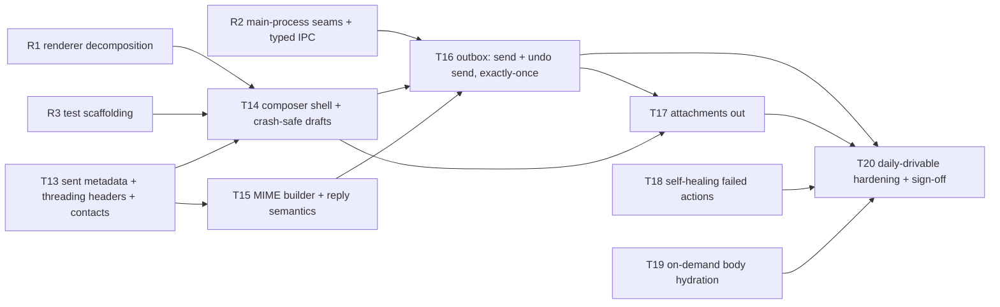

# M2 Implementation Plan — Mail Out (Composer, Drafts, Send, Undo Send, Exactly-Once Outbox)

**Audience:** the engineer(s) building M2. Written to the same contract as [M1-PLAN.md](M1-PLAN.md): every task is one PR, nothing is done until `npm run verify` is green, and "spec F6" means a section of [SPEC.md](SPEC.md) (v0.13) — read it before starting the task.
**Basis:** SPEC §8 M2, F6 (compose/send/undo send), F3 (reader the composer opens from), the M1 deviations table, and the codebase as merged through PR #26.
**Goal:** M2 ends at the **daily-drivable bar** — one of us runs Attn as their only mail client. That requires both the new mail-out surface and the hardening pass (T20) that closes the M1 deviations assigned to M2.

**Prerequisite from M1:** the two remaining M1 exit smokes (real-Gmail airplane-mode drain; real-OS notification click-through) must be recorded in the M1 plan before M2 *sign-off* — but they do not block starting R1–R3 or any T-task.

---

## Why this order

The composer is the largest single UI surface in the product, and it lands in a renderer whose root component is already 1,989 lines. The outbox is the first subsystem where a bug destroys trust irreversibly (a duplicate send cannot be undone). So M2 starts with refactors that make room (R1–R3), builds the data foundation next (T13), then the composer and the send machinery on top of clean seams, and ends with the hardening pass (T20) that makes "daily-drivable" honest.



Parallelization: R1 ∥ R2 ∥ T13 touch disjoint files. T15 is pure modules and can run beside T14. T18 and T19 are independent of the composer chain and fit whenever someone is free.

---

## Global rules (every task — carried over from M1, plus two new ones)

1. **Migrations are an append-only array** (`src/main/db/migrations.ts`). Next index is **v7**; merge order decides numbering; two tasks never share one migration. No dev-only rewrites this milestone — M2 schema changes must be additive because dogfooding databases now carry real state (T11's authorized v5 rewrite is not a precedent).
2. **IPC has three parts** (main handler, preload bridge, shared types) — all in the same commit. After R2, channel names and signatures live in the typed channel map in `src/shared/` — never write a raw channel string in main or preload again.
3. **Mail content is untrusted.** That now includes **outgoing** content: quoted history entering the composer passes the same DOMPurify path as display, and composer output is sanitized against a minimal allowlist before it is stored or built into MIME. Never `dangerouslySetInnerHTML`.
4. **Select on `data-testid`** in e2e; add testids for every new interactive element.
5. **Signed-out means onboarding, not a degraded inbox** (PR #27 removed mock mode). The mail tree — including the composer — only mounts for a signed-in or seeded account, so no composer code may assume it can render without one. Nothing behind the sign-in screen may register commands, IPC subscriptions, or key handlers; the regression test asserting that no key is `preventDefault`-ed on that screen must stay green.
6. **After UI changes, look at the screenshots** — the suite gains `composer.png` in T14; review it like the other four.
7. **Every user-facing action is a registered command** (F5). New contexts (`composer`) still register; the M3 palette will assert the full inventory.
8. **If your task changes the verify pipeline or harness behavior, update AGENTS.md in the same PR.**
9. **New (exactly-once discipline):** any code path that can call `messages.send`/`drafts.send` must be reachable only from the outbox state machine in T16. No convenience send helpers anywhere else — one chokepoint, one invariant.
10. **New (pure-core discipline):** better-sqlite3 cannot load under vitest (Electron ABI), so DB-touching logic stays thin and e2e-covered while decisions live in pure planner modules (the T7 poller and T9 notifier pattern). The outbox machine, reply computation, MIME builder, and contact ranking are all built as pure functions with exhaustive unit tests.

---

## R1 — Decompose the renderer before the composer lands

**Depends on:** nothing · **Unblocks:** T14 · **Parallel with:** R2, T13

### Why

`App.tsx` is **2,054 lines** (PR #27 added the login screen) and its `Inbox` component alone holds ~25 pieces of state: list, reader, selection, snooze picker, label picker, sync status, account menu, toasts, keyboard dispatch, and the mail-data lifecycle. The composer adds the biggest stateful surface yet (recipients, editor, attachments, autocomplete, outbox status) plus per-keystroke latency budgets (<16ms). Landing that in the current file would push it past 3,000 lines and make the keystroke path re-render the world.

PR #27 already set the precedent worth continuing: it split the file into an **auth shell** (`App`) and a **mail tree** (`Inbox`) so the signed-out screen cannot mount mail hooks. R1 extends that same cut downward — keep the shell/tree boundary intact and pull leaf surfaces out of `Inbox`.

### Implementation guide

**No behavior change. No new features. The 52-test e2e suite is the safety net and must pass unmodified** (testids and DOM structure stay stable; only import paths move).

1. New `src/renderer/src/components/`: extract, one commit each so review stays mechanical:
   - `LoginScreen.tsx`, `SyncStatus.tsx` (with `SyncProgress`), `AccountMenu.tsx`, `SnoozePicker.tsx`, `Toast.tsx`, `QueueReadout.tsx`
   - `ThreadList.tsx` (list container + row + date groups + `ThreadLabels`/`ReminderChips`)
   - `ConversationView.tsx` (reader header + scroll container) and move the existing `MessageCard`/`RecipientLine`/`ConversationMessages` beside it
2. New `src/renderer/src/hooks/`:
   - `useMailData` — auth status, sync state, threads/snoozed/labels/unread/pending, the `refresh` + `mail:changed` wiring, and the deferred-refresh machinery (`deferRefreshUntilRef`)
   - `useSelectionState` — `selectedIds`/anchor/base + toggle/extend/clear (the pure parts already live in `selection.ts`)
   - `useConversation` — the conversation cache, neighbor preload, and mark-read-on-open effect
   - `useKeyboardDispatch` — the window keydown listener, chord state, and reading-scroll handoff
   - `useToast`
3. `App.tsx` keeps the auth shell; `Inbox` becomes composition + the triage/command-registration glue. Target: **under ~450 lines for the file**. If a piece resists extraction, that's a finding — write it down in the PR rather than forcing it.
4. Props stay explicit (no context providers yet); the composer task decides whether a context is warranted when it actually feels the pain.

### Done when

E2e suite green with zero spec edits; all five existing screenshot artifacts (`login`, `inbox`, `reading`, `simple-mail`, `label-picker`) visually unchanged; `App.tsx` under ~450 lines; no component over ~350.

---

## R2 — Main-process seams and the typed IPC map

**Depends on:** nothing · **Unblocks:** T16 · **Parallel with:** R1, T13

### Why

`src/main/index.ts` is 720 lines mixing boot wiring, window creation, sync orchestration (the generation-guard logic — the subtlest code in the app), and every IPC handler. T16 adds an outbox sender, more IPC, and boot recovery; without seams, index.ts becomes the next App.tsx. And IPC channel names are currently bare strings repeated in three files — a typo compiles fine and fails at runtime.

### Implementation guide

1. **`src/shared/ipc.ts` — the typed channel map.** One interface listing every invoke channel with request/response types, and every broadcast channel with payload type. `preload/index.ts` and the main-process registrar both derive from it (a small `handle<K extends Channel>(channel, fn)` wrapper in main; the preload methods keyed off the same names). Renaming or retyping a channel becomes a compile error everywhere. No runtime behavior change.
2. **`src/main/ipc.ts`** — move `registerIpc` there, taking its dependencies (`db`, `currentAccountId`, executor, scheduler, notifier, sync controller) as an explicit context object instead of closing over module globals.
3. **`src/main/syncController.ts`** — extract the sync orchestration state machine: `startSync`, `startHistoryPoller`, `stopHistoryPoller`, `retrySync`, `resumeOnlineWork`, the `authSessionGeneration` counter, `backfillRetryGeneration`, `syncRunning`, and sync-state publishing. Give it a narrow interface (`onSignIn()`, `onSignOut()`, `retry()`, `getState()`) and keep the generation-guard rules in one documented place. Extract the pure routing decisions (which already exist as `syncRetryRoute`) plus any new ones into unit-testable functions.
4. `index.ts` keeps: env seams, single-instance lock, window creation, boot sequence, will-quit teardown. Target under ~350 lines.
5. Grep-proof: after R2, `ipcMain.handle('` appears only in `ipc.ts`, and no channel string literal appears more than once in the codebase.

### Done when

Verify green with no e2e edits; channel map adopted by all three layers; `index.ts` under ~350 lines; sync generation logic isolated with its routing decisions unit-tested.

---

## R3 — Test scaffolding for mail-out

**Depends on:** R1 (file layout) · **Unblocks:** T14, T16 · **Small task**

1. **Seed fixture growth:** add to `e2e/fixtures/seed-inbox.json` a thread whose messages carry `Message-ID`/`References` headers (T13 exposes them) and a message with a `Reply-To` differing from `From` — reply-computation e2e needs both. Keep existing thread indices stable (triage specs assert fixture math; append, don't reorder).
2. **Composer page object:** `e2e/composer.ts` helper (open via `c`/`r`, read recipient chips, type in editor, trigger send, read outbox state via the footer/pending readout) so T14–T17 specs stay declarative.
3. **Clock seam for unit tests:** the outbox machine and undo-send window are time-driven. Standardize on injectable `now()`/timer factories (the M1 scheduler already takes this shape) so vitest covers window elapse without real waits.
4. Document all three in AGENTS.md's harness section.

---

## T13 — Sent-mail metadata, threading headers, and the contacts store

**Depends on:** nothing (main-process only) · **Unblocks:** T14 (autocomplete data), T15 (threading fields) · **Spec:** F6 (autocomplete "built locally from synced sent mail"), F2

### Why

Three M2 features need data the store doesn't have yet: recipient autocomplete needs the user's sending history; reply threading needs each message's RFC `Message-ID`/`References`; and the M3 Sent view will need SENT membership anyway. One sync-layer task supplies all three.

### Design (decided)

- **`listThreadIds` must stop hardcoding INBOX first** (review finding, P1). `GmailMailProvider.listThreadIds` sets `labelIds: 'INBOX'` unconditionally (`src/main/gmail/provider.ts`), so a naive `q: 'in:sent'` stage would request INBOX ∩ SENT — near-empty, and autocomplete would silently ship with no data. Change the signature to take the label explicitly (`listThreadIds({ q?, labelIds?, pageToken? })`) and pass `['INBOX']` at the **three existing call sites** — backfill's metadata stage, its bodies stage, and the reconcile re-list, where the implicit filter is load-bearing. Do this as the task's first commit, mechanically, with the existing suite as the check.
- **Backfill gains a `sent` metadata stage** after `bodies`: `listThreadIds({ labelIds: ['SENT'], q: 'newer_than:12m' })`, persisted `metadataOnly` through the same `runThreadPhase` machinery (checkpointed cursor `sent:<token>`, resumable). The history poller already refetches *any* thread that appears in history records, so sent mail stays current after backfill without poller changes; the `newMail` exclusion of self-sent messages (SENT label) is untouched.
- **Upgrade path for existing accounts:** `backfill_cursor='done'` databases must run the sent stage exactly once without redoing metadata/bodies. Add a `sent_synced` flag column to `sync_state` (v7). `startSync` routes: cursor `done` + `sent_synced=0` → run only the sent stage, then set the flag. Fresh backfills set it as part of the normal sequence. **Do not reset anyone's `done` cursor.**
- **Threading headers:** `parse.ts` extracts `Message-ID` and `References` (plus `In-Reply-To` as a References fallback); `persistThread` stores them. Only newly-synced mail carries them — T15 handles the missing-header case at reply time.
- **Contacts are derived, and must be idempotent** (review finding, P2). The obvious design — increment `sent_to_count` while walking `persistThread` — is wrong, because `persistThread` runs again every time a thread is refetched: history polling, body hydration, expiry recovery, and T16's post-send refresh all re-persist the same messages. Counters would inflate with *refetch frequency* rather than interaction frequency, so the threads you touch most would dominate autocomplete regardless of who you actually write to. Nothing about that failure is visible until the rankings are quietly wrong.
  - Instead, record **one contribution row per (message, email, role)** and aggregate. `INSERT OR IGNORE` makes re-persisting a no-op by construction, so correctness doesn't depend on remembering which sync paths can repeat.
  - Roles: `to` (a recipient of a message carrying SENT) and `from` (the sender of a received message). Store the display name seen on that contribution so the aggregate can prefer the most recent one.
  - Stats are a `GROUP BY` over that table joined to `messages` for the date — no derived counters to drift, and no `rebuildContacts` backfill pass to write, since re-persisting existing threads populates it naturally. Materialize only if the query is measured slow.
- **Ranking is a pure function** in `src/shared/contacts.ts` (shared — the renderer ranks as the user types): score = `3·sent_to + received` with a recency multiplier (halve per 90 days since the last interaction), prefix matches on address or name beat infix, self is excluded. Exact formula is a starting point — tune during dogfood, keep it pure and tested.

### Implementation guide

**Migration v7 (single migration for the task):**

```sql
ALTER TABLE messages ADD COLUMN rfc_message_id TEXT;
ALTER TABLE messages ADD COLUMN references_json TEXT;
ALTER TABLE sync_state ADD COLUMN sent_synced INTEGER NOT NULL DEFAULT 0;
-- One idempotent contribution per (message, email, role): re-persisting a
-- thread can never double-count, whatever sync path triggered it.
CREATE TABLE contact_messages (
  account_id TEXT NOT NULL,
  message_id TEXT NOT NULL,
  email      TEXT NOT NULL,
  role       TEXT NOT NULL,          -- 'to' (we wrote to them) | 'from' (they wrote to us)
  name       TEXT,
  PRIMARY KEY (account_id, message_id, email, role)
);
CREATE INDEX idx_contact_messages_email ON contact_messages (account_id, email);
```

Search aggregates live, newest display name winning:

```sql
SELECT cm.email,
       SUM(cm.role = 'to')   AS sent_to_count,
       SUM(cm.role = 'from') AS received_count,
       MAX(m.internal_date)  AS last_interacted_at
  FROM contact_messages cm
  JOIN messages m ON m.account_id = cm.account_id AND m.id = cm.message_id
 WHERE cm.account_id = ? AND cm.email LIKE ?
 GROUP BY cm.email
```

- IPC (typed map): `contacts:search(query) → { name, email, score }[]` (main runs the SQL narrow, shared ranking orders; cap ~8 rows).
- Seed loader: accept optional `messageId`/`references` per fixture message (R3 uses this).
- `SyncStage` union gains `'sent'`; the footer stage label reads "Sent mail". Keep `sameSyncState`/progress rendering in step.

### Testing

- Unit: header extraction (angle-bracket forms, folded References), contact ranking (recency decay, prefix beats infix, self-exclusion), cursor routing for the three upgrade shapes (fresh, mid-backfill, done-without-sent).
- **E2e regression for the idempotency finding:** persist the same seeded thread twice (a refetch is one `relaunch()` plus a poll, or drive `persistThread` through the test seam) and assert the contact aggregate is unchanged. Without this, overcounting reappears the first time someone adds a sync path that re-persists.
- E2e (seeded): seeded fixture exposes headers through `getConversation`; `contacts:search` returns seed senders ranked; boot log shows the sent stage skipped when seeded.
- Manual smoke (signed in): fresh sign-in runs metadata → bodies → sent; an existing done-cursor DB runs only sent; contacts populate from real history.

### Done when

Verify green; both upgrade paths demonstrated (fresh + existing DB); autocomplete data queryable over IPC; AGENTS harness notes updated if the fixture shape changed.

---

## T14 — Composer shell: overlay panel, crash-safe local drafts, autocomplete

**Depends on:** R1, R3, T13 (can start against a stubbed `contacts:search`) · **Unblocks:** T16, T17 · **Spec:** F6, §5 composer keys

### Design (decided)

- **Overlay panel above the current view** (F6: context is never lost) — a bottom-right docked panel in the Dispatch language, not a modal takeover: the list/reader stays visible and interactive scroll-wise behind it; app keyboard verbs suspend while the composer has focus (the existing text-entry guard already does most of this).
- **The local `outbox` row is the draft's source of truth from the moment the composer opens** (state `composing`, T16's table — T14 lands the table's *draft* subset if it merges first; coordinate migration order with T16, they must not share one migration). Create the row on open, before any typing, so there is always something to recover into.
- **Autosave needs a bounded checkpoint, not just an idle debounce** (review finding, P1). A trailing 1s-idle debounce does *not* bound loss to one second: every keystroke resets the timer, so someone typing continuously for three minutes has written nothing to disk, and a force-quit loses the whole draft — the exact scenario F6's crash-safety criterion is about. Pair the 1s idle trigger with a **hard max-wait (5s) while dirty**, so continuous typing still checkpoints on a fixed interval. Note the test trap the same finding names: a relaunch test that pauses before quitting silently passes, because the pause fires the idle save. The regression test must type *continuously* and relaunch with no idle gap.
- **Gmail Drafts mirror is best-effort and asynchronous:** debounced (~3s idle) `drafts.create`/`drafts.update` through the provider, storing `gmail_draft_id`. Mirror failures never block typing or local autosave; offline composing is fully supported (mirror catches up when the executor comes back — the mirror op rides the existing action queue as a new intent kind, so it inherits retry/offline semantics).
- **Editor: Lexical** (owner decision, 2026-08-13 — `npm i lexical @lexical/react @lexical/rich-text @lexical/list @lexical/link @lexical/html`). Rejected alternative: raw `contenteditable` + `document.execCommand`. The deciding argument is **M4, not M2** — F8 snippets must expand as a *single* undoable step with `{cursor}` placement, and F17 streams an AI draft into a live editable box. Both are programmatic edits that need correct undo grouping and selection preservation, which a document model provides and `execCommand` (also deprecated) does not. Paste normalization from other mail clients is the second reason. The usual headline reason — cross-browser normalization — is explicitly *not* why we're adopting it: Electron pins one Chromium (D3).
  - **Constrain the schema to F6's surface and nothing more:** bold/italic/underline, ordered/unordered lists, links, blockquote. A narrow schema is the point — it makes output predictable and rejects pasted junk by construction. Do not enable tables, images, code blocks, or collaborative extensions "because they're available".
  - **Serialization:** `@lexical/html` `$generateHtmlFromNodes` on autosave and on send, then **still** through DOMPurify with the minimal allowlist (`p/div/br/b/strong/i/em/u/a[href]/ul/ol/li/blockquote`). The schema makes the sanitizer's job easy; it does not replace it (global rule 3 — outgoing content is untrusted too).
  - **Plain-text alternative** derives from the editor state, not from `innerText`: walk the node tree so blockquote becomes `>` prefixes and list items keep their markers.
  - **Latency:** Lexical's own updates are cheap, but the composer must not re-render the React tree per keystroke — subscribe to editor state for the *autosave debounce only*, never lift editor content into React state on change. This is the single most likely way to miss F6's <16ms budget; T20 profiles it.
  - **Bundle:** ~25KB gz for core + the plugins above. Acceptable on desktop, but note it in the PR — it is the first runtime dependency the renderer has taken beyond React and DOMPurify.
- **Recipient fields:** chip-based To/Cc/Bcc (Cc/Bcc revealed on demand), free-text parse on comma/Enter/blur with the existing `parseAddressList` semantics, invalid addresses visibly rejected at chip-creation time. Autocomplete dropdown from `contacts:search`; `Tab`/`Enter` accepts the highlighted suggestion (F6).
- **Keys:** `c` (global) opens a new message. `Mod+Enter` send (wired fully in T16; until then it saves + closes with a "Sending lands with T16" toast behind a flag — or hold the PR until T16 if the flag feels dishonest; prefer holding). `Esc` closes (draft saved, toast "Draft saved"). `Mod+B/I/U`, `Mod+Shift+K` (link). All registered as commands with a new `'composer'` context; the registry's `matchKey` currently drops modifier chords, so composer-context dispatch happens inside the composer's own key handler while the registry entries carry the shortcut strings for the palette (extend `COMMAND_SPECS` typing to allow `Mod+` shortcuts without loosening the global matcher).
- **Reopen behavior:** exactly one composer at a time in v1. `c` with a live `composing` row reopens it (single-account, single-window reality); a second draft requires discarding or sending the first. On boot, a `composing` row that is dirtier than its Gmail mirror reopens automatically — that is F6's crash-recovery acceptance made visible. M3's Drafts view generalizes this.

### Implementation guide

- New `src/renderer/src/composer/` (Composer.tsx, RecipientField.tsx, EditorToolbar.tsx, editorConfig.ts — the constrained node set + theme, serialize.ts — HTML/plain-text output, useComposerDraft.ts, useAutocomplete.ts). Keep every module under the R1 size bars.
- IPC (typed map): `draft:save(draft) → { id }`, `draft:get(id)`, `draft:discard(id)`, `draft:takeRecovered() → draft | null` (boot recovery pull, mirroring the pending-focus pattern).
- Main: draft persistence module `src/main/outbox/drafts.ts` (row CRUD + mirror enqueue). No send paths here (global rule 9).
- Testids: `composer`, `composer-to`, `composer-subject`, `composer-editor`, `composer-attachments`, `autocomplete-option`, `composer-close`.
- Screenshot artifact: `composer.png` (open composer over the inbox, one recipient chip, styled body line).

### Testing

- Unit: outgoing-HTML sanitizer allowlist (hostile paste collapses to allowed tags), plain-text derivation, recipient parse/chip rules, autocomplete ranking integration. **Serialization is testable without a DOM** — build editor states with `@lexical/headless` so these stay in the plain-Node vitest suite (global rule 10) instead of becoming e2e-only.
- E2e (seeded): `c` opens focused at To; chips accept/reject; `Esc` saves and toasts; relaunch → draft reopens with content intact (**the F6 crash acceptance, minus force-kill which the relaunch helper approximates**); **a second relaunch case that types continuously and never idles, proving the max-wait checkpoint rather than the debounce**; typing in the editor never triggers list verbs; the sign-in screen still registers nothing (the #27 regression test stays green with composer commands in the registry).
- Perf (@perf): composer open < 100ms CI ceiling; keystroke-to-paint sampled under the 2k-thread seed with a generous CI ceiling (catch order-of-magnitude regressions, not 16ms exactness — that's T20's profiled pass).

### Done when

Draft lifecycle (open/type/autosave/close/reopen/relaunch-recover) fully demonstrated in e2e without network; mirror ops visible in the pending queue when seeded; `composer.png` reviewed; verify green.

---

## T15 — MIME builder and reply/reply-all/forward semantics

**Depends on:** T13 (headers) · **Unblocks:** T16 · **Parallel with:** T14 · **Spec:** F6

### Why a dedicated task

Everything here is a pure function from stored state to bytes or to a prefilled draft — the most unit-testable code in M2 and the code most likely to embarrass us in other people's mail clients. It gets its own task so it is exhaustively tested before the outbox ever calls it.

### Implementation guide

**`src/main/outbox/mime.ts`** — RFC 5322/2045 builder, no dependencies:
- `buildMime(draft, { accountEmail, rfcMessageId, date }): string` → complete message: headers (`From`, `To`/`Cc`/`Bcc`, `Subject` with RFC 2047 encoded-words for non-ASCII, `Message-ID` (the caller-supplied one — exactly-once depends on it), `In-Reply-To`/`References` when replying, `Date`, `MIME-Version`), body as `multipart/alternative` (text + html), wrapped in `multipart/mixed` when attachments exist (base64, 76-col lines, `Content-Disposition: attachment; filename*=` RFC 2231 for non-ASCII names; `Content-ID` for future inline use).
- Deterministic boundaries derived from the message id (stable output = testable with fixture files).

**`src/main/outbox/replyPlan.ts`:**
- `planReply(kind, conversation, accountEmail)` → `{ to, cc, subject, quoteHtml, quoteText, inReplyTo, references, threadId }`.
- Recipients: reply → `Reply-To ?? From` of the latest non-self message (fall back to latest message if all are self), minus self. Reply-all → that plus To+Cc of the source message, minus self, deduped case-insensitively. Forward → empty.
- Subject: `Re: `/`Fwd: ` prefixed once, case-insensitive detection, existing prefix preserved (`Re: Re:` never produced).
- Quote: attribution line ("On {date}, {name} <{email}> wrote:") + the source body inside `blockquote` (HTML path reuses the display sanitizer **before** embedding; text path `>`-prefixes). Forward uses the forwarded-message header block instead. The quote is stored separately on the draft (`quote_html`) and collapsed in the composer (F6) — the user's text never mixes into it unless they expand and edit, which folds it into the body.
- References: source's `References` + source's `Message-ID` (RFC 5322 §3.6.4), truncated from the front if the header would exceed ~998 octets. **Missing headers** (mail cached before v7): plan returns `references: []` and T16 still sets `threadId` on the API call — Gmail threads it server-side; external recipients may see a new thread, which is the accepted cost, logged in the PR.

### Testing

Unit only (this task ships no UI): golden-file MIME fixtures (simple text, html+text, attachment, non-ASCII subject + filename, reply with References chain); reply-plan table tests (self-only thread, Reply-To divergence, dedupe, prefix cases, missing headers); property check that every generated message parses back with a naive header splitter. Update `parse.ts` fixtures if header extraction needs sharing.

### Done when

Builder + planner land with the test matrix above; no send path exists yet; verify green.

---

## T16 — Outbox: send, undo send, exactly-once

**Depends on:** R2, T14, T15 · **Unblocks:** T17, T20 · **Spec:** F6 (undo send, outbox state machine), F2 (queue), §6 (scheduler owns undo-send windows)

### Design (decided — the invariant lives here)

- **State machine per outbox row:** `composing → queued → sending → sent` (+ `failed`, + `needs-review` for the unresolvable-ambiguity case below). Transitions are durable **before** their side effects: a row is `queued` with `send_at` before the toast shows; `sending` is written before the first byte leaves; `sent` is written only on confirmed success.
- **Exactly-once rests on the Gmail draft id, not on a search** (revised after a review finding, P1). The original design generated a client RFC Message-ID, baked it into the MIME, and on any ambiguity searched `rfc822msgid:` — treating "not found" as proof the send never happened. That inference is unsound: Gmail's search index is not synchronously consistent with send, and Gmail does not honor a supplied Message-ID as an idempotency key. A message accepted seconds ago can be genuinely absent from search, so "not found ⇒ resend" manufactures exactly the duplicate this machine exists to prevent.
  - **Always send through a Gmail draft.** At send time, if the row has no `gmail_draft_id`, `drafts.create` first (with our Message-ID in the MIME), persist the id, then `drafts.update` + `drafts.send`. The draft id is a *strong, immediately-consistent* handle — no search index involved — and `drafts.send` atomically consumes the draft, so its disappearance is a real signal rather than an inference.
  - **Recovery when a `sending` row is found after a crash or ambiguous error:** `drafts.get(gmail_draft_id)` — **present ⇒ the send did not complete, resend is safe**; **404 ⇒ it did, mark `sent`**. This is the common path and it is decisive.
  - **The residual ambiguity is narrow:** a crash between `drafts.create` and persisting its id. There the Message-ID search is a *secondary* check, run with a bounded verification window (re-check over ~60s rather than trusting one negative), and it searches drafts as well as messages, since an orphaned draft carries the same Message-ID.
  - **When still unresolved, do not send.** A message that failed to send is recoverable by the user; a duplicate is not, and F6 makes "no duplicate send" the acceptance criterion. Park the row in a `needs-review` state and reopen the composer with a plain explanation ("We couldn't confirm this was sent — check your Sent mail before resending"). Silent dropping is not acceptable either; the user must be told.
  - Keep the client Message-ID regardless — it is what makes both the secondary search and any manual reconciliation possible.
- **Undo window:** queueing sets `send_at = now + delay` (setting stored via the M1 `settings` table: `undoSendDelaySeconds`, **default 8**; the settings *UI* is M4 — a palette-less default is fine for M2 dogfood). The **scheduler owns the timer** (§6): extend the M1 scheduler pattern with an `OutboxSender` armed on the next due `queued` row; catch-up on boot sends anything whose window elapsed while the app was closed. **Undo (`Z`) rides the existing main-process undo stack:** queueing a send pushes an entry whose inverse flips the row back to `composing`, cancels the timer, and tells the renderer to reopen the composer. Popping it after the send fired reports "Already sent" (no inverse) — deliberately still consuming the stack entry so `Z Z` doesn't skip backwards silently.
- **Send execution** (the only `send` chokepoint, global rule 9): always the draft path — `drafts.create` if no `gmail_draft_id` yet (persist it *before* sending), then `drafts.update` (raw MIME) and `drafts.send`, which replaces the draft atomically and leaves no husk in Drafts. `messages.send` is deliberately **not** used: it would forfeit the draft-id handle that makes recovery decisive. Calls set `threadId` when replying; attachment payloads use `uploadType=multipart`. A 404 on `drafts.send` means the draft is already consumed — treat as sent, never as a reason to blind-resend.
- **After confirmed send:** refetch the returned `threadId` through the provider → `persistThread` → `mail:changed`, so the sent message appears in the local thread within a second (and Sent-view data accrues for M3). Reply-sends leave the inbox untouched; F4 auto-advance is not coupled to sending in v1.
- **Offline:** rows sit in `queued` past their window while no provider exists; footer pending count includes `queued`/`sending` outbox rows (the local-first visibility contract, same as triage). Toast on queue: **"Sent — Undo (Z)"** with the toast persisting for the window's duration rather than the standard 4s.
- **Failures:** permanent 4xx (bad recipient, size) → `failed` + toast + composer reopens with the error banner and content intact. Retryable errors follow the executor's backoff ladder with the verification-first rule above.

### Implementation guide

**Migration v8:**

```sql
CREATE TABLE outbox (
  id              TEXT PRIMARY KEY,
  account_id      TEXT NOT NULL,
  state           TEXT NOT NULL DEFAULT 'composing',  -- composing|queued|sending|sent|failed|needs-review
  kind            TEXT NOT NULL DEFAULT 'new',      -- new | reply | replyAll | forward
  thread_id       TEXT,
  source_message_id TEXT,
  to_json         TEXT NOT NULL DEFAULT '[]',
  cc_json         TEXT NOT NULL DEFAULT '[]',
  bcc_json        TEXT NOT NULL DEFAULT '[]',
  subject         TEXT NOT NULL DEFAULT '',
  body_html       TEXT NOT NULL DEFAULT '',
  body_text       TEXT NOT NULL DEFAULT '',
  quote_html      TEXT,
  attachments_json TEXT NOT NULL DEFAULT '[]',
  rfc_message_id  TEXT,
  gmail_draft_id  TEXT,
  send_at         INTEGER,
  attempts        INTEGER NOT NULL DEFAULT 0,
  last_error      TEXT,
  created_at      INTEGER NOT NULL,
  updated_at      INTEGER NOT NULL
);
CREATE INDEX idx_outbox_due ON outbox (account_id, state, send_at);
```

(If T14 merged first with the draft-subset table, this becomes the additive completion — coordinate; the two PRs must not share a migration.)

- **Pure core** `src/main/outbox/machine.ts`: `planTransition(row, event, now)` returning the next state + required effects (`persist`, `armTimer`, `verify`, `send`, `notify`) — the vitest surface. Effects live in `src/main/outbox/sender.ts` (thin, e2e-covered).
- Provider grows `createDraft/updateDraft/sendDraft/getDraft/findByRfcId` — interface in `sync/provider.ts`, implementation in `gmail/provider.ts` (raw upload paths). `getDraft` is the decisive recovery probe; `findByRfcId` is only the secondary check and must search drafts as well as messages. No `sendMessage` — the draft path is the only send route.
- IPC: `outbox:send(draftId)`, `outbox:undoSend(outboxId)` (also reachable via the undo stack), broadcast `outbox:changed` for composer/toast state.
- Reply entry points: `r`/`a`/`f` commands (reader context) call `planReply` and open the composer prefilled; register in the registry (§5 keys).

### Testing

- **Unit (the heart of the task):** machine transition matrix including every crash point (kill before/after `sending` write, kill after network-ambiguous error, **kill between `drafts.create` and persisting its id** — the one genuinely ambiguous window), draft-present-⇒-resend and draft-404-⇒-sent recovery, the bounded secondary search never resending on a single negative, `needs-review` parking, window catch-up on boot, and undo-after-fire — all against a fake provider + injected clock. This is the M1 "sync-engine correctness" bar applied to send.
- **E2e (seeded, no network):** `Mod+Enter` queues + toast with undo; `z` inside the window reopens the composer intact; window elapse moves the row to the provider-gate (visible as pending); relaunch with a queued row preserves it (durability); reply prefill shows quoted history collapsed and correct recipients from the fixture's Reply-To thread.
- **Manual smoke (signed in, documented in the PR):** real send → lands threaded in Gmail web and leaves **no leftover draft**; undo inside window → nothing sent, composer restored; force-quit during the window → sends on relaunch; force-kill mid-send → exactly one copy in Sent after relaunch (run it several times, since this is the criterion the whole design exists for); reply threading renders correctly in Gmail + one external client.

### Done when

The unit matrix and e2e above are green; the manual exactly-once checklist is executed and pasted into the PR; no send call exists outside the sender; verify green.

---

## T17 — Attachments out

**Depends on:** T14, T16 · **Spec:** F6 (drag-drop/picker, 25MB, progress)

- **Spool at attach time:** copying the file into `userData/outbox/{draftId}/` immediately makes the draft self-contained (the original can move/delete before send — crash-safety includes attachments). Spool entries are recorded in `attachments_json` (filename, mimeType, sizeBytes, spool path) and cleaned on discard/sent.
- Drag-and-drop onto the composer + a picker button (`dialog.showOpenDialog` via a new typed IPC). Per-file and total caps enforced at attach time: reject past **25MB total** with a clear toast (Gmail's own limit; oversize handoff links are out of scope v1).
- MIME: T15 already frames attachments; the sender streams spool files into the multipart upload. Progress: per-outbox-row send progress event (`outbox:progress`) driving a thin bar on the composer/toast — coarse (per-attachment) granularity is fine at these sizes.
- Mirror behavior: Gmail draft mirrors include attachments only at final send-time build (mirroring megabytes on every autosave would hammer quota; the local spool is the durability story, the mirror is convenience). Note the interaction with T16's draft-only send path: since every send now goes through `drafts.update` + `drafts.send`, the attachment bytes upload as part of that final update — one upload, not two. Document this bound in the PR.
- Testing — unit: spool naming/cleanup, cap math, MIME framing with spooled files; e2e: attach via a seeded fixture file, chip renders with size, discard cleans the spool (assert via relaunch), oversize rejection toast; manual: real send with mixed attachments arrives intact (checksum the received files).

### Done when

Attach → queue → relaunch → send survives with bytes intact; caps enforced; spool leaks impossible in the e2e lifecycle; verify green.

---

## T18 — Self-healing failed actions (deciding an M1 deferred call)

**Depends on:** nothing (parallel-friendly) · **Spec:** F2 action queue + conflict rule; M1 deviations rows 2–3

**Product decision (owner, 2026-08-13):** a permanently failed action **repairs itself and says so** — local state converges back to what the server actually thinks, so an archive Gmail rejected simply reappears in the inbox. No failed-actions panel, no retry button, no error log. Debugging sync is not the user's job.

**The mechanism is refetch, not inverse-delta.** Don't compute a reverse of the failed action — delete the queue row and re-fetch that thread (`getThread` → `persistThread`, which already replays any remaining pending intent on top). Server state is the truth by F2's own conflict rule, so this converges exactly and cannot drift the way a hand-rolled inverse can. It costs one request on a path that is, by construction, rare.

**Three nuances the policy must respect — getting these wrong is worse than the old behavior:**

1. **Only *permanent* failures revert.** Offline, 5xx, and 429 stay retryable with their backoff ladder untouched. Reverting on a transient failure would flicker mail back into the inbox during a network blip — the worst outcome available here. `isPermanentActionError` already draws this line; use it, don't widen it.
2. **Auth failures never revert.** A 401/revoked token doesn't mean "Gmail rejected this", it means "we couldn't ask". The intent is still valid, so those rows re-pend on the next successful sign-in for the same account (the M1 deviation) instead of discarding 20 archives because a token lapsed. Detect via the stored 401 error string from `GmailApiError` formatting (stable, test-pinned) — no migration needed.
3. **Sends are the exception (T16).** A failed send must never silently vanish or self-repair — the user wrote that message. It reopens the composer with content intact and the error shown. This task's auto-revert covers triage actions only.

**Telling the user.** Silent reappearance is spooky: mail moving on its own reads as a bug. On revert, one plainly-worded, non-actionable toast — *"Couldn't archive 'Q3 roadmap review' — it's back in your inbox."* Batch to a single toast when several revert together. That is the entire surface: no badge state, no panel, no command.

**Consequences (deliberate simplifications):**
- Footer pending readout stays a single count — the planned `· N failed` split is cut.
- `pendingActionCount` stops counting permanently-failed rows because they no longer exist; the M1 comment about failed rows haunting the badge forever, and the deviation row behind it, both retire here.
- The `failed` state effectively disappears from `action_queue` for triage intents (auth-stranded rows sit in `pending`). Keep the column — the outbox reuses it.
- **Undo-stack hygiene:** an undo entry whose action was reverted must not later re-apply. On revert, drop entries referencing that thread+action rather than leaving a `Z` that resurrects a rejected change.

### Testing

- Unit: three-way permanent / retryable / auth classification (exhaustive); undo-stack invalidation; toast batching.
- E2e (seeded): drive a permanent failure through the test seam → thread returns to the list, toast appears, pending count returns to zero, and a following `z` does not re-archive it.

### Done when

A permanently failed triage action leaves the UI matching the server with one explanatory toast and no user action; auth-stranded actions survive re-sign-in; sends still surface in the composer; verify green; the two M1 deviation rows point here.

---

## T19 — On-demand body hydration for metadata-only threads

**Depends on:** nothing · **Spec:** F2 ("older content is fetched on demand"), M1 deviation row

Opening a 90-day-to-12-month-old thread today renders snippets only, forever. Close the gap:

- `mail:getConversation` returns what the store has, immediately (never block the open — F3's <50ms). When any returned message lacks both `body_text`-beyond-snippet and `body_html`, and a provider exists, kick a background hydrate: `getThread(full)` → `persistThread` → `hydrateMissingThreadBodies` → `mail:changed`. The renderer's existing refresh path repaints the open conversation; add a quiet "Loading full message…" placeholder on body-less cards so the beat is legible.
- Debounce per thread (one in-flight hydrate; failures fall back silently to snippet view and retry on next open). Seeded/offline: no provider → placeholder text becomes "Full message loads when signed in" (mirrors the attachment toast language).
- SENT metadata threads from T13 get bodies the same way when opened.
- Testing — unit: the "needs hydration" predicate; e2e: seeded metadata-only fixture thread opens instantly with placeholder, then (with a stub provider seam? no — seeded has no provider) asserts the offline placeholder; the online path is a documented manual smoke. Perf: conversation-open budget unaffected (hydrate is post-paint).

### Done when

Old threads read like new ones when signed in; opens never block; verify green; deviation row updated.

---

## T20 — Daily-drivable hardening and M2 sign-off

**Depends on:** T16, T17, T18, T19 · **Spec:** §7 budgets, §8 M2 bar, M1 deviations

The closing pass that turns "features exist" into "this is my mail client":

1. **10k-thread decision (F3):** generate a 10k perf seed locally, measure list render + scroll frame times + memory against §7. If the mounted list misses, implement fixed-height windowing by hand (rows are uniform; ~150 lines, no dependency) and re-measure; if it passes, raise the 300-row query cap to the measured-safe bound and record the evidence. Either way the deviation rows (virtualization, 300-cap) resolve with data, not vibes.
2. **Composer latency profile:** measure keystroke-to-paint under a 2k store with the profiler, not just the CI ceiling; fix anything over ~8ms median so the 16ms budget has headroom.
3. **Gmail client token-bucket limiter** (the reworded M1 TODO): a simple bucket (e.g. 200 units/user/100s tracked client-side) in front of `request()` smoothing backfill+poller+sender bursts, replacing pure backoff-on-403 as the primary defense. Unit-test the bucket; keep the backoff as the fallback.
4. **Dogfood checklist executed and recorded** (the M2 exit evidence): a full week of real use by at least one of us, plus the F6 acceptance list — composer <50ms open, imperceptible typing, force-quit recovery, undo-send reliability, zero duplicate sends across the week, attachment round-trips — and the M1 leftovers if still open (airplane-mode drain, notification click-through).
5. **Docs:** SPEC status + milestone table updated (M2 shipped state, any new accepted deviations), AGENTS pipeline notes if the harness changed, README "current state" paragraph.

### Done when — the M2 exit checklist

- [ ] All R and T tasks above merged; `npm run verify` green including the new composer/outbox suites
- [ ] F6 acceptance criteria each demonstrably pass (list them in the closing PR with evidence links)
- [ ] Exactly-once manual matrix executed on real Gmail, including forced crashes — zero duplicates
- [ ] 10k list + composer latency measurements recorded; virtualization/cap deviation resolved with data
- [ ] Failed triage actions self-heal to server truth with an explanatory toast; auth re-pend shipped; no silent queue states remain
- [ ] On-demand hydration shipped; no permanently body-less threads for signed-in accounts
- [ ] One maintainer has used Attn as their only mail client for a week and filed the friction list (it becomes M3 input)
- [ ] SPEC/README/AGENTS/M1-plan deviation rows updated to the shipped reality

Then M3 (search, system mailboxes, splits, palette, themes) starts — with the sync-engine → utility-process move as its first hardening candidate, deliberately **not** done in M2 (moving the process boundary while building the outbox would risk the exactly-once invariant for a jank win whose real driver is M3's FTS indexing).

---

## Accepted-risk register (decisions made by this plan — don't relitigate ad hoc)

| Decision | Rationale | Revisit |
|---|---|---|
| **Lexical** for the composer editor, over raw `contenteditable`/`execCommand` (owner, 2026-08-13) | M4's snippets (single-undo expansion, `{cursor}`) and AI draft streaming are programmatic edits that need a real document model; `execCommand` is deprecated and paste normalization is otherwise hand-rolled. Cross-browser normalization is *not* a factor — Electron pins one Chromium | Only if Lexical's HTML output fights real-world mail rendering; the sanitizer stays either way |
| Gmail draft mirror is async/best-effort; local row is the source of truth | Typing latency and offline composing must never wait on Gmail | v2 multi-device story |
| Attachments mirror to Gmail only at send time | Autosave-frequency × megabytes would burn quota for convenience | If dogfood shows draft-handoff-to-phone matters |
| Gmail draft id (always send via `drafts.send`) as the exactly-once handle; client Message-ID demoted to a secondary check | Draft existence is immediately consistent and `drafts.send` consumes it atomically, so recovery is decisive. Search-based verification is not: Gmail's index lags sends and it honors no client idempotency key, so a single negative result cannot authorize a resend | v2 backend could own send |
| On unresolvable send ambiguity, park in `needs-review` and tell the user rather than resending | F6 makes "no duplicate send" an acceptance criterion; an unsent message is user-recoverable, a duplicate is not | If dogfood shows the state never occurs in practice |
| Replies to pre-v7 cached mail may lack `References` (threadId still set) | Server-side threading intact; external-client threading degrades rarely and temporarily | Fades as the cache refreshes |
| One live composer at a time | Single window, single account; multiple drafts arrive with M3's Drafts view | M3 |
| Utility-process move deferred to M3 | Don't move the process boundary under the outbox build | M3 first hardening task |
