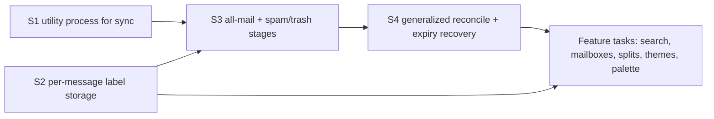

# M3 Implementation Plan — Find & Focus (opening block: the sync restructure)

**Audience:** the engineer(s) building M3. Same contract as [M1-PLAN.md](M1-PLAN.md) and [M2-PLAN.md](M2-PLAN.md): every task is one PR, nothing is done until `npm run verify` is green, and "spec F2" means a section of [SPEC.md](SPEC.md) (v0.15) — read it before starting the task.
**Basis:** SPEC §8 M3, §9 #10 (system mailboxes are explicit v1 scope), §9 #17 (lifetime headers replace the 12-month window), §6 (utility-process move), F2 (sync engine), F3 (mailbox navigation), F10 (instant search).
**Goal:** M3 makes everything in the account *findable* — locally, instantly, and without a window cliff. That requires the store to hold the mail first, which is why this milestone opens with sync work rather than with search UI.

**Status:** this document plans **M3's opening sync block (S1–S4)**. S3 and S4's membership half were pulled forward and shipped with the T13A/sync-stage PR (owner call: land the whole stage pipeline at once rather than splitting across milestones); S1, S2, and S4's existence-sweep tombstone pass remain. The feature tasks that follow — FTS5 search, mailbox navigation, splits, inbox-zero states, themes, palette hardening — are listed at the end as scope but are **not yet planned**; they get written up when the remaining sync work is underway and the store's shape is settled.

---

## Why M3 opens with sync

### What sync looks like as M3 begins

Two independent mechanisms exist when this milestone starts. Read both before touching either — the most
likely M3 mistake is re-implementing something T13A already shipped.

**1. The staged backfill** (`src/main/sync/backfill.ts`), one cursor (`sync_state.backfill_cursor`, grammar
`phase` / `phase:pageToken` / `done`), phases enumerated by `SyncStage` in `src/shared/mail.ts`.

**2. The lifetime sweep** (`src/main/sync/lifetimeSweep.ts`, T13A) — deliberately **not** a backfill phase.
It has its own cursor and progress columns in `sync_state`, its own throttle constants, and its own
progress/quota-wait reporting; `SyncController.startLifetimeSweep` launches it once the backfill completes.
It walks Gmail's default listing with **no query and no label filter**, newest-first, skipping threads
already stored. That shape is correct and M3 does not change it.

Three *data* gaps existed after T13A was designed, and every one is a gap a UI task cannot close. Two and a half of them closed when S3 and S4's membership half shipped early in the T13A PR (#51); the record below keeps the reasoning and marks what is left:

1. ~~**Spam and Trash are never fetched.**~~ **Closed by S3 (#51):** explicit `SPAM`/`TRASH` label stages run after all-mail (`src/main/sync/backfill.ts`), because `threads.list` excludes both unless asked (SPEC §9 #17). Without them M3's Spam and Trash mailboxes would render empty against a store that never had the rows.
2. ~~**The 12-month tier is still Inbox-scoped at normal priority.**~~ **Closed by S3 (#51):** the unfiltered `all-mail` stage fetches the last 12 months of archived + sent mail at normal background priority and the dedicated `sent` stage is retired (old `sent` cursors route to `all-mail` in `parseCursor`). Archived mail from last quarter no longer arrives only through T13A's throttled sweep.
3. **Reconciliation and expiry recovery understood only INBOX — half closed.** `reconcileLabelMembership` (`src/main/sync/poller.ts:87`) now generalizes the INBOX-only helper, `reconcilePurgeableMembership` (`poller.ts:122`) verifies Spam/Trash candidates thread-by-thread and deletes only on a direct 404, and both the backfill completion path and `SyncController.recoverExpiredHistory` call the same helpers. **Still open (S4):** the existence-sweep tombstone pass — a thread purged server-side while its local labels held neither `SPAM` nor `TRASH` is never removed, because Gmail auto-purges Spam/Trash at ~30 days and only an unfiltered + Spam + Trash listing walked to exhaustion in one run (or a per-thread 404) can prove non-existence.

Building the search and mailbox UI on top of an incomplete store would mean shipping views that are quietly missing mail, then fixing sync underneath them. The remaining sync work (S1, S2, S4's tombstone pass) therefore still precedes the feature tasks.



Parallelization: S1 and S2 are independent of each other and can run side by side. The graph above records the intended order; in practice S3 shipped first (in the main process, ahead of S1 and S2), so S1 now moves the finished stage set as-is, and S2 backfills per-message labels into rows S3 already stored — existing rows read `NULL` until their next refetch, as S2's PR notes must say. S4's tombstone pass still waits on S2, because it needs per-message `TRASH`/`SPAM` truth to avoid deleting a partially-trashed live thread.

---

## Global rules (carried from M2, still binding)

1. **No runtime compatibility-migration framework.** `src/main/db/schema.ts` is the single authoritative snapshot and every schema change bumps `CURRENT_SCHEMA_VERSION` (currently 15, after T16's revision 13, T13A's revision 14, and the attachment-flag cursor's revision 15). Throwaway profiles may be deleted and re-synced; a real dogfood profile gets the additive manual upgrade in `AGENTS.md`, and **every schema-changing task publishes its exact DDL**.
2. **IPC has three parts** (main handler, preload bridge, typed channel map in `src/shared/`) — all in the same commit.
3. **Mail content is untrusted**, incoming and outgoing alike.
4. **Select on `data-testid`** in e2e.
5. **Every user-facing action is a registered command** (F5) — and in M3 the palette test asserts the full inventory, so this stops being an honor system.
6. **One reducer, two sources.** Server history events and local optimistic actions keep flowing through the same state-transition code. S1 moves that code between processes; it does not fork it.
7. **Interactive work outranks historical indexing** (SPEC §6). Any new background sweep yields to sends, action replay, history polling, and body hydration.
8. **If your task changes the verify pipeline or harness behavior, update AGENTS.md in the same PR.**

---

## S1 — Move sync work into an Electron utility process

**Depends on:** nothing (M2 deliberately deferred this — see M2-PLAN's risk register) · **Unblocks:** S3 · **Parallel with:** S2 · **Spec:** §6 architecture

### Why first

SPEC §6 already commits M3 to moving Gmail fetch, backfill, derived-data rebuilds, and FTS indexing into a utility process, with the main process remaining the typed IPC/lifecycle broker. M2's risk register deferred it with the reasoning "don't move the process boundary under the outbox build" — the same reasoning applies in reverse now: do the move while the stage set is stable and well-tested, then restructure stages inside the new home. Doing S3 first would mean writing the new stages twice, or moving a boundary under freshly-changed code.

### Design constraints (not a full design — that is this task's first deliverable)

- **Behavior-preserving.** This task moves code; it does not change what sync fetches. The e2e suite and the sync unit tests are the contract, and they should pass unchanged apart from wiring.
- **Preserve the two invariants that M2 paid for:** one reducer for server- and locally-originated changes, and exactly-once send. Neither may acquire a second implementation on the other side of the process boundary.
- **Durable checkpoints survive a crash of the utility process**, and the supervisor restarts it without restarting the app or losing the action queue.
- **The SQLite connection must have exactly one owner.** Decide explicitly — either the utility process owns the DB and the main process asks it for reads, or the DB stays in main and the utility process ships parsed results back. Do not end up with two writers; the current `Db` handle is passed directly into queries, IPC handlers, and executors, so this decision reaches most of `src/main/`.
- **`SchedulerTime` injection stays** (`src/main/time.ts`) so tests never wait on wall-clock time.

### Testing and done condition

Existing unit + e2e coverage passes with the boundary moved; add a supervisor test that kills the utility process mid-backfill and asserts the next cycle resumes from the persisted cursor with no duplicate rows. Done when sync runs off the main thread, interaction budgets in §7 are unchanged or better, and no invariant has a second implementation.

---

## S2 — Per-message label storage

**Depends on:** nothing · **Unblocks:** S3, and every mailbox view · **Parallel with:** S1 · **Spec:** §9 #17, F3

### Why

`persistThread` (`src/main/sync/persist.ts`) collects `labelUnion` across a thread's messages and writes it to `thread_labels`; `messages` has no label column at all. A thread-level union cannot express a partially-trashed or partially-spammed thread, which is exactly what Gmail produces — deleting one message from a live conversation is ordinary behavior. Once Trash and Spam are cached (S3), that union would put a live thread in the Trash view and hide it from All Mail. Gmail's own semantics are per-message, so the store has to be too.

A related wrinkle was already closed in M2 (T14B): `persistThread` drops `DRAFT`- and `CHAT`-labelled messages at the top of its loop (`nonDraftMessages`, `src/main/sync/persist.ts:51`), so a Gmail-side reply draft arriving through the history path is never stored as an ordinary message. Per-message labels make that decision queryable instead of a write-time filter, and — the part that matters here — let a *stored* message's `TRASH`/`SPAM` membership be read per row. One edge the filter leaves for this task: when every message in an authoritative snapshot is a draft, `persistThread` returns early and never prunes the thread's stale non-draft rows (`persist.ts:67-68`), so a thread whose real messages were permanently deleted while a draft remains keeps them locally until the S4 tombstone pass. Handle that pruning here, where the message loop is being reworked anyway.

### Design and implementation

- Add `labels_json TEXT` to `messages`, written from `msg.labelIds` in the same loop that builds `labelUnion`. Keep `thread_labels` as the thread-level projection — mailbox list queries stay fast against it — but let per-message queries (conversation rendering, Trash/Spam membership, draft exclusion) read the new column.
- **Metadata-only refetches must not clobber it.** `persistThread`'s upsert already guards `attachments_json` behind `@metadata_only`; label ids *are* present on metadata-format fetches, so `labels_json` can be written unconditionally — assert that in a test rather than assuming it.
- Decide and document the view rules that follow Gmail's own semantics: **Trash and Spam list any thread with at least one message carrying that label** — a single deleted message must be findable in Trash even though its conversation lives on — while **All Mail lists any thread with at least one message outside SPAM/TRASH**. A mixed thread therefore appears in both, and each view renders the mailbox-appropriate message subset: normal reading contexts exclude trashed/spammed messages, the Trash/Spam reader surfaces them. Encode membership in one query helper, not per call site.
- Keep the reader free of `DRAFT`-labeled messages — today that holds because the write path never stores them; once per-message labels exist, decide whether the filter stays at write time or moves to the query layer, and keep the T14B unit test (`persistThread` skips a `DRAFT` message) green either way.
- **Schema:** bump `CURRENT_SCHEMA_VERSION`. Local dogfood DDL: `ALTER TABLE messages ADD COLUMN labels_json TEXT;` plus the `PRAGMA user_version` bump in the same `BEGIN IMMEDIATE … COMMIT`. Existing rows read as `NULL` and are repopulated by ordinary refetches; note in the PR that a mixed-label thread stays thread-level-only until its next fetch.

### Testing and done condition

Unit: the persist path stores per-message labels from both `full` and `metadata` fetches; the any-message membership rule for Trash/Spam and the outside-SPAM/TRASH rule for All Mail; draft exclusion. E2e: a seeded fixture thread with one TRASH message appears in both the All Mail and Trash membership queries, and normal reading contexts render its conversation without the trashed message. Done when a partially-trashed thread is discoverable in Trash *and* alive in All Mail, and the reader never shows a draft as sent mail.

---

## S3 — All-mail and Spam/Trash backfill stages

**Status: shipped with the T13A/sync-stage PR — pulled forward from M3 by owner decision, ahead of S1/S2; the stage rewrite therefore lands in the main process and moves with S1 later.** · **Unblocks:** S4, mailbox views, search recall · **Spec:** F2 backfill stages 4–5, §9 #17

### Why

This is the task the sync redesign exists for. Today's stages are Inbox-scoped plus a Sent pass; SPEC F2 replaces that with a priority-ordered walk whose 12-month tier has **no label filter**, followed by explicit Spam and Trash passes. After this task, everything Gmail holds for the last year is local at normal background priority, and T13A's lifetime sweep becomes the tail rather than the only path to archived mail.

### Target stage order (SPEC F2)

```
#  stage       scope               fetches   status in M3        contacts
1  metadata    12m, INBOX          headers   unchanged           senders of received mail
2  bodies      90d, INBOX          full      unchanged           (same threads, refetched)
3  drafts      all drafts          full      unchanged (T14D)    —
4  all-mail    12m, no filter      headers   NEW — replaces (4)  recipients of sent mail
   ~~sent~~    12m, SENT           headers   DELETED — subsumed  (moves to all-mail)
5  spam-trash  all (~30d exists)   headers   NEW — label lists   none — excluded by design
6  reconcile   per-label id lists  ids       GENERALIZED in S4   —
── backfill_cursor ends here; sweep_cursor takes over ──
7  lifetime    no date bound       headers   unchanged (T13A)    everything older than 12m
```

**The ordering contract.** Each constraint below exists for a stated reason; keep them or state why:

1. **`metadata` stays first and stays INBOX-scoped.** It is what makes the triage surface and the unread
   count complete within seconds. Merging it into `all-mail` would make an inbox-zero user's five live
   threads arrive behind thousands of archived ones.
2. **`all-mail` precedes `spam-trash`.** Real mail before junk; Spam/Trash are the least valuable rows in
   the account and are inherently small.
3. **`reconcile` stays last among bounded stages.** It repairs membership against what the earlier stages
   just wrote; running it before them reconciles a half-filled store.
4. **The lifetime sweep runs only after every bounded stage reports done.** This is already true —
   `startLifetimeSweep` fires on backfill completion — but S3 adds stages *before* that completion point, so
   verify the trigger still keys off the final stage rather than a hardcoded phase name. Starting the
   throttled walk earlier would put it in contention with the fast tier and delay the useful year.
5. **Cursor compatibility.** `parseCursor` must route a profile resuming on the retired `sent` token to a
   valid phase instead of throwing (`Invalid backfill cursor`), since dogfood profiles will be mid-backfill
   when this lands. `sweep_cursor` is untouched by all of this.

**Where Sent mail and the contact index live.** Neither is a stage of its own. Gmail's unfiltered
`threads.list` already returns SENT, so sent mail is simply part of the all-mail walk (and of the lifetime
sweep beyond 12 months) — that is precisely why the dedicated `sent` stage is deleted rather than reordered.
The contact index is not a fetch at all: `persistThread` derives it from headers on every message write,
recording recipients when a message carries SENT and the sender otherwise, and `METADATA_HEADERS` already
requests From/To/Cc/Bcc/Reply-To, so header-only stages populate contacts exactly as full fetches do.
Autocomplete therefore ramps rather than switching on: received senders from the inbox stage, sent
recipients (which carry 3× weight in `rankContacts`) from all-mail, and pre-12-month history from the
lifetime sweep. One behavioral difference from today's dedicated SENT pass is worth expecting: sent contacts
now arrive interleaved by recency instead of as one contiguous block, which suits the ranking formula's
90-day recency half-life but means "all my sent contacts" is complete only at the end of the stage.

### What this adds over T13A's sweep

T13A (M2) already walks the account unfiltered and unbounded, so it reaches everything stage 4 would — the
delta here is **priority and reach, not existence**. Three things change:

1. **The useful year is promoted out of the throttled tail.** Under T13A alone, archived mail from six
   months ago arrives at low-priority sweep speed; stage 4 fetches that slice at normal background priority
   ahead of the sweep, so a fresh install has its year in minutes rather than behind an hour-long throttle.
2. **Spam and Trash become reachable at all.** Unfiltered listings exclude both, so no amount of sweeping
   reaches them — only the explicit label stages do.
3. **The `sent` stage retires**, its job subsumed.

Skip-if-present is what makes the overlap free: stage 4 fetches the year, and T13A's sweep then skips those
ids and continues into older mail. Neither fetches a thread the other already stored.

### Design and implementation

- **Provider gains spam/trash reach.** `ListThreadIdsOptions` (`src/main/sync/provider.ts`) grows the knob and `GmailMailProvider.listThreadIds` passes it. Prefer **explicit `labelIds: ['SPAM']` / `['TRASH']` stages over a global `includeSpamTrash=true`**: it keeps junk from interleaving into the 12-month walk, keeps the ordering legible in the footer, and keeps the lifetime sweep correct without a flag (Gmail purges both at ~30 days, so there is no lifetime spam/trash to reach).
- **Skip-if-present is what makes overlapping stages cheap.** Before fetching a listed thread id, skip it when `threads` already holds it. Put the check in the stage runner, not in `persistThread` — the write path stays authoritative for threads that *are* fetched. This is safe because the history checkpoint is recorded before the first backfill page, so anything already stored is kept current by the poller.
- **Overlap, never complement.** The all-mail stage queries `newer_than:12m` and re-lists what the inbox stage already covered. Do **not** try to carve exact date complements: Gmail's `newer_than`/`older_than` operators are coarse and fuzzy, and a seam gap loses mail invisibly, while re-listing ids costs ~1% of the fetch budget.
- **The `sent` stage is removed, not kept.** SENT is inside the unfiltered scope, so the dedicated pass is redundant once all-mail runs. Delete the stage, its cursor token, and its status label in the same PR; T13A's contact derivation is unaffected because it reads the same stored messages. Note the interaction: a profile that resumes mid-`sent` on the old cursor grammar must route to a valid new phase rather than throwing in `parseCursor`.
- **Cursor grammar and stage plumbing.** `parseCursor`/`checkpoint` in `src/main/sync/backfill.ts` gain the new phases with the existing `phase:pageToken` resume semantics and drop `sent`; `SyncStage` (`src/shared/mail.ts`) swaps `'sent'` for `'all-mail'` and `'spam-trash'`; `SYNC_STAGES` and `syncStageLabel` (`src/renderer/src/components/SyncStatus.tsx`) follow ("All mail", "Spam & trash"). The existing `runThreadPhase` handles both new stages as-is — they page thread ids like the others. Do **not** add a `'lifetime'` member to `SyncStage`: the sweep reports through its own progress channel and cursor, and duplicating it as a backfill phase would give it two owners.
- **Skip legacy `CHAT` rows** defensively; old accounts surface Hangouts messages in unfiltered listings.
- **Seeded accounts skip the new stages** exactly as they skip `sent` today (`src/main/index.ts:236`).
- **Contact hygiene is a hard prerequisite supplied by T13A.** Preserve its rule that messages labeled SPAM
  or TRASH never contribute to `contact_messages`. A deliberate 30-day spam pass would otherwise
  bulk-import spammer addresses into autocomplete — a visible regression, not a theoretical one.

### Testing and done condition

Unit: cursor routing and resume across every new phase, including the retired `sent` token; skip-if-present against a seeded store (assert *no* fetch for present ids); the mock provider receives explicit SPAM/TRASH listings and an unfiltered 12-month query; CHAT rows skipped. E2e: a seeded profile reaching the new stages reports them in the footer in order and reaches `done`. Manual signed-in smoke: an account with archived mail from ~6 months ago has those threads locally without opening them, and Trash/Spam rows exist. Done when the last 12 months of the account — archived, sent, spam, and trash — are in the store at normal background priority, and the footer narrates the new stages honestly.

---

## S4 — Generalized reconcile and expiry recovery

**Status: membership half shipped with S3** — `reconcileLabelMembership` generalizes the INBOX-only helper, backfill's reconcile phase re-lists INBOX/SPAM/TRASH, and Spam/Trash candidates missing from their listing are verified thread-by-thread (refetch persists truth; only a 404 deletes). Both the backfill completion path and expiry recovery call the same helpers. **Remaining in M3:** the existence-sweep tombstone pass for label-less orphans (a thread purged server-side while local labels held neither SPAM nor TRASH is still never removed — it needs an unfiltered + Spam + Trash listing walked to exhaustion in one run, which the lifetime sweep's re-walk can double as). · **Unblocks:** trustworthy mailbox views · **Spec:** F2 incremental, §9 #17

### Why

`reconcileInboxMembership` takes a single server id list and strips INBOX from local threads missing from it; `recoverExpiredHistory` re-lists INBOX alone. That was cheap and sufficient while INBOX was the only cached label. With Spam and Trash local it becomes wrong in a way that grows over time: Gmail purges both at ~30 days, and a `historyId` expiry (any absence longer than roughly a week) leaves ghost rows that no code path ever removes. Label drift on archived and starred threads has the same shape — changes made in Gmail web while the app was away are never corrected.

### Design and implementation

- Generalize to **per-label membership reconciliation**: for each cached system label, page its ids (ids only — ~10 units per page, no per-thread fetch) and apply the same add/remove reducer path, with `replayPendingThreadDeltas` preserving local intent exactly as it does today. One implementation, driven by a list of labels, replaces the hardcoded INBOX call.
- Add a **tombstone pass — and never conclude deletion from system-label absence.** An archived, read, unstarred thread legitimately carries no system label at all, so "absent from every re-listed system label" describes most archived mail; deleting on that signal would destroy valid cached bodies, search results, and contact contributions. Existence has exactly two trustworthy signals: absence from an **unfiltered thread-id listing walked to exhaustion in the same run plus the SPAM and TRASH listings** (the unfiltered walk excludes both), or a per-thread `threads.get` returning 404. Membership reconciliation therefore never deletes; the tombstone pass runs only when a full existence sweep is in hand (expiry recovery, a lifetime re-walk), or it verifies each candidate individually and deletes on 404 alone. Partial pages prove nothing — a network truncation must never delete real mail.
- **Both the backfill's reconcile stage and expiry recovery call the same helper.** Two callers, one behavior.
- Reconcile is inherently a full-listing operation, so keep it bounded: ids only, no bodies, and let the M1 offline/retry routing handle interruption. A long lifetime sweep will very likely span a `historyId` expiry — make that interaction explicit and tested rather than discovered.

### Testing and done condition

Unit: per-label reconcile across add/remove/no-change; the tombstone rule, including its two negative cases — an archived thread with **no** system label survives reconcile untouched, and a truncated listing must **not** delete; pending local deltas replayed on top of server truth. E2e: a seeded store with a thread absent from a re-listed label loses that membership, and one absent from an exhausted existence sweep (or 404ing on direct fetch) is removed. Done when a week offline followed by a relaunch converges every cached label to server truth without ghost rows, archived label-less mail survives, and no local pending action is lost in the process.

---

## Still to be planned (M3 scope, tasks not yet written)

These are the milestone's feature half. They depend on S1–S4 and get planned once the store's shape is settled:

- **F10 — FTS5 instant search + operators**, including the "Search all of Gmail" server row and the on-demand thread fetch it implies (fetch-and-persist an arbitrary thread id — a primitive the app does not have today, useful beyond search).
- **F3 — system mailbox navigation** (Inbox, All Mail, Sent, Drafts, Starred, Snoozed, Spam, Trash) with `G` chords and palette entries; list virtualization stops being conditional at All Mail scale.
- **F11 — split inbox + rules.**
- **Inbox-zero states, F14 themes, and palette hardening** (every command registered and asserted).
- **§9 #14 — the contextual chord guide** in the shortcut footer, deferred from M2.
- **§5 reader keys `N`/`P`/`O` — decided 2026-08-17: bind, not cut** (SPEC §9 #18d); lands with palette hardening's registry-completeness assertion.

---

## Open questions for this milestone

| Question | Why it matters | Decide by |
|---|---|---|
| Does the utility process own SQLite, or does main? | Reaches most of `src/main/`; two writers is a corruption bug | S1 design |
| Pathological-mailbox posture — design target (e.g. smooth to 250k messages), then throttle harder, cap, or expose a setting? | §7's budgets are written against 50k messages; lifetime headers can exceed that | S3, informed by T13A's real-mailbox measurement |
| ~~Is the lifetime attachment-flag walk (`q=has:attachment`, ids only) worth its ~1% cost?~~ **Decided yes (owner, 2026-08-17, SPEC §9 #18c); shipped as `sync/attachmentFlags.ts`** | Makes `has:attachment` trustworthy locally before mail is hydrated | Closed |
